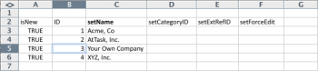

# Kick-Starts情境：公司、群組、角色和使用者Kick-Starts準備

開始實作Adobe Workfront時，您可以匯入客戶清單、內部部門、職位角色和使用者資訊，而不是手動輸入資料。

## 存取需求

+++ 展開以檢視本文中功能的存取需求。

您必須具有下列存取權才能執行本文中的步驟：

<table style="table-layout:auto"> 
 <col> 
 <col> 
 <tbody> 
  <tr> 
   <td role="rowheader">Adobe Workfront計畫</td> 
   <td>任何</td> 
  </tr> 
  <tr> 
   <td role="rowheader">Adobe Workfront授權</td> 
   <td>
   
 新增：標準

   或
   
目前：計畫
</td> 
  </tr> 
  <tr> 
   <td role="rowheader">存取層級設定</td> 
   <td>[!UICONTROL 系統管理員]</td> 
  </tr> 
 </tbody> 
</table>

如需有關此表格的詳細資訊，請參閱Workfront檔案中的[存取需求](/help/quicksilver/administration-and-setup/add-users/access-levels-and-object-permissions/access-level-requirements-in-documentation.md)。

+++

## 您可以匯入的內容

下表顯示要匯入的公司、群組和角色：

| 公司 | 群組 | 角色 |
|---|---|---|
| Acme， Co 
Workfront公司 
_您的公司_ 
XYZ， Inc. | 財務 
IT 
行銷 
銷售額 | 業務分析師 
控制器Creative 
設計師 
資源管理員 
Scrum Master 
技術撰稿人 
Web開發人員 |

{style="table-layout:auto"}

角色名稱必須是唯一的。 無法匯入現有職位角色。

下表顯示要匯入的使用者以及每個使用者的數個使用者屬性：

### 使用者1

| 屬性 | 值 |
|---|---|
| **名字** | Chris |
| **姓氏** | 人員管理 |
| **使用者名稱/電子郵件** | mailto:cmanning@foo.com |
| **密碼** | 更新我 |
| **存取** | 小組成員 |
| **公司** | &lt;*您的公司>* |
| **主群組** | 行銷 |
| **工作角色** | 業務分析師 |

{style="table-layout:auto"}

### 使用者2

| 屬性 | 值 |
|---|---|
| **名字** | Jennifer |
| **姓氏** | 坎貝爾 |
| **使用者名稱/電子郵件** | jcampbell@foo.com |
| **密碼** | 更新我 |
| **存取** | 專案經理 |
| **公司** | &lt;*您的公司>* |
| **主群組** | 行銷 |
| **工作角色** | 專案經理 |

{style="table-layout:auto"}

### 使用者3

| 屬性 | 值 |
|---|---|
| **名字** | 吉爾 |
| **姓氏** | 沙利文 |
| **使用者名稱/電子郵件** | jsullivan@foo.com |
| **密碼** | 更新我 |
| **存取** | 服務台 |
| **公司** | &lt;*您的公司>* |
| **主群組** | 銷售額 |
| **工作角色** | 銷售代表 |

{style="table-layout:auto"}

### 使用者4

| 屬性 | 值 |
|---|---|
| **名字** | 馬克 |
| **姓氏** | Lewis |
| **使用者名稱/電子郵件** | mlewis@foo.com |
| **密碼** | 更新我 |
| **存取** | 投資組合經理 |
| **公司** | &lt;*您的公司>* |
| **主群組** | 財務 |
| **工作角色** | 控制器 |

{style="table-layout:auto"}

### 使用者5

| 屬性 | 值 |
|---|---|
| **名字** | Pam |
| **姓氏** | Reynolds |
| **使用者名稱/電子郵件** | preynolds@foo.com |
| **密碼** | 更新我 |
| **存取** | 專案經理 |
| **公司** | *您的公司>* |
| **主群組** | 行銷 |
| **工作角色** | IT |

{style="table-layout:auto"}

### 使用者6

| 屬性 | 值 |
|---|---|
| **名字** | Ray |
| **姓氏** | Andrews |
| **使用者名稱/電子郵件** | randrews@foo.com |
| **密碼** | 更新我 |
| **存取** | 管理員 |
| **公司** | *您的公司>* |
| **主群組** | 資源管理員 |
| **工作角色** | 無 |

{style="table-layout:auto"}

## 下載Kick-Start范

{{step-1-to-setup}}

1. 按一下&#x200B;**系統** > **Kick-Starts** > **匯入資料。**

1. 按一下&#x200B;**其他選項**&#x200B;檢視匯入選項的完整清單。
1. 選取您要匯入的存取層級、公司、群組、工作角色和使用者物件。
1. 按一下&#x200B;**下載**。

## 輸入公司資訊

1. 開啟您剛下載的&#x200B;**Workfront.xlsx**&#x200B;檔案。

   >[!TIP]
   >
   >使用非常寬的資料表時，您可能想要使用試算表編輯器的「凍結窗格」（或同等功能）工具，讓試算表更易於使用。

1. 移至&#x200B;**CMPY公司**&#x200B;工作表。

   除非系統中已有公司，否則應留空。

    

1. 在&#x200B;**isNew**&#x200B;資料行中輸入&#x200B;**TRUE**。

   對每個要新增的公司重複此動作。 （在此範例中，請針對列3-6完成此動作，因為將新增4家公司）。

   

1. 輸入唯一的&#x200B;**識別碼**。

   您必須為每一列輸入識別碼。 建立新記錄時，從1開始的整數可正常運作。

   

1. 在&#x200B;**setName**&#x200B;欄中輸入每個客戶的名稱。

   

1. 移至&#x200B;**群組**&#x200B;工作表。

   除非您已在Workfront中建立群組，否則此工作表應該僅顯示與Workfront的每個帳戶布建的「預設群組」。

    

1. 在&#x200B;**isNew**&#x200B;資料行中輸入&#x200B;**TRUE**。

   根據此情境，將匯入4個群組，因此請在&#x200B;**isNew**&#x200B;欄中為第4到7列輸入&#x200B;**TRUE**。

1. 輸入唯一的&#x200B;**識別碼**。

   您必須為每一列輸入識別碼。 建立新記錄時，從1開始的整數可正常運作。

   

1. 在&#x200B;**setName**&#x200B;欄位中輸入每個部門的名稱。

   

1. 移至&#x200B;**ROLE Role**&#x200B;工作表。

   除非您已建立或刪除帳戶中的角色，否則此工作表應顯示8個已布建每個Workfront帳戶的角色。

   

1. 在&#x200B;**isNew**&#x200B;資料行中輸入&#x200B;**TRUE**。

   根據此情境，將會匯入7個工作角色，所以請在列12到18的&#x200B;**isNew**&#x200B;欄中輸入&#x200B;**TRUE**。

   

1. 輸入唯一的&#x200B;**識別碼**。

   您必須為每一列輸入識別碼。 建立新記錄時，從1開始的整數可正常運作。

   

1. 為&#x200B;**setName**&#x200B;欄中的每個角色輸入名稱。

   

1. 視需要提供其他詳細資訊。

   視需要包含您正在建立之角色的收費率、成本費率和說明。

1. 移至&#x200B;**使用者**&#x200B;工作表。

   除非您已在您的帳戶中建立使用者，否則本工作表應該僅顯示已布建每個Workfront帳戶的「管理員使用者」。

    

1. 在&#x200B;**isNew**&#x200B;資料行中輸入&#x200B;**TRUE**。

   根據此情境，將會匯入6位使用者，所以請在&#x200B;**isNew**&#x200B;欄中為列4到9輸入&#x200B;**TRUE**。

   

1. 輸入唯一的&#x200B;**識別碼**。

   您必須為每一列輸入識別碼。 建立新記錄時，從1開始的整數可正常運作。

   

1. 在&#x200B;**setFirstName**&#x200B;和&#x200B;**setLastName**&#x200B;欄位中輸入每個使用者的名稱。

   

1. 在&#x200B;**setEmail**、**setPassword**&#x200B;和&#x200B;**setUsername**&#x200B;欄中輸入值，以設定詳細值。

   

1. 指定存取層級值。

   例如，Chris Manning是團隊成員。 在&#x200B;**ACSLVL存取層級**&#x200B;工作表上查詢團隊成員存取層級的識別碼。 複製ID，並在&#x200B;**USER User**&#x200B;工作表上貼到該使用者列上的&#x200B;**setAccessLevelID**&#x200B;欄。

   對每個使用者和存取層級重複此步驟。

    

1. 輸入使用者的「主群組」詳細資料。

   根據情境，Chris Manning屬於行銷群組。 在&#x200B;**群組群組**&#x200B;工作表上，找出行銷群組的識別碼，加以複製，然後在&#x200B;**使用者使用者**&#x200B;工作表上，將其貼到使用者列上的&#x200B;**setHomeGroupID**&#x200B;欄。&#x200B;URL對每個使用者和群組指派重複此步驟。

    

1. 輸入使用者的公司詳細資料。

   此情境中的所有使用者都屬於相同公司。 在&#x200B;**CMPY公司**&#x200B;工作表上，找到&#x200B;**您自己的公司**&#x200B;公司的ID，複製ID，然後在&#x200B;**使用者使用者**&#x200B;索引標籤上，將此值貼到&#x200B;**setCompanyID**&#x200B;欄的每一列&#x200B;。

   對每個使用者和群組指派重複此步驟。

    

1. 輸入使用者的工作角色詳細資訊。

   根據情況，Chris Manning將擔任Business Analyst角色。 在&#x200B;**ROLE角色**&#x200B;工作表上，找到Business Analyst角色的ID，複製它，然後在&#x200B;**USER User**&#x200B;工作表上將其貼到使用者列上的&#x200B;**setRoleID**&#x200B;欄。&#x200B;URL對每個使用者和群組指派重複此步驟。

    

1. 視需要填寫其他使用者詳細資訊，然後儲存檔案。
1. 匯入Excel檔案。

   遵循[使用Kick-Start範本將資料匯入Adobe Workfront](/help/quicksilver/administration-and-setup/manage-workfront/using-kick-starts/import-data-via-kickstarts.md)中提供的指示。

>[!NOTE]
>
>匯入至Workfront的使用者會建立在「已停用」和「等待核准」狀態。
> 
>如果您的組織已移轉至Adobe Admin Console，且使用者未在幾分鐘內離開「已停用」和「未決核准」狀態，您可以將使用者批次直接新增到Adobe Admin Console。
>
>如需指示，請參閱[管理多個使用者 | 在Adobe檔案中大量上傳CSV](https://helpx.adobe.com/tw/enterprise/using/bulk-upload-users.html)。
