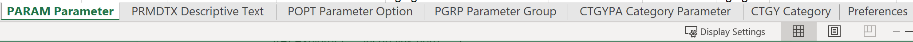

# Kick-Starts情境：將多個選項自訂欄位匯入Workfront

您可以使用Kick-Start功能，在Adobe Workfront中匯入具有多個選項的自訂欄位。

具有多個選項的自訂欄位範例包括：

* 多選下拉清單
* 下拉
* 核取方塊
* 選項按鈕

這些欄位有時會有許多（有時數百個）選項。 使用Kick-Start功能匯入這些變數，可讓您作為Workfront管理員節省大量時間並確保避免錯誤。

>[!IMPORTANT]
>
>您必須依照以下各節所述的步驟，以使用kick-start依序匯入具有多個選項的自訂欄位：
>
>1. 從Workfront匯出現有的自訂資料（選擇性步驟）
>1. 匯出自訂資料的Kick-Starts範本
>1. 填入Excel Kick-Start試算表
>1. 將Excel試算表上傳至Workfront

## 存取需求

+++ 展開以檢視本文中功能的存取需求。

<table style="table-layout:auto"> 
 <col> 
 <col> 
 <tbody> 
  <tr> 
   <td>Adobe Workfront套件</td> 
   <td>
任何
</td> 
  </tr> 
  <tr> 
   <td>Adobe Workfront授權</td> 
   <td>
標準

       
規劃
</td>
  </tr> 
  <tr> 
   <td>存取層級設定</td> 
   <td>系統管理員</td> 
  </tr> 
 </tbody> 
</table>

如需詳細資訊，請參閱Workfront檔案中的[存取需求](/help/quicksilver/administration-and-setup/add-users/access-levels-and-object-permissions/access-level-requirements-in-documentation.md)。

+++

## 從Workfront匯出現有的自訂資料（選擇性步驟）

如果您不熟悉Workfront資料庫結構，或不熟悉Workfront匯入資訊所需的快速啟動檔案，建議您先從Workfront匯出包含現有資訊的快速啟動檔案，類似於您要匯入的欄位。

例如，如果您想要匯入自訂表單或自訂欄位，必須先匯出包含現有自訂資料的KickStart檔案。

先匯出現有資料可讓您掃描資料，並檢視新資料需要如何格式化。

如果您熟悉Workfront資料庫物件和結構，可以繼續下一節。

若要從Workfront匯出現有資料：

{{step-1-to-setup}}

1. 展開左側功能表中的&#x200B;**系統**，然後按一下&#x200B;**匯出資料(Kick-Starts)**。

1. 選取&#x200B;**要包含的內容**&#x200B;區段中的&#x200B;**自訂資料**。

   

1. 在&#x200B;**下載格式**&#x200B;區段中選擇&#x200B;**.xlsx檔案**。

   >[!TIP]
   >
   >視您在系統中的自訂資料量而定，這可能需要很長的時間。

1. 按一下&#x200B;**下載**。 將.xlsx檔案下載到您的電腦。 導覽至並開啟。

   

1. 檢查下載的檔案，並記下下列詳細資訊：

   * 檔案包含數個頁面。 您可能不需要知道每個工作表中的資訊，但會使用某些工作表來匯入您的資訊。 請花點時間熟悉內容，尤其是每個工作表內容的格式。
   * 請特別留意欄位名稱以及每個欄位中資料顯示的格式。
   * 您不得變更任何頁面中的欄名或欄順序。 欄標題指示您必須在每列中填寫資訊的欄位。 如果欄標題顯示為粗體，則為必填欄位，因此該欄中必須有資訊。

   >[!IMPORTANT]
   >
   >某些欄標題可能不會以粗體顯示，但仍可能需要。

   * 保留下載的檔案以供日後參考，並繼續進行下一節。

## 匯出自訂資料的Kick-Start範本

掃描系統中現有自訂欄位的相關資訊後，您可以下載新的快速啟動範本進行匯入。

{{step-1-to-setup}}

1. 展開左側功能表中的&#x200B;**系統**。

1. 按一下&#x200B;**匯入資料(Kick-Starts)**。

1. 在&#x200B;**下載空白的Kick-Start試算表**&#x200B;區域中，選取&#x200B;**自訂資料**&#x200B;核取方塊，然後按一下&#x200B;**下載**。

   

   將空白的快速啟動檔案下載到您的電腦。

   >[!NOTE]
   >
   >檔案中的工作表數、工作表名稱、以及每個工作表中的欄數和名稱應該與上方區段中下載的kick-start （包含您現有的自訂資料）中的工作表數和名稱相同。

## 填入Excel Kick-Start試算表

在填入Excel試算表之前，請依照上節所述下載Kick-start範本。

>[!IMPORTANT]
>
>請勿嘗試使用臨機Excel試算表匯入資訊。 使用Kick-Start功能將資訊匯入Workfront的所有試算表都必須符合您從Workfront下載以及本文所述的檔案內容。

若要將新自訂欄位的資訊填入Excel試算表中：

1. 開啟您在上一節下載的Excel試算表，並檢閱工作表。 每個工作表代表應用程式中的一個物件。

   例如，**Parameter** （參考自訂欄位）、**Parameter Option** （參考自訂欄位選項）、**Category** （參考自訂表單）。

   您必須使用Workfront資料庫支援的格式來寫入物件名稱及其屬性。

   如需這些物件含義的詳細資訊，請參閱[術語 [!DNL Adobe Workfront] 辭彙表](../../../workfront-basics/navigate-workfront/workfront-navigation/workfront-terminology-glossary.md)。

   如需Workfront資料庫中物件名稱的相關資訊，請參閱[API總管](../../../wf-api/general/api-explorer.md)。

   

1. 請確認下列資訊的格式正確：

   * 每個頁面的第一列都必須保持空白，否則匯入會產生錯誤。
   * 每個工作表中的欄標題代表可在匯入期間設定的物件屬性。 匯出工作表時，所有的欄標題必須保持相同的順序，而且不能重新命名。
   * 以粗體顯示的欄標題是必填欄位，必須具有值。

     >[!TIP]
     >
     >有些欄雖然非粗體，但還是需要使用。 例如，`isNew`和`ID`欄不是粗體，但為必填欄位。

1. 選取**0}工作表，並在下列必要欄位中新增新自訂欄位的相關資訊：`**PARAM Parameter`

   * **`isNew`** =在此欄中為每個代表新自訂欄位的行輸入&#x200B;**`TRUE`**。 這表示欄位是Workfront中的新欄位且不存在。

     >[!TIP]
     >
     >如果行代表Workfront中已存在的欄位，您應輸入&#x200B;**`isNew`** = **`FALSE`**。

   * **`ID`** =代表新欄位的每行必須是唯一的數字。 您可以使用任何從1開始的數字，但前提是每個新欄位都有唯一的數字。
   * **`setDataType`** =對於代表新欄位的每一行，輸入欄位支援的資料型別。 必須按在資料庫中顯示的形式輸入資料型別。 從下列資料型別中選取：

      * 數字&#x200B;**`NMBR`**
      * **`CURC`**&#x200B;代表貨幣
      * **`TEXT`**&#x200B;文字

   * `**setDisplaySize**`=任何多個選項自訂欄位的顯示大小(&#39;**setDisplaySize**&#39;)一律為0。
   * **`setDisplayType`** =對於代表新欄位的每一行，輸入欄位的顯示型別。 必須輸入顯示型別，就像在資料庫中顯示的顯示型別一樣。

     若為多選項自訂欄位，請從下列選項中選取：

      * 多選下拉式清單的&#x200B;**`MULT`**
      * 下拉式清單的&#x200B;**`SLCT`**
      * 選項按鈕的&#x200B;**`RDIO`**
      * 核取方塊的&#x200B;**`CHCK`**

     >[!TIP]
     >
     >若要尋找「資料型別」和「顯示型別」資訊，請參閱[API總管](../../../wf-api/general/api-explorer.md)，展開&#x200B;**Parameter**&#x200B;物件，然後在&#x200B;**欄位**&#x200B;標籤下尋找這些屬性。

   * **`setName`** =輸入您想要在Workfront中顯示的自訂欄位名稱。

     >[!INFO]
     >
     >例如，我們可能會匯入兩個自訂欄位，名為&#x200B;_Brand_ （核取方塊欄位）和&#x200B;_Media_ （選項按鈕欄位）。

   * **`setName`**&#x200B;和&#x200B;**`setValue`**&#x200B;欄通常包含相同的資訊，它們應該反映新欄位的Workfront介面中所需的名稱。

   欄位的值是出現在報表中的名稱，而名稱顯示在附加到物件的自訂表單中。

   如需詳細資訊，請參閱[建立自訂表格](/help/quicksilver/administration-and-setup/customize-workfront/create-manage-custom-forms/form-designer/design-a-form/design-a-form.md)。

   

1. 選取&#x200B;**`POPT Parameter Options`**&#x200B;工作表，並在下列必要欄位中新增每個自訂欄位選項的相關資訊：

   * **`isNew`** =在此欄中為每個代表新欄位選項的行輸入&#x200B;**`TRUE`**。

     >[!TIP]
     >
     >    如果線條代表現有的選項，您應該輸入&#x200B;**`isNew`** = **`FALSE`**。

   * **`ID`** =代表新選項的每一行必須是唯一的數字。 您可以使用任何以1開頭的數字，但前提是每個新選項都有唯一的數字。
   * **`setIsDefault`** =為您要預設顯示的選項輸入`TRUE`，並為每個欄位輸入所有其他選項的`FALSE`。  例如，我們想要將&#x200B;_Nike_&#x200B;設為&#x200B;_Brand_&#x200B;的預設選項，並將&#x200B;_Print_&#x200B;設為&#x200B;_Media_&#x200B;的預設選項。

     >[!TIP]
     >
     >每個欄位只能有一個預設選項。

   * **`setParameterID`** =與&#x200B;_品牌_&#x200B;自訂欄位對應的選項為&#x200B;**`setParameterID`** （共1個），而與&#x200B;_媒體_&#x200B;對應的選項為**`setParameterID`** （共2個）。 `PARAM`與`POPT`工作表會相互交叉參照，指出哪些選項屬於哪個自訂欄位。
   * **`setDisplayOrder`**=顯示順序欄表示選項在自訂欄位中的顯示順序。 您可以從1開始，然後依遞增順序繼續所有選項，無論它們屬於哪個欄位。 這裡重要的是每個選項都有唯一編號。
   * **`setLabel`**&#x200B;和`**setValue`**欄通常包含相同的資訊，且應反映Workfront UI中所需的名稱。 選項的值是顯示在報表中的名稱，例如，而標籤在附加到物件時顯示在自訂表單中。 如需詳細資訊，請參閱[建立自訂表格](/help/quicksilver/administration-and-setup/customize-workfront/create-manage-custom-forms/form-designer/design-a-form/design-a-form.md)。
   * **`setIsHidden`** =若要隱藏任何選項，請輸入`TRUE`。

   

1. （選擇性）如果您也想要建立自訂表單，以便稍後在其中新增欄位，請選取&#x200B;**`CTGY Category`**&#x200B;工作表並更新自訂表單資訊的下列必要欄：

   * **`isNew`** =在此欄中為每個代表新自訂表單的行輸入&#x200B;**`TRUE`**。
   * **`ID`** =為代表新表單的每一行輸入唯一的數字。 您可以使用任何以1開頭的數字，只要每個新選項或行具有一個唯一數字即可。
   * **`setGroupID`** =新增主群組的群組識別碼，或您想要其成員存取此表單之系統中的任何其他群組。 這是必填欄位。

   若要找出群組的`ID`，您可以建置群組報告並在檢視中新增`ID`欄位，或導覽至群組並尋找該群組的URL。 群組ID會位於群組頁面的URL中。 例如，如果群組的URL是`https://companyName.my.workfront.com/group/575b000800467a6f66e747932c807464/members`，則群組識別碼是`575b000800467a6f66e747932c807464`。

   * **`setCatObjCode`**=這是您要建立表單之物件型別的物件程式碼。 從下列選項輸入代碼：
      * 公司&#x200B;**`CMPY`**
      * 任務的&#x200B;**`TASK`**
      * 專案的&#x200B;**`PROJ`**
      * 適用於Portfolio的&#x200B;**`PORT`**
      * 計畫的&#x200B;**`PRGM`**
      * 使用者的&#x200B;**`USER`**
      * 檔案&#x200B;**`DOCU`**
      * 問題&#x200B;**`OPTASK`**
      * 費用&#x200B;**`EXPNS`**
      * 反複專案的&#x200B;**`ITRN`**
      * 記帳記錄的&#x200B;**`BILL`**
      * 群組&#x200B;**`GROUP`**

     >[!NOTE]
     >
     >針對多物件表單，輸入您在UI中建立表單時將會選取的第一個物件。 例如，如果您要在Workfront介面中選取「任務」，然後選取「問題」、「Portfolio」等，但您不想要表單可供「專案」使用，請將`setCatObjCode`設為`TASK`。

   * **`setName`** =這是您想要在Workfront介面中顯示的自訂表單名稱。

     

1. 將試算表儲存為電腦上的.xls或.xlsx檔案。 您的Excel試算表已填滿，現在可以匯入Workfront了。

## 將Excel試算表上傳至Workfront

執行前述各節所述的步驟後，繼續下列步驟，將新欄位和表單上傳至Workfront：

{{step-1-to-setup}}

1. 按一下&#x200B;**系統>匯入資料(Kick-Starts)**。

1. 按一下&#x200B;**使用Kick-Start試算表上傳資料**&#x200B;區段下的&#x200B;**選擇檔案**。

1. 在電腦上瀏覽您準備的Excel試算表，並在找到時加以選取。

   檔案會自動上傳，並顯示已成功匯入的通知。 視您匯入的資訊量而定，此步驟可能需要幾秒鐘到一分鐘的時間。

   新的自訂欄位和表單現在包含在您的Workfront系統中。 您可以在「設定」的「自訂Forms」區域中找到它們。

   >[!NOTE]
   >
   >您匯入的新表單和欄位尚未連線。 匯入的表單沒有自訂欄位。 您必須手動將欄位新增至新自訂表單或其他現有自訂表單。

   如需有關新增欄位至自訂表單的資訊，請參閱[建立自訂表單](/help/quicksilver/administration-and-setup/customize-workfront/create-manage-custom-forms/form-designer/design-a-form/design-a-form.md)。

1. （視條件而定）如果匯入失敗，您會收到錯誤訊息，指出問題所在。 嘗試識別發生問題的欄位、工作表和列號，並更正Excel檔案中的資訊。 然後，嘗試再次匯入檔案。

1. （視條件而定）根據問題性質（如錯誤訊息所述），某些資訊可能已匯入。 您必須執行下列任一項作業，才能再次匯入頁面：

   * 刪除成功從Workfront從「自訂Forms」區域匯入的資訊，然後進行錯誤訊息所指示的更正。
   * 指出系統中已有欄位或表單用於已匯入的欄位或表單，然後進行更正。
若要指出欄位或自訂表單已在Workfront中，您必須確定在包含表單(`inNew`)或欄位(`FALSE`)相關資訊的工作表中，`CTGY`欄位已標示為`PARAM`。
