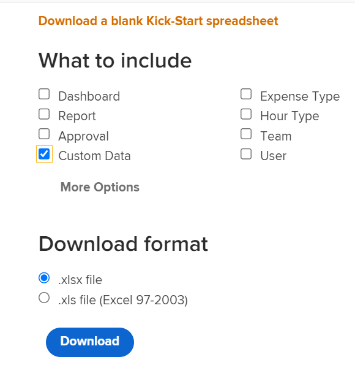

# Kick-Starts案例：將多選項自訂欄位匯入Workfront

您可以使用Kick-Start功能，在Adobe Workfront中匯入含有多個選項的自訂欄位。

具有多個選項的自訂欄位範例包括：

* 多選下拉清單
* 下拉
* 核取方塊
* 單選按鈕.

這些欄位有時可以有許多（有時是數百個）選項。 使用Kick-Start功能匯入這些函式可節省您(身為Workfront管理員)的大量時間，並確保您避免錯誤。

您必須依照以下各節所述的步驟，依序使用啟動匯入具有多個選項的自訂欄位：

1. 從Workfront匯出現有自訂資料（可選步驟）
1. 匯出自訂資料的啟動範本
1. 填入Excel開始試算表
1. 上傳Excel試算表至Workfront

## 從Workfront匯出現有自訂資料（可選步驟）

如果您不熟悉Workfront資料庫結構，或不熟悉Workfront匯入資訊所需的啟動檔案，建議您先從Workfront匯出具有現有資訊的啟動檔案，類似於您要匯入之欄位的資訊。

例如，如果要匯入自訂表單或自訂欄位，您必須先匯出含有現有自訂資料的啟動檔案。

先匯出現有資料可讓您掃描資料，並了解新資料的格式化需求。

如果您對Workfront資料庫物件和結構有很好的了解，可以繼續下列章節。

若要從Workfront匯出現有資料：

1. 按一下 **主菜單>設定** 在Workfront介面的右上角。
1. 展開 **系統** 菜單，然後按一下 **匯出資料（啟動）**.

   

1. 選擇 **自訂資料** 在 **應包含的內容** 區段。

   

1. 選擇 **.xlsx檔案** 在 **下載格式** 區段。

   >[!TIP]
   >
   >    視您在系統中擁有的自訂資料量而定，這可能需要很長的時間。

   

1. 按一下 **下載**. .xlsx檔案下載至您的電腦。 導覽至並開啟它。

   

1. 檢查下載的檔案，並記下下列詳細資訊：

   * 檔案包含數張工作表。 您可能不需要知道每個工作表中的資訊，但會使用其中的一些工作表來匯入資訊。 請花點時間熟悉內容，尤其是每張工作表的內容格式。
   * 請特別注意欄名稱和每個欄中資料的顯示格式。
   * 您不得更改任何工作表中列的名稱或順序。 欄標題會指出您在每一列中需要填入資訊的欄位。 如果欄標題以粗體顯示，則為必填欄位，因此您必須在該欄中有資訊。
   >[!IMPORTANT]
   >
   >某些欄標題可能無法以粗體顯示，但仍為必要項目。

   * 保留下載的檔案以供日後參考，並繼續前往下節。

## 匯出自訂資料的「啟動」範本

掃描系統中現有自訂欄位的相關資訊後，您可以下載新的啟動範本以匯入。

1. 按一下 **主菜單>設定** 在Workfront介面的右上角。

1. 展開 **系統** 菜單。

1. 按一下 **匯入資料（啟動）**.

   

1. 在 **下載空白的Kick-Start試算表** 區域，選擇 **自訂資料** 核取方塊和按一下 **下載**.

   

   將空白的啟動檔案下載到您的電腦。

   >[!NOTE]
   >
   >檔案中的工作表數、其名稱、每個工作表中的欄數和名稱，應與上節（包含您現有自訂資料）中下載的啟動開始中的工作表數相同。

## 填入Excel開始試算表

在填入Excel試算表之前，請依照上節所述下載「啟動」範本。

>[!IMPORTANT]
>
>請勿嘗試使用臨機Excel試算表匯入資訊。 所有使用啟動功能將資訊匯入Workfront的試算表，都必須符合您從Workfront下載並在本文中說明的檔案內容。

若要在Excel試算表中填入新自訂欄位的資訊：

1. 開啟您在前一節下載的Excel試算表，然後注意到數張工作表。 每個工作表都表示應用程式中的一個對象。

   例如： **參數** （指自訂欄位）, **參數選項**（即「自訂欄位」選項）, **類別** （指自訂表單）。

   您必須以Workfront資料庫支援的格式寫入對象的名稱及其屬性。

   如需這些物件含意的相關資訊，請參閱 [Workfront字彙表](../../../workfront-basics/navigate-workfront/workfront-navigation/workfront-terminology-glossary.md).

   有關Workfront資料庫中對象名稱的資訊，請參見 [API Explorer](../../../wf-api/general/api-explorer.md).

   

1. 請確定下列資訊的格式正確：

   * 每個工作表的第一行必須保持空白，否則匯入會產生錯誤。
   * 每個工作表中的列標題表示可在導入期間設定的對象的屬性。 匯出工作表時，所有欄標題必須依您找到的相同順序保持不變，且無法重新命名。
   * 粗體的欄標題是必填欄位，且必須有值。

      >[!TIP]
      >
      >某些欄並非以粗體顯示，但仍為必要欄。 例如， `isNew` 和 `ID` 欄不是粗體，但是是必填欄位。

1. 選取 `**PARAM Parameter`**工作表，並在下列必要欄中新增有關新自訂欄位的資訊：

   * **`isNew`** =輸入 **`TRUE`** 在此欄中，代表新自訂欄位的每一行皆適用。 這表示此欄位是新欄位，且不存在於Workfront中。

      >[!TIP]
      >
      >    如果行代表Workfront中已存在的欄位，您可以輸入 **`isNew`** = **`FALSE`**.

   * **`ID`** =必須是代表新欄位之每行的唯一數字。 只要每個新欄位都有唯一的編號，您就可以使用以1開頭的任何編號。
   * **`setDataType`** =對於代表新欄位的每行，輸入欄位支援的資料類型。 必須按資料庫中顯示的方式輸入資料類型。 從下列資料類型中選取：
      * **`NMBR`** 數字
      * **`CURC`** 貨幣
      * **`TEXT`** 文字
   * `**setDisplaySize**`=顯示大小(「**setDisplaySize**&#39;)對於任何多個選項，自訂欄位一律為0。
   * **`setDisplayType`** =對於代表新欄位的每行，輸入欄位的顯示類型。 必須輸入顯示類型，該類型將顯示在資料庫中。

      若為多選項自訂欄位，請從下列選項中選取：

      * **`MULT`** 多選下拉式清單
      * **`SLCT`** 下拉式清單
      * **`RDIO`** 選項按鈕
      * **`CHCK`** 複選框
      >[!TIP]
      >
      >要查找資料類型和顯示類型資訊，請參閱 [API Explorer](../../../wf-api/general/api-explorer.md)，展開 **參數** 對象，並在下查找這些屬性 **欄位** 標籤。

   * **`setName`** =輸入自訂欄位名稱，如您所希望的顯示在Workfront中。

      例如，我們可匯入兩個自訂欄位，稱為 _品牌_、核取方塊欄位和 _媒體_，選項按鈕欄位。

   * 此 **`setName`** 和 **`setValue`** 欄通常包含相同資訊，且應反映新欄位在Workfront介面中所需的名稱。
   例如，欄位的值是顯示在報表中的名稱，而名稱顯示在附加至物件的自訂表單中。

   如需詳細資訊，請參閱 [新增自訂欄位至自訂表單](../../../administration-and-setup/customize-workfront/create-manage-custom-forms/add-a-custom-field-to-a-custom-form.md).

   

1. 選取 **`POPT Parameter Options`** 工作表，並在下列必要欄中新增每個自訂欄位選項的相關資訊：

   * **`isNew`** =輸入 **`TRUE`** 在此欄中，代表新欄位選項的每行。

      >[!TIP]
      >
      >    如果行代表現有選項，您可輸入 **`isNew`** = **`FALSE`**.

   * **`ID`** =必須是代表新選項之每行的唯一數字。 只要每個新選項都有唯一的編號，您就可以使用以1開頭的任何編號。
   * **`setIsDefault`** =輸入 `TRUE` 以取得預設要顯示的選項，以及 `FALSE` 針對所有其他選項，針對每個欄位。  例如，我們想要 _Nike_ 為的預設選項 _品牌_ 和 _列印_ 為的預設選項 _媒體_.

      >[!TIP]
      >
      >每個欄位只能有一個預設選項。

   * **`setParameterID`** =與 _品牌_ 自訂欄位具有 **`setParameterID`** 的1，以及 _媒體_ 有**`setParameterID`**/2。 此 `PARAM` 和 `POPT` 工作表互相參照，以指出哪些選項屬於哪些自訂欄位。
   * **`setDisplayOrder`**=顯示順序欄會指出選項在您的自訂欄位中的顯示順序。 無論選項屬於哪些欄位，您都可以從1開始，並以升序繼續。 重要的是，每個選項都有不重複的編號。
   * 此 **`setLabel`** 和 `**setValue`**欄通常包含相同的資訊，且應反映Workfront UI中需要的名稱。 例如，選項的值是報表中顯示的名稱，而標籤在附加至物件時會顯示在自訂表單中。 如需詳細資訊，請參閱 [新增自訂欄位至自訂表單](../../../administration-and-setup/customize-workfront/create-manage-custom-forms/add-a-custom-field-to-a-custom-form.md).
   * **`setIsHidden`** =輸入 `TRUE` 如果希望隱藏任何選項。
   

1. （可選）如果您也想建立自訂表單，以便稍後新增欄位，請選取  **`CTGY Category`** 工作表並更新以下自訂表單資訊所需的欄：

   * **`isNew`** =輸入 **`TRUE`** 在此欄中，代表新自訂表單的每一行皆適用。
   * **`ID`** =為代表新表單的每行輸入唯一編號。 只要每個新選項或行都有唯一編號，您就可以使用以1開頭的任何編號。
   * **`setGroupID`** =為您的「首頁組」或系統中任何其他組添加組ID，這些組的成員要訪問此表單。 這是必填欄位。
   若要了解 `ID` 群組中，您可以建立群組報表並新增 `ID` 欄位，或導覽至群組並尋找群組的URL。 群組ID會位於群組頁面的URL中。 例如，如果群組的URL為 `https://companyName.my.workfront.com/group/575b000800467a6f66e747932c807464/members`，群組ID為 `575b000800467a6f66e747932c807464`.

   * **`setCatObjCode` **=這是要為其建立表單的對象類型的對象代碼。 從下列選項中輸入代碼：
      * **`CMPY`** 公司
      * **`TASK`** 任務
      * **`PROJ`** 專案
      * **`PORT`** Portfolio
      * **`PRGM`** 方案
      * **`USER`** 使用者
      * **`DOCU`** 檔案
      * **`OPTASK`** 問題
      * **`EXPNS`** 支出
      * **`ITRN`** 迭代
      * **`BILL`** 對於帳單記錄
      * **`GROUP`** 群組
      >[!NOTE]
      >
      >對於多物件表單，請在UI中建立表單時輸入您要選取的第一個物件。 例如，設定 `setCatObjCode` to `TASK`，如果您先在Workfront介面中選取「工作」，然後再選取「問題」、「Portfolio」等，但您不希望該表單可供「專案」使用。

   * **`setName`** =這是您希望自訂表單顯示在Workfront介面中的名稱。

      

1. 將試算表儲存為電腦上的.xls或.xlsx檔案。 您的Excel試算表已填寫，現在已可匯入至Workfront。

## 上傳Excel試算表至Workfront

執行前幾節所述的步驟後，請繼續下列步驟，將新欄位和表單上傳至Workfront:

1. 按一下 **匯入資料** **（啟動）** **主菜單>設定>系統** 功能表。

1. 按一下 **選擇檔案** 在 **使用Kick-Start試算表上傳資料**.

1. 在電腦上瀏覽您準備的Excel試算表，並在找到後加以選取。  Workfront辨識檔案時，「上傳」按鈕會變成藍色。
1. 按一下 **上傳。**

   

1. 會顯示匯入成功的通知。 根據您要匯入的資訊量，此步驟可能需要幾秒鐘到一分鐘的時間。

   

   新的自訂欄位和表單現在位於您的Workfront系統中。 您可以在「設定」的「自訂Forms」區域中找到它們。

   >[!NOTE]
   >
   >您匯入的新表單和欄位尚未連線。 匯入的表單沒有自訂欄位。 您必須手動將欄位新增至新的自訂表單，或新增至其他現有的自訂表單。

   如需將欄位新增至自訂表單的詳細資訊，請參閱 [新增自訂欄位至自訂表單](../../../administration-and-setup/customize-workfront/create-manage-custom-forms/add-a-custom-field-to-a-custom-form.md).

1. （條件性）如果匯入未成功，您會收到錯誤訊息，其中包含問題所在。 嘗試識別遇到問題的欄位、工作表和行號，並更正Excel檔案中的資訊，然後嘗試再次導入該檔案。

   

1. （條件性）根據問題所在，如錯誤訊息所述，可能已匯入某些資訊。 必須執行以下操作之一，才能再次導入工作表：

   * 從「自訂Workfront」區域刪除已成功匯入Forms的資訊，然後進行錯誤訊息所指示的更正。
   * 指出系統中已針對已匯入的欄位或表單已有欄位或表單，然後進行更正。
若要指出欄位或自訂表單已在Workfront中，您必須確定 `inNew` 欄位標示為 `FALSE` 包含表單資訊的工作表(`CTGY`)或欄位(`PARAM`)。
