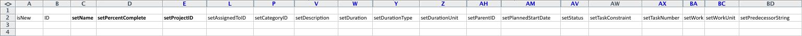

# Kick-Starts情境：簡單的專案和任務匯入準備

詳細說明使用Kick-Start方法匯入基本專案和任務的可用設定和控制項。

## 情境

實作團隊寧可匯入使用中專案的專案與任務資訊，也不願手動將此資料輸入系統中。

* [專案](#projects)
* [任務清單](#task-list)

### 專案 {#projects}

下表顯示四個專案及其需要對應至Kick Start檔案格式的基本詳細資訊。

此情境假設使用者已匯入Adobe Workfront。 如果使用者尚未在Workfront中，請取代不同的名稱或在此情境之前由使用者完成Kick Start情境。

1. 實作Workfront。

   | 規劃開始日期 | 今天 |
   |---|---|
   | 專案經理 | Jennifer Campbell |
   | 專案贊助者 | Marc Lewis |
   | 群組 | 行銷 |
   | 公司 | *您的公司* |

   {style="table-layout:auto"}

1. 實作HR系統。

   | 規劃開始日期 | 20XX年7月14日 |
   |---|---|
   | 專案經理 | Pam Reynolds |
   | 專案贊助者 | Marc Lewis |
   | 群組 | 行銷 |
   | 公司 | *您的公司* |

   {style="table-layout:auto"}

1. 實作檔案管理系統。

   | 規劃開始日期 | 20XX年8月22日 |
   |---|---|
   | 專案經理 | Jennifer Campbell |
   | 專案贊助者 | Ray Andrews |
   | 群組 | IT |
   | 公司 | *您的公司* |

   {style="table-layout:auto"}

1. 實作新的行事曆系統。

   | 規劃開始日期 | 20XX年9月6日 |
   |---|---|
   | 專案經理 | Pam Reynolds |
   | 專案贊助者 | Ray Andrews |
   | 群組 | IT |
   | 公司 | *您的公司* |

   {style="table-layout:auto"}

### 任務清單 {#task-list}

下列工作清單顯示專案的過度簡化工作清單。 專案之間唯一的差異是開始日期和在每個專案上取得的進度。

父系任務會繼承子系任務的持續時間、工作和完成百分比。 不需要為將變為摘要任務的設定這些值。

>[!NOTE]
>
>此情境中提供的指示並不像[Kick-Starts情境中提供的逐步指示那麼明確：公司、群組、角色和使用者Kick-Starts準備](../../../administration-and-setup/manage-workfront/using-kick-starts/kick-starts-scenario-company-group-role-user-prep.md)。 假設您已瞭解如何從「公司」和「群組」工作表中查詢及複製值，因此將提及這些步驟，但並未特別概述。

1. 設定。
1. 匯入使用者。

   <table style="table-layout:auto"> 
    <col width="50%"> 
    <col width="50%"> 
    <tbody> 
     <tr> 
      <td role="rowheader">指派至</td> 
      <td>Ray Andrews</td> 
     </tr> 
     <tr> 
      <td role="rowheader">父系任務</td> 
      <td>1</td> 
     </tr> 
     <tr> 
      <td role="rowheader">期間</td> 
      <td>1 小時</td> 
     </tr> 
     <tr> 
      <td role="rowheader">工作</td> 
      <td>1 小時</td> 
     </tr> 
     <tr> 
      <td role="rowheader">完成百分比</td> 
      <td> 
Workfront： 0%
 
HR： 100%
 
檔案： 100%
 
行事曆： 100%
 </td> 
     </tr> 
    </tbody> 
   </table>

1. 設定許可權。

   <table style="table-layout:auto"> 
    <col width="50%"> 
    <col width="50%"> 
    <tbody> 
     <tr> 
      <td role="rowheader">指派至</td> 
      <td>Ray Andrews</td> 
     </tr> 
     <tr> 
      <td role="rowheader">父系任務</td> 
      <td>1</td> 
     </tr> 
     <tr> 
      <td role="rowheader">前置任務</td> 
      <td>2</td> 
     </tr> 
     <tr> 
      <td role="rowheader">期間</td> 
      <td>1 小時</td> 
     </tr> 
     <tr> 
      <td role="rowheader">工作</td> 
      <td>1 小時</td> 
     </tr> 
     <tr> 
      <td role="rowheader">完成百分比</td> 
      <td> 
Workfront： 0%
 
HR： 100%
 
檔案： 100%
 
行事曆： 100%
 </td> 
     </tr> 
    </tbody> 
   </table>

1. 建立群組。

   <table style="table-layout:auto"> 
    <col width="50%"> 
    <col width="50%"> 
    <tbody> 
     <tr> 
      <td role="rowheader">指派至</td> 
      <td>Ray Andrews</td> 
     </tr> 
     <tr> 
      <td role="rowheader">父系任務</td> 
      <td>1</td> 
     </tr> 
     <tr> 
      <td role="rowheader">前置任務</td> 
      <td>4</td> 
     </tr> 
     <tr> 
      <td role="rowheader">期間</td> 
      <td>2 天</td> 
     </tr> 
     <tr> 
      <td role="rowheader">工作</td> 
      <td>4 小時</td> 
     </tr> 
     <tr> 
      <td role="rowheader">完成百分比</td> 
      <td> 
Workfront： 0%
 
HR： 100%
 
檔案： 100%
 
行事曆： 25%
 </td> 
     </tr> 
    </tbody> 
   </table>

1. 準備訓練。

   <table style="table-layout:auto"> 
    <col width="50%"> 
    <col width="50%"> 
    <tbody> 
     <tr> 
      <td role="rowheader">指派至</td> 
      <td>克里斯·曼寧</td> 
     </tr> 
     <tr> 
      <td role="rowheader">期間</td> 
      <td>2 天</td> 
     </tr> 
     <tr> 
      <td role="rowheader">工作</td> 
      <td>4 小時</td> 
     </tr> 
     <tr> 
      <td role="rowheader">完成百分比</td> 
      <td> 
Workfront： 0%
 
HR： 100%
 
檔案： 50%
 
行事曆： 100%
 </td> 
     </tr> 
    </tbody> 
   </table>

1. 建立持續的支援政策。

   <table style="table-layout:auto"> 
    <col width="50%"> 
    <col width="50%"> 
    <tbody> 
     <tr> 
      <td role="rowheader">指派至</td> 
      <td>克里斯·曼寧</td> 
     </tr> 
     <tr> 
      <td role="rowheader">期間</td> 
      <td>2 天</td> 
     </tr> 
     <tr> 
      <td role="rowheader">工作</td> 
      <td>4 小時</td> 
     </tr> 
     <tr> 
      <td role="rowheader">完成百分比</td> 
      <td> 
Workfront： 0%
 
HR： 100%
 
檔案： 50%
 
行事曆： 0%
 </td> 
     </tr> 
    </tbody> 
   </table>

1. 轉出。

   | 前置任務 | 1， 6， 7 |
   |---|---|

   {style="table-layout:auto"}

1. 訓練使用者。

   <table style="table-layout:auto"> 
    <col width="50%"> 
    <col width="50%"> 
    <tbody> 
     <tr> 
      <td role="rowheader">指派至</td> 
      <td>克里斯·曼寧</td> 
     </tr> 
     <tr> 
      <td role="rowheader">父系任務</td> 
      <td>8</td> 
     </tr> 
     <tr> 
      <td role="rowheader">期間</td> 
      <td>1 天</td> 
     </tr> 
     <tr> 
      <td role="rowheader">工作</td> 
      <td>2 小時</td> 
     </tr> 
     <tr> 
      <td role="rowheader">完成百分比</td> 
      <td> 
Workfront： 0%
 
HR： 0%
 
檔案： 0%
 
行事曆： 0%
 </td> 
     </tr> 
    </tbody> 
   </table>

## 下載範本

前往Kick-Start頁面。 選取「公司」、「群組」、「專案」、「任務」和「使用者」物件。 選取「包含現有資料」核取方塊（執行此動作可快速參考公司、群組和使用者ID）。 按一下下載按鈕。

## 輸入專案詳細資訊

開啟您剛下載的Workfront.xlsx檔案。 移至「專案專案」工作表。

除非您已經在Workfront中建立專案，否則檔案應該是空的。

設定下列專案欄位的值：

* **設定isNew資料行**
在isNew欄的列3到6中輸入TRUE。
* **設定唯一識別碼**
在每一列中，為ID欄輸入唯一的ID — 通常，建立新記錄時，從1開始的整數可正常運作。
* **設定專案名稱**
在setName欄中輸入每個專案的名稱。
* **設定專案排程**

  在setScheduleID欄位中輸入您要專案使用的排程ID

* **設定專案計劃開始日期**

  在setPlannedStartDate欄中輸入日期和時間，其中包含您要專案開始的時間和日期。 如果保留為空白，Workfront會根據瀏覽器的時區，匯入包含當天日期和當天午夜時間戳記的專案。

* **設定任務編號**
將值輸入至setTaskNumber欄，以控制任務在專案計畫中的顯示順序。
* **提供專案日期。**
在setPlannedStartDate欄中輸入每個專案的「計劃開始日期」。
* **設定其他需要的詳細資料。**
視需要填寫其他詳細資訊，例如說明或目前狀態。 在「群組群組」工作表中查詢每個專案的群組ID，並將其輸入至個別專案的setGroupID欄。 在COMPANY公司表上查詢專案的公司識別碼，並將其輸入到setCompanyID欄中。 在「使用者」工作表中查詢每個專案所有者的使用者ID，並將其輸入到setOwnerID欄中。 在使用者使用者工作表上查詢每個專案贊助者的使用者ID，並將其輸入到setSponnerID欄中。

>[!NOTE]
>
>在Workfront的「工作流程設定」區域中，檢視每個物件的狀態和優先順序偏好設定，即可找到「狀態」和「優先順序」欄位的可接受值。

## 輸入任務詳細資訊

當您使用kick-starts匯入專案時，可以新增有關專案上任務的資訊。

開啟您剛下載的Workfront.xlsx檔案。 **移至[工作]工作表。**

除非您已在Workfront中建立任務，否則此工作表應為空白。

對應任務最簡單的方式是一次對應一個專案（尤其是當每個專案上的任務相同時）。 然後，您可以複製第一個專案的作業計畫，並對後續專案的作業計畫進行小幅調整。 其餘步驟將假設您僅針對實作Workfront專案建立任務。 根據此情境，您將會為每個專案匯入9個任務，因此請將TRUE輸入到isNew欄的列3到11中。

設定下列工作列位的值：

* **設定ID**
在每一列中，為ID欄輸入唯一的ID。
* **設定名稱**
將工作名稱輸入到setName欄中。
* **確認專案識別碼**
輸入您為實作Workfront專案設定的ID；檢閱PROJ專案表以確定它是正確的ID。
* **設定使用者**
移至「使用者」工作表，以查詢指派給每個工作的使用者ID，並在setAssignedToID欄中的個別儲存格中輸入這些值。
* **識別工作關係**
對於任務2到5，在setParentID欄中輸入1。 若為工作9，請在setParentID欄中輸入8。 在setPrecessortString欄中，輸入每個前置任務的任務編號。 如果任務有多個前置任務，例如此案例中的任務8，您需要使用逗號來分隔每個前置任務ID。 使用建立前置任務關係一文中所述的簡寫，可以在非「完成 — 開始」關係上以延遲來定義前置任務。
* **設定持續時間**
在setDuration欄位中輸入任務的時數、天數、周數或月數，以設定每個任務的工期。 然後在setDurationUnit欄位中輸入持續時間單位。

  |   | 可接受的值 |
  |---|---|
  | 分鐘 | 一 |
  | 時數 | H |
  | 天 | D |
  | 週 | 週 |
  | 個月 | T |

  分鐘數也可以表示為一小時的小數（例如，分鐘數= 5小時）

* 設定setWorkRequired欄位中每個任務的工作量。 然後在setWorkUnit欄位中輸入工作單位。 如果「所需工作」值與持續時間不同，則還需要在setDurationType欄位中輸入A。

  | 期間類型 | 可接受的值 |
  |---|---|
  | 已計算的任務指派 | A |
  | 已計算的工作 | 週 |
  | 投入比導向 | D |
  | 簡單 | S |

* 在每個任務的setPercentComplete欄位中輸入完成百分比的整數表示法。 此值不應包含百分比符號(%)。
* 視需要為您正在建立的每個「任務」加入說明和其他詳細資訊。

  

* setPlannedStartDate和setTaskConstraint欄不用於建置此專案的時間表，因為我們依賴前置任務關係。 您可以改為輸入每個任務的日期。 如果這樣做，請務必在setTaskConstraint欄中提供有效的任務限制。 如需此欄位有效值的詳細資訊，請檢閱任務限制和相關文章。

  在此案例中，為您匯入的其他專案建置任務的最簡單方法是複製您剛才定義的任務，然後貼到下方（從第12列開始）。 然後您會：

   1. 重新編號ID欄中的值。
   1. 將setProjectID欄更新為您為下一個專案設定的值。
   1. 更新setParentID和setPrecessionString值，以反映指派給此專案任務的新ID。
   1. 更新任務指派和完成百分比。
   1. 對下一個專案的任務重複這些步驟。

* **匯入Excel檔案**

  遵循[使用Kick-Start範本將資料匯入Adobe Workfront](../../../administration-and-setup/manage-workfront/using-kick-starts/import-data-via-kickstarts.md)中提供的指示。
