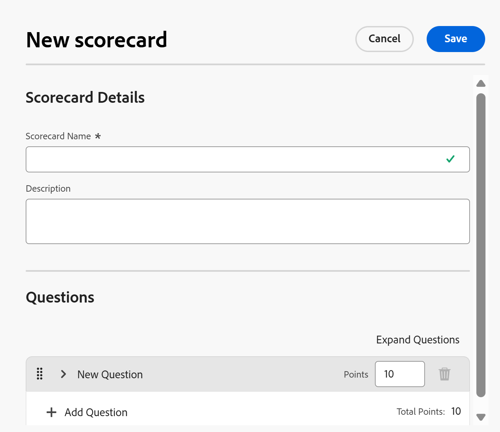

# 建立計分卡

<!--Audited: 05/2025-->

<!--DON'T DELETE, DRAFT OR HIDE THIS ARTICLE. IT IS LINKED TO THE PRODUCT, THROUGH THE CONTEXT SENSITIVE HELP LINKS.-->

<!--The highlighted information on this page refers to functionality not yet generally available. It is available only in the Preview environment for all customers. The same features will also be available in the Production environment for all customers after a week from the Preview release.    

For more information, see [Interface modernization](/help/quicksilver/product-announcements/product-releases/interface-modernization/interface-modernization.md). -->

計分卡可測量專案與專案組合先前建立之條件的符合程度。 計分卡通常可反映組織的使命、價值和策略目標。

作為投資組合經理，您可以定義計分卡問題和答案，以確保它們在專案優先順序化和選擇期間具有意義和價值。

作為[!DNL Adobe Workfront]管理員，您可以根據投資組合經理的建議建立計分卡。

為計分卡選擇的問題和答案必須可量化，以便提供可比較不同專案的對齊值。

您可以透過下列方式建立計分卡：

* 從頭開始
* 透過複製現有的一個

## 存取需求

+++ 展開以檢視本文中功能的存取需求。

<table style="table-layout:auto"> 
 <col> 
 <col> 
 <tbody> 
  <tr> 
   <td role="rowheader">[!DNL Adobe Workfront] 計畫*</td> 
   <td> 
新增： Ultimate

   
目前： [!UICONTROL Business]或更高版本
 
   </td> 
  </tr> 
  <tr> 
   <td role="rowheader">[!DNL Adobe Workfront] 授權*</td> 
   <td>
新增：[!UICONTROL Standard]

   
目前： [!UICONTROL 計畫]

   </td> 
  </tr> 
   <tr> 
   <td role="rowheader">
存取層級
</td> 
   <td>
系統管理員

   </td> 
  </tr>
 </tbody> 
</table>

*如需詳細資訊，請參閱Workfront檔案中的[存取需求](/help/quicksilver/administration-and-setup/add-users/access-levels-and-object-permissions/access-level-requirements-in-documentation.md)。

+++

## 從頭開始建立計分卡

{{step-1-to-setup}}

1. 按一下&#x200B;**[!UICONTROL 計分卡]**，然後按一下&#x200B;**[!UICONTROL 新增計分卡]**。

   **新計分卡**&#x200B;方塊開啟。

   

1. 指定&#x200B;**[!UICONTROL 計分卡名稱]**&#x200B;和&#x200B;**[!UICONTROL 描述]**。

   將計分卡與專案建立關聯時，會顯示名稱。 說明會顯示在計分卡清單中的計分卡名稱旁。

1. 按一下&#x200B;**[!UICONTROL 新增問題]**&#x200B;下拉式功能表，開啟[!UICONTROL 計分卡問題]區段，然後指定您問題的下列資訊：

   <table style="table-layout:auto"> 
    <col> 
    <col> 
    <tbody> 
     <tr> 
      <td role="rowheader">[!UICONTROL Question]</td> 
      <td>輸入您要納入計分卡中的問題。</td> 
     </tr> 
     <tr> 
      <td role="rowheader">[!UICONTROL 點]</td> 
      <td>輸入此問題的最大可能分數。</td> 
     </tr> 
     <tr> 
      <td role="rowheader">[!UICONTROL 負點]</td> 
      <td>選取此選項以指出[!DNL Workfront]應該從總可能點數中減去。 負分無法新增到計分卡的最大可能點數。</td> 
     </tr> 
     <tr> 
      <td role="rowheader">[!UICONTROL 顯示型別]</td> 
      <td>如果您想要在計分卡中顯示數值欄位，讓使用者可指定介於0到100之間的任何值，請選取<strong>[!UICONTROL Value(0-100)]</strong>。
或者，選取<strong>[!UICONTROL 下拉式清單]</strong>或<strong>[!UICONTROL 選項按鈕]</strong>，以建立使用者可使用該控制項指定的答案。 按一下<strong>[!UICONTROL 新增答案]</strong>，然後輸入此答案的<strong>[!UICONTROL 值]</strong> （以百分點為單位），以備回應完成。 如果您選擇100%，則會完全達到分配給此問題的點數。 如果您要指出此答案只包含分配給此問題的總點數的一部分，請選取較低的百分比值。 例如，如果您的問題值是10點，而您想要此答案攜帶其中5點，請為您的值選擇50%。

      
如果您要指出此答案為預設答案，請選取<strong>[!UICONTROL 預設值]</strong>。</strong>

     </tr> 
    </tbody> 
   </table>

1. 按一下&#x200B;**[!UICONTROL 新增問題]**，依照相同步驟將更多問題和答案新增至您的計分卡。

   >[!NOTE]
   >
   >您可以依照正確順序拖放問題，重新排序計分卡中的問題。

1. 按一下「**[!UICONTROL 儲存]**」。

   這會建立計分卡，專案經理現在可以將其附加至其專案業務案例。

## 複製現有計分卡

您可以複製並編輯現有的計分卡，藉此建立計分卡。

{{step-1-to-setup}}

1. 按一下左側面板中的&#x200B;**[!UICONTROL 計分卡]**。
1. 在清單中選取計分卡，然後按一下計分卡清單頂端的&#x200B;**複製**&#x200B;圖示。

   **複製計分卡**&#x200B;方塊開啟。

   

1. 指定下列資訊：

   * **計分卡**：更新計分卡的名稱。  依預設，名稱會根據下列格式自動更新：

     `Original scorecard name (Copy)`
   * **描述**：輸入計分卡的其他資訊。
1. 按一下「**儲存**」。

   這會建立新的計分卡，其資訊與原始計分卡相同。 專案經理現在可以將它附加至其專案業務案例中。

## 將計分卡套用至專案

具有[!UICONTROL 管理]專案許可權的使用者可以在[!DNL Workfront]管理員建立計分卡後，將計分卡套用至專案。

計分卡會新增至專案，作為建立專案業務案例的一部分。 如需將計分卡新增至專案的詳細資訊，請參閱[將計分卡套用至專案並產生一致性分數](../../../manage-work/projects/define-a-business-case/apply-scorecard-to-project-to-generate-alignment-score.md)。

如需有關專案許可權的詳細資訊，請參閱[在 [!DNL Adobe Workfront]](../../../workfront-basics/grant-and-request-access-to-objects/share-a-project.md)中共用專案。

