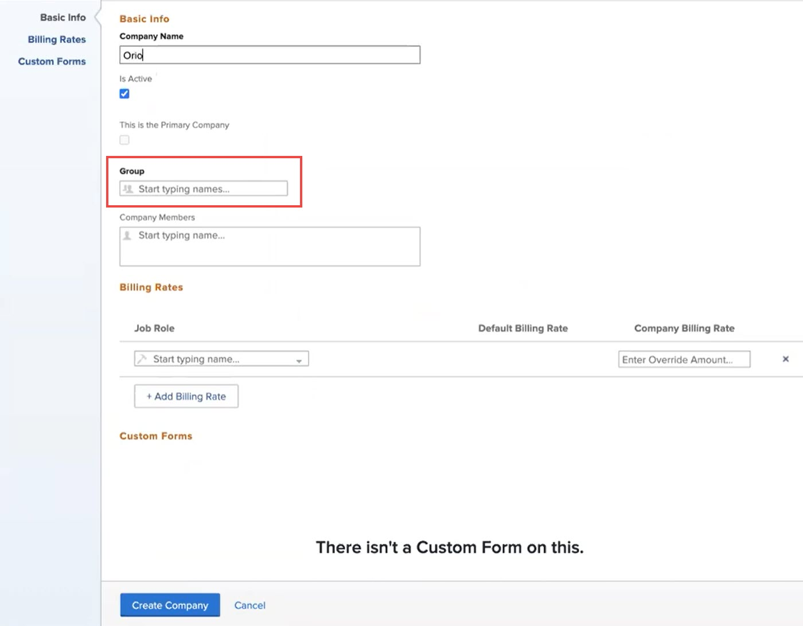

# 建立和編輯公司

<!--DON'T DELETE, DRAFT OR HIDE THIS ARTICLE. IT IS LINKED TO THE PRODUCT, THROUGH THE CONTEXT SENSITIVE HELP LINKS.-->

公司是 [!DNL Adobe Workfront] 可代表您的組織、組織內的部門，或您所合作的客戶。 您可以將公司新增至 [!DNL Workfront] 並將它們用於財務規劃、報告、定義對象的權限以及保密資訊。

## 存取需求

您必須具備下列條件，才能在 [!DNL Workfront]:

<table style="table-layout:auto"> 
 <col data-mc-conditions=""> 
 <col data-mc-conditions=""> 
 <tbody> 
  <tr> 
   <td role="rowheader"> 
[!DNL Workfront] 計劃*
 </td> 
   <td>[!UICONTROL團隊]或更高版本</td> 
  </tr> 
  <tr> 
   <td role="rowheader"> 
[!DNL Adobe Workfront] 授權*
 </td> 
   <td>[!UICONTROL計畫]</td> 
  </tr> 
  <tr data-mc-conditions=""> 
   <td role="rowheader">訪問級別配置*</td> 
   <td> 
下列其中一項：
 
    <ul> 
     <li> 
[!UICONTROL系統管理員]存取級別，允許您編輯系統中的任何公司。 如需詳細資訊，請參閱 <a href="../../../administration-and-setup/add-users/configure-and-grant-access/grant-a-user-full-administrative-access.md" class="MCXref xref">授予使用者完整的管理存取權</a>. 
 </li> 
     <li> 
對管理公司的管理存取，允許您編輯系統中的任何公司。 如需詳細資訊，請參閱 <a href="../../../administration-and-setup/add-users/configure-and-grant-access/grant-users-admin-access-certain-areas.md" class="MCXref xref">授予用戶對特定區域的管理訪問權限</a>.
 </li> 
    </ul> 
<b>附註</b>:  
     <ul> 
      <li> 
您也可以管理與任何群組相關聯的公司，而您在這些群組中被指派為群組管理員。
 </li> 
      <li> 
若要新增至，並從 [!DNL Workfront] 系統，您必須具備下列其中一項：
 
       <ul> 
        <li> 
[!UICONTROL系統管理員]訪問級別。 如需詳細資訊，請參閱 <a href="../../../administration-and-setup/add-users/configure-and-grant-access/grant-a-user-full-administrative-access.md" class="MCXref xref">授予使用者完整的管理存取權</a>. 
 </li> 
        <li> 
在訪問級別中，必須為[!UICONTROL用戶]設定選擇[!UICONTROL編輯]。 此外，對於[!UICONTROL用戶]設定，在[!UICONTROL微調您的設定]下  ，必須啟用[!UICONTROL建立]選項和兩個[!UICONTROL用戶管理]選項中的至少一個。 
 
  
 
如果您使用「[!UICONTROL用戶管理員（組用戶）]」選項，則必須是用戶所屬組的組管理員。
 </li> 
       </ul> 
如需存取層級中「使用者」設定的相關資訊，請參閱 <a href="../../../administration-and-setup/add-users/configure-and-grant-access/grant-access-other-users.md" class="MCXref xref">授予使用者存取權</a>.
 </li> 
     </ul> 
 </td> 
  </tr> 
 </tbody> 
</table>

&#42;要了解您擁有的計畫、許可類型或訪問級別配置，請與 [!DNL Workfront] 管理員。

## 將使用者新增至公司的好處 {#benefits-of-adding-users-to-a-company}

* 您可以將使用者與直接報表建立關聯，借此建立公司的組織圖表。 只能將來自相同公司的使用者新增為該公司其他使用者的直接報表。
* 身為專案經理，您可以識別同一公司內的可用資源。
* 您可以選擇下列任一或所有設定，讓公司間的資訊保持隱私：

   * 來自相同公司的使用者可以看見彼此的請求。

      如需 [!DNL Workfront] 管理員可以根據使用者的公司提供類似請求的存取權，請參閱區段 [為 [!DNL Workfront]](../../../administration-and-setup/set-up-workfront/configure-system-defaults/set-task-issue-preferences.md#changing-task-and-issue-preferences) 在文章中 [配置全系統任務和問題首選項](../../../administration-and-setup/set-up-workfront/configure-system-defaults/set-task-issue-preferences.md).

      如需群組管理員如何根據使用者的公司給予請求類似存取權限的詳細資訊，請參閱 [配置組的任務和問題首選項](../../../administration-and-setup/manage-groups/create-and-manage-groups/configure-task-issue-preferences-group.md).

   * 使用者只能看見與其公司相關聯的請求佇列。 如需限制請求佇列可見性的詳細資訊，請參閱 [提供對請求隊列的訪問](../../../manage-work/requests/create-and-manage-request-queues/provide-access-to-request-queues.md).
   * 您可以限制使用者只能查看其公司、公司和主要公司中的使用者。 如需有關使用者隱私權的主要公司功能資訊，請參閱 [建立或修改自訂存取層級](../../../administration-and-setup/add-users/configure-and-grant-access/create-modify-access-levels.md).
   * 使用者只能限制對公司使用者可見的項目進行更新。 如需將更新設為公司專用的詳細資訊，請參閱 [更新工作](../../../workfront-basics/updating-work-items-and-viewing-updates/update-work.md).

## 在中建立或編輯公司 [!DNL Workfront] {#create-or-edit-a-company-in-workfront}

可新增的公司數量沒有限制。 但是，我們建議由於對象權限可能發生的問題而限制您使用的公司數量 — 過多的碎片可能會干擾用戶對工作項目的可見性。

依預設，與您的例項相關聯的公司 [!DNL Workfront] 已在 [!DNL Workfront] 系統，是貴組織的主要公司。 其名稱與您的客戶名稱相同。 如需客戶資訊的詳細資訊，請參閱 [!DNL Workfront]，請參閱 [配置系統的基本資訊](../../../administration-and-setup/get-started-wf-administration/configure-basic-info.md).

若要新增或編輯公司：

1. 按一下 **[!UICONTROL 主菜單]** 圖示  在 [!DNL Adobe Workfront]，然後按一下 **[!UICONTROL 設定]** .

1. 按一下 **[!UICONTROL 公司]**.
1. 如果您要新增公司，請按一下 **[!UICONTROL 新公司]**.

   或

   如果您正在編輯現有公司，請選取公司，然後按一下 **[!UICONTROL 編輯]**.

1. 使用顯示的選項來設定下列資訊：

   <table style="table-layout:auto"> 
    <col> 
    <col> 
    <tbody> 
     <tr> 
      <td role="rowheader">[!UICONTROL基本資訊]部分</td> 
      <td> 
       <ul> 
        <li> 
<b>[!UICONTROL公司名稱]</b>:輸入公司的名稱。
 </li> 
        <li> 
<b>[!UICONTROL處於活動狀態]</b>:啟用此選項後，使用者可以找到公司，並將其附加至他們建立和編輯的專案。 非活動公司無法附加至專案。 預設會啟用此選項。
 </li> 
        <li> 
<b>[!UICONTROL這是主要公司]</b>:將公司指派為您組織的主要公司。 主要公司通常代表您的 [!DNL Workfront] 帳戶。
 
您可以有一個公司或沒有指定為主要公司的公司，但不能有多個公司指定為主要公司。 如需詳細資訊，請參閱 <a href="../../../administration-and-setup/add-users/configure-and-grant-access/create-modify-access-levels.md" class="MCXref xref">建立或修改自訂存取層級</a>.
 
<b>注意</b>:通過修改其訪問級別，您可以限制用戶查看其他用戶：僅在其主要公司中，或在其關聯公司和主要公司中。 如需主要公司如何搭配使用者的存取層級運作的相關資訊，請參閱 <a href="../../../administration-and-setup/add-users/configure-and-grant-access/create-modify-access-levels.md" class="MCXref xref">建立或修改自訂存取層級</a>.
 </li> 
        <li> 
<b>[!UICONTROL組]</b>:如果有與公司有業務往來的組，您可以在此處添加組的名稱。 這對於需要報告及管理其群組從事業務之所有公司的群組管理員非常有用。
 
<b>重要</b>:如果您未關聯將與此公司合作的組，則組的管理員將無法訪問，除非他們在其訪問級別中對公司具有管理訪問權限。 如需如何授予此存取權的詳細資訊，請參閱 <a href="../../../administration-and-setup/add-users/configure-and-grant-access/grant-users-admin-access-certain-areas.md" class="MCXref xref">授予用戶對特定區域的管理訪問權限</a>.
 
開始鍵入組名，然後按 <strong>[!UICONTROL Enter]</strong> 時顯示。
 
當您將群組指派給公司時，群組的群組管理員即可取得公司的[!UICONTROL管理]存取權。 如需詳細資訊，請參閱 <a href="#group-administrators-and-companies" class="MCXref xref">群組管理員和公司</a> 這篇文章。
 </li> 
        <li> 
<b>[!UICONTROL公司成員]</b>:新增現有使用者至公司。 通過執行此操作，您將這些用戶與此公司關聯。
 
您與一個公司建立關聯的使用者數目並無限制，但一個使用者無法與多個公司建立關聯。
 </li> 
       </ul> </td> 
     </tr> 
     <tr> 
      <td role="rowheader">[!UICONTROL計費率]部分</td> 
      <td> 
您可以在公司層改寫與職務相關聯的開單費率。 有關建立職務職責以及將其與開單費率關聯的資訊，請參閱 <a href="../../../administration-and-setup/set-up-workfront/organizational-setup/create-manage-job-roles.md" class="MCXref xref">建立和管理作業角色</a>.
 
如需關於在公司層級覆寫計費率的詳細資訊，請參閱 <a href="../../../administration-and-setup/set-up-workfront/organizational-setup/override-job-role-billing-rates-company-level.md" class="MCXref xref">在公司層改寫職務開單費率</a>.
 </td> 
     </tr> 
     <tr> 
      <td role="rowheader">[!UICONTROL自訂Forms]區段</td> 
      <td> 
如果有您要新增至公司的欄位，在 [!DNL Workfront]，您可以建立自訂表單，並將其與您的公司建立關聯。 您可以從下拉式功能表中選取此表單，將此表單附加至您的公司。 下拉式功能表中僅列出作用中的公司。 如需建立自訂Forms的相關資訊，請參閱 <a href="../../../administration-and-setup/customize-workfront/create-manage-custom-forms/create-or-edit-a-custom-form.md" class="MCXref xref">建立或編輯自訂表單</a>. 
 </td> 
     </tr> 
    </tbody> 
   </table>

1. 如果您要建立新公司，請按一下 **[!UICONTROL 建立公司]**.

   或

   如果您正在編輯現有公司，請按一下 **[!UICONTROL 儲存變更]**.

## 管理公司會籍

有關管理現有公司成員資格的資訊，請參見 [管理公司會籍](../../../administration-and-setup/set-up-workfront/organizational-setup/manage-company-memberships.md).

## 關於與公司共用物件

與公司相關聯的使用者可使用某些權限，如 [將使用者新增至公司的好處](#benefits-of-adding-users-to-a-company). 除了這些權限，您還可以允許用戶權限查看、貢獻或編輯 [!DNL Workfront] 與公司共用物件。

您可以將物件共用給其整個公司，而不是一次與個別使用者共用。 公司中的每位使用者都對該物件擁有相同的權限。

如需共用物件的詳細資訊，請參閱 [對象共用權限概述](../../../workfront-basics/grant-and-request-access-to-objects/sharing-permissions-on-objects-overview.md).

## 群組管理員和公司 {#group-administrators-and-companies}

當 [!DNL Workfront] 管理員將組分配給公司，組管理員將獲得 [!UICONTROL 管理] 在 [!UICONTROL 設定]. 這包括 [!UICONTROL 公司] 頁面 [!UICONTROL 設定]，他們可在此查看和管理與其群組相關聯的公司。

透過 [!UICONTROL 公司] 頁面，群組管理員可將群組指派給公司，但必須是群組管理員建立的公司。 如果群組管理員的存取層級未設定公司的管理存取權，則 [!UICONTROL 群組] 當組管理員建立公司時，欄位是必填欄位 — 其粗體標題表示：

如需有關使用者如何在其存取層級取得公司的管理存取權的詳細資訊，請參閱 [授予用戶對特定區域的管理訪問權限](../../../administration-and-setup/add-users/configure-and-grant-access/grant-users-admin-access-certain-areas.md).

如需在 [!UICONTROL 設定] 區域，請參閱 [在中建立或編輯公司 [!DNL Workfront]](#create-or-edit-a-company-in-workfront) 這篇文章。
