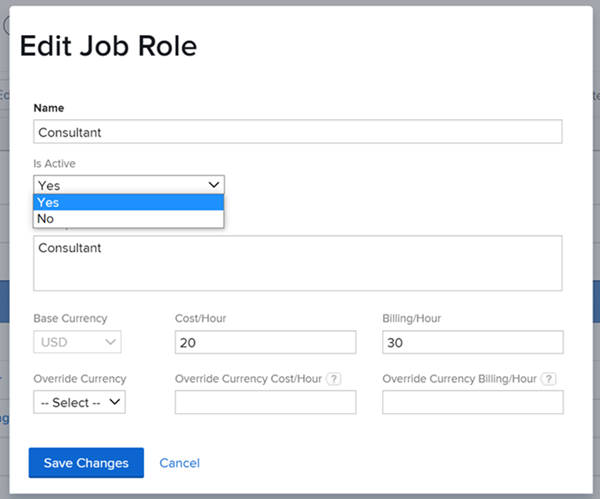

# 停用職位角色

作為[!DNL Adobe Workfront]管理員或具有工作角色管理存取許可權的使用者，您可以停用系統中已作廢的工作角色。 當您停用而非刪除工作角色時，您可以保留與其相關聯的任何歷史資訊。

您也可以重新啟用先前已停用的工作角色。

## 存取需求

您必須具備下列條件：

<table style="table-layout:auto"> 
 <col> 
 <col> 
 <tbody> 
  <tr> 
   <td role="rowheader">[！UICONTROL Adobe Workfront]計畫*</td> 
   <td> 
任何 
 </td> 
  </tr> 
  <tr> 
   <td role="rowheader">[！UICONTROL Adobe Workfront]授權*</td> 
   <td>[！UICONTROL計畫]</td> 
  </tr> 
  <tr> 
   <td role="rowheader">存取層級設定*</td> 
   <td> 
職位角色的管理存取權
 
<b>注意</b>：如果您仍然沒有存取權，請詢問您的[!DNL Workfront]管理員是否對您的存取層級設定了其他限制。 如需[!DNL Workfront]管理員如何修改存取層級的詳細資訊，請參閱<a href="../../../administration-and-setup/add-users/configure-and-grant-access/create-modify-access-levels.md" class="MCXref xref">建立或修改自訂存取層級</a>。
 </td> 
  </tr> 
 </tbody> 
</table>

&#42;若要瞭解您擁有的計畫、授權型別或存取權，請連絡您的[!DNL Workfront]管理員。

## 停用工作角色的影響

如果您停用工作角色，它不再顯示於以下區域：

* [!UICONTROL 工作總攬]預先輸入欄位（用於任務、範本任務、問題、核准和路由規則）
* 清單和報告中的[!UICONTROL 工作總攬]欄位
* 使用者設定檔

  >[!NOTE]
  >
  >當您將新角色新增到使用者時，停用的工作角色不顯示。 但如果使用者在停用工作角色之前與工作角色相關聯，則它仍會顯示在[!UICONTROL 主要角色]和[!UICONTROL 其他角色]欄位中。

* 物件的[!UICONTROL 共用]對話方塊，包括配置範本指派
* 自訂表單中的預先輸入欄位
* [!UICONTROL 資源集區]中的[!UICONTROL 集區成員]欄位
* 當使用者覆寫專案的計費費率時，[!UICONTROL 計費費率]編輯畫面的[!UICONTROL 工作角色]欄位
* 專案中的[!UICONTROL 新增指派至Kanban面板]對話方塊
* 當有人使用[!DNL Adobe Workfront Scenario Planner]時，計畫或方案的[!UICONTROL 工作角色]欄位。

  [!DNL Scenario Planner]僅在新的[!DNL Adobe Workfront]體驗中可用，而且需要額外的授權。 如需[!DNL Workfront Scenario Planner]的相關資訊，請參閱[ [!DNL Scenario Planner] 概觀](../../../scenario-planner/scenario-planner-overview.md)。

>[!TIP]
>
>已停用的角色一律顯示在清單、報告和其他工具（例如[!UICONTROL 工作負載平衡器]）的篩選器中。

## 停用工作角色之前的考量事項

最好是停用工作角色，而非刪除已過時的工作角色，這樣您就可以保留與您過去可能使用過的角色相關的所有歷史資訊。

>[!NOTE]
>
>在停用之前指派給工作角色的任何工作都會維持指派狀態。

建議您先執行下列動作，再停用未使用的工作角色：

* 針對指派給您計畫停用的角色的任何物件建立報告，並將其重新指派給作用中的工作角色。 如需建立報表的相關資訊，請參閱[建立報表](../../../reports-and-dashboards/reports/creating-and-managing-reports/create-report.md)。

  >[!TIP]
  >
  >您可以建立報告，以篩選已停用角色獲指派的任何任務或問題。 然後使用報告將未完成的任務或問題重新指派給作用中的角色。

* 針對您計畫停用的工作角色，盤點所有核准程式、目前核准路徑、製程規則或其他物件，並將它們重新指派給有效角色。

  >[!TIP]
  >
  >使用請求佇列時，如果您停用在路由規則中指派為預設受指派人的職務角色，角色會保留，請求仍會路由至已停用的角色。 建議您先以作用中角色更新路由規則，再停用專案團隊。

  如需有關建立核准程式與路由規則的資訊，請參閱下列文章：

   * [建立工作專案的核准流程](../../../administration-and-setup/customize-workfront/configure-approval-milestone-processes/create-approval-processes.md)
   * [建立路由規則](../../../manage-work/requests/create-and-manage-request-queues/create-routing-rules.md)

## 停用工作角色

1. 按一下[!DNL Adobe Workfront]右上角的&#x200B;**[!UICONTROL 主要功能表]**&#x200B;圖示，然後按一下&#x200B;**[!UICONTROL 設定]** 。

1. 在左側面板中，按一下&#x200B;**[!UICONTROL 工作角色].**
1. （選擇性）在&#x200B;**[!UICONTROL 篩選器]**&#x200B;下拉式功能表中，選取&#x200B;**[!UICONTROL 作用中]**&#x200B;以僅顯示作用中的工作角色。
1. 按一下要停用的工作角色名稱。
1. 在&#x200B;**[!UICONTROL 為使用中]**&#x200B;下拉式功能表中，選取&#x200B;**[!UICONTROL 否]**。

   

1. 按一下「**[!UICONTROL 儲存變更]**」。

   工作角色已停用，無法再指派給工作、與版面配置範本關聯等。 如需[!DNL Workfront]中所有工作角色使用的相關資訊，請參閱[工作角色總覽](../../../administration-and-setup/set-up-workfront/organizational-setup/job-role-overview.md)。
