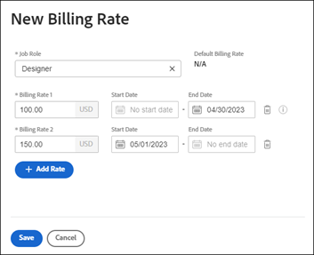

# 覆寫公司層級的工作角色收費率

{{preview-fast-release-general}}

建立職務角色時，您可以選擇選取該角色的每小時收費率。 您可以建立公司特定的多個每小時收費率。 每個收費率在特定日期範圍內有效。

在專案層次，您可以啟用允許公司層次收費率覆寫專案層次費率的選項。 如需詳細資訊，請參閱[以公司層級的收費率覆寫專案層級的收費率](../../../manage-work/projects/project-finances/override-project-level-with-company-level-billing-rates.md)。

## 存取權要求

+++ 展開以檢視這篇文章中所述功能的存取權要求。

<table style="table-layout:auto"> 
 <col> 
 <col> 
 <tbody> 
  <tr> 
   <td>[!DNL Adobe Workfront] 封裝</td> 
   <td>
若要將費率屬性新增至公司層級的收費率：工作流程Ultimate

       
若要建立公司層級的收費率並編輯所有其他費率設定：任何Workfront或Workflow套件
</td> 
  </tr> 
  <tr> 
   <td>[!DNL Adobe Workfront] 授權</td> 
   <td>
[！UICONTROL標準]

       
[！UICONTROL計畫]
</td>
  </tr> 
  <tr> 
   <td>存取層級設定</td> 
   <td> 
如果您不是系統管理員，可以管理對公司的存取權

   
編輯財務資料的存取權
 </td>
  </tr> 
 </tbody> 
</table>

如需詳細資訊，請參閱Workfront檔案中的[存取需求](/help/quicksilver/administration-and-setup/add-users/access-levels-and-object-permissions/access-level-requirements-in-documentation.md)。

+++

## 覆寫或變更用於特定工作角色的已建立收費率

{{step-1-to-setup}}

1. 按一下&#x200B;**[!UICONTROL 公司]**。
1. 找出指派工作角色的公司。
1. 按一下清單中的公司名稱。
1. 按一下左側面板中的&#x200B;**[!UICONTROL 收費率]**。
1. 按一下&#x200B;**[!UICONTROL 新增收費率] > [!UICONTROL 新增收費率]**，或&#x200B;**新增收費率**。
1. 在[!UICONTROL 新收費率]對話方塊中，選取&#x200B;[!UICONTROL **工作角色**]&#x200B;以定義收費率。

### 在生產環境中：

[!UICONTROL **預設收費率**]&#x200B;會顯示此工作角色的系統層級費率。

1. 在&#x200B;[!DNL **收費率1**]&#x200B;欄位中，輸入收費率。 然後，按一下[儲存][!UICONTROL **一次覆寫收費率。**]

   或

   按一下&#x200B;[!UICONTROL **新增費率**]&#x200B;以新增更多具有有效日期的計費費率。

1. （視條件而定）如果您要新增多個收費率，請輸入下列資訊：

   * **[!UICONTROL 記帳費率1]、2等。**：時間週期的記帳費率值。
   * **[!UICONTROL 開始日期]**：費率生效的日期。
   * **[!UICONTROL 結束日期]**：費率結束的日期。

     帳單費率1不會有開始日期，而最後的帳單費率不會有結束日期。 部分日期會自動新增。 例如，如果「帳單費率1」沒有結束日期，而您新增了開始日期為2023年5月1日的「帳單費率2」，則會在「帳單費率1」中新增結束日期為2023年4月30日的「帳單費率2」，因此不會有間隙。

1. 按一下「[!UICONTROL **儲存**]」。

   >[!NOTE]
   >
   >專案上工作角色費率變更只會影響該專案。 公司層級變更的費率將影響所有專案。 如需詳細資訊，請參閱[覆寫帳單費率與計算專案收入的總覽](/help/quicksilver/manage-work/projects/project-finances/override-role-billing-rates-and-calculate-project-revenue.md)。

### 在預覽環境中：

1. 選取費率屬性，例如「代理商」、「地點」或「成本中心」。

   這些屬性會個別定義，可能會影響收入和成本的計算。 如需詳細資訊，請參閱[定義費率屬性](/help/quicksilver/administration-and-setup/manage-enterprise-operations/define-rate-attributes.md)。

   

1. 選取匯率的&#x200B;**貨幣**。 Workfront管理員會在「設定」區域中新增基本貨幣。 您可以將選取專案變更為其他可用貨幣，也可以變更有效日期時間範圍內的貨幣。

   >[!TIP]
   >
   >此欄位僅提供您系統中「匯率」區域中可用的貨幣。 如果您只設定一種貨幣，則只能使用該貨幣。

   如需有關在Workfront中設定基本貨幣的資訊，請參閱[設定匯率](/help/quicksilver/administration-and-setup/manage-workfront/exchange-rates/set-up-exchange-rates.md)。

   如需有關變更專案貨幣的資訊，請參閱[變更專案貨幣](/help/quicksilver/manage-work/projects/project-finances/change-project-currency.md)。

1. 在&#x200B;[!DNL **收費率**]&#x200B;欄位中，輸入工作角色的收費率。

   這是工作角色的每小時收費率。 此值會計算與角色相關之任務和問題的計畫和實際收入，最終是專案的計畫和實際收入。 使用選取的幣別輸入匯率。

   如果您使用屬性，則屬性和職務角色會結合以定義唯一費率。 例如，代理商A在紐約的Designer角色與代理商B在巴黎的Designer角色可能有不同的費率。

   若要取得日期有效收費率，請按一下[新增日期有效費率]。**** 輸入時間期間的每小時帳單費率，並視需要指定「開始日期」與「結束日期」。 第一個收費率不會有開始日期，而最後一個收費率則不會有結束日期。

   Workfront可讓您在日期範圍之間保留間隙，但您會收到警告，確認這是刻意為之。

   如需Workfront如何計算收入的詳細資訊，請參閱[帳單與收入概觀](/help/quicksilver/manage-work/projects/project-finances/billing-and-revenue-overview.md)。

   >[!TIP]
   >
   >編輯現有費率時，您可以排序清單，在費率清單頂端檢視最近的開始日期。

1. 按一下「[!UICONTROL **儲存**]」。

   >[!NOTE]
   >
   >專案上工作角色費率變更只會影響該專案。 公司層級變更的費率將影響所有已指派公司的專案。 如需詳細資訊，請參閱[覆寫帳單費率與計算專案收入的總覽](/help/quicksilver/manage-work/projects/project-finances/override-role-billing-rates-and-calculate-project-revenue.md)。

