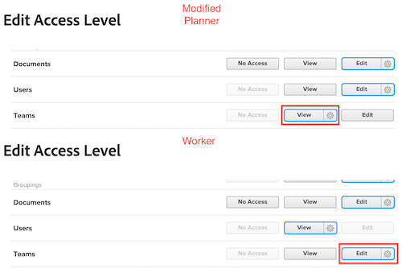

# 群組管理員的存取權必須高於其管理的

如果群組管理員的存取層級權限低於其管理的層級，他們將無法檢視、修改或指派較低的存取層級。

## 問題

如果為組管理員分配了具有「團隊」查看權限的修改計畫員訪問級別，但某些用戶分配了具有「團隊」編輯權限的工作人員訪問級別，則組管理員將無法與修改的「工作人員」訪問級別交互。

>[!NOTE]
>
>此邏輯也適用於「微調您的設定」下拉式功能表。 兩個存取層級都可以具有「編輯」存取權，但群組管理員在「微調設定」下拉式選單中的設定必須較高。
> 

## 解決方案

群組管理員在存取層級的所有區域中，必須擁有比他們管理的區域更高的權限。