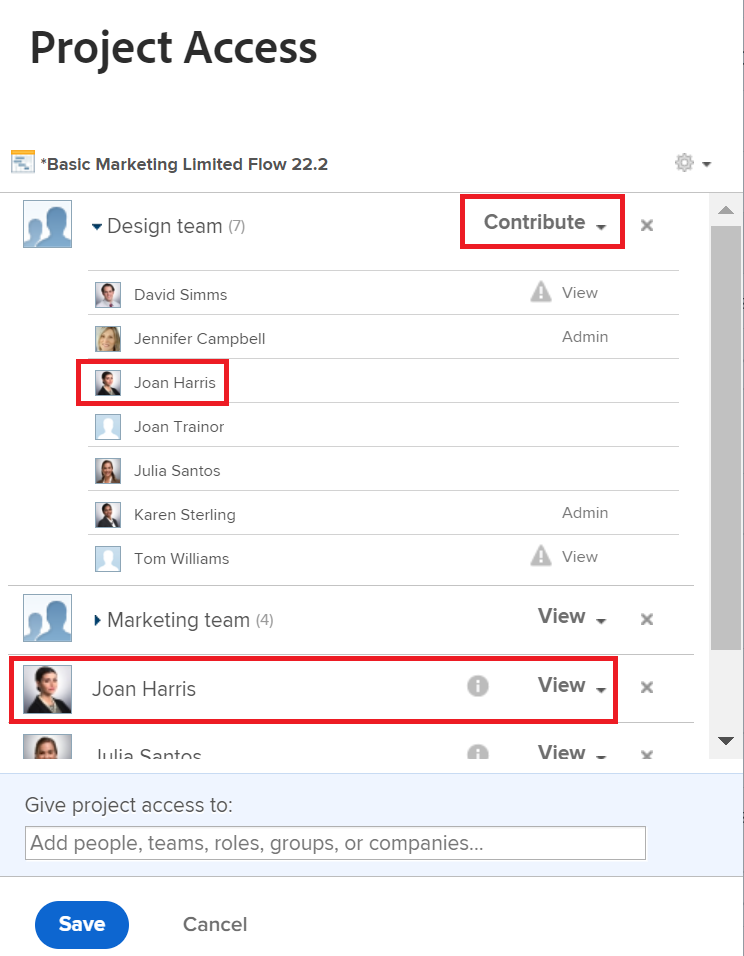

# 共用會顯示多個許可權

## 問題

「共用」視窗會顯示一個使用者的兩個不同許可權。 正在使用哪一個？

## 解答

使用者擁有共用畫面上顯示的最高許可權。 如需有關許可權的詳細資訊，請參閱文章[物件許可權共用概觀](../../workfront-basics/grant-and-request-access-to-objects/sharing-permissions-on-objects-overview.md)。

