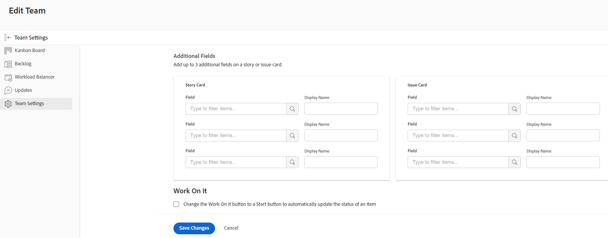
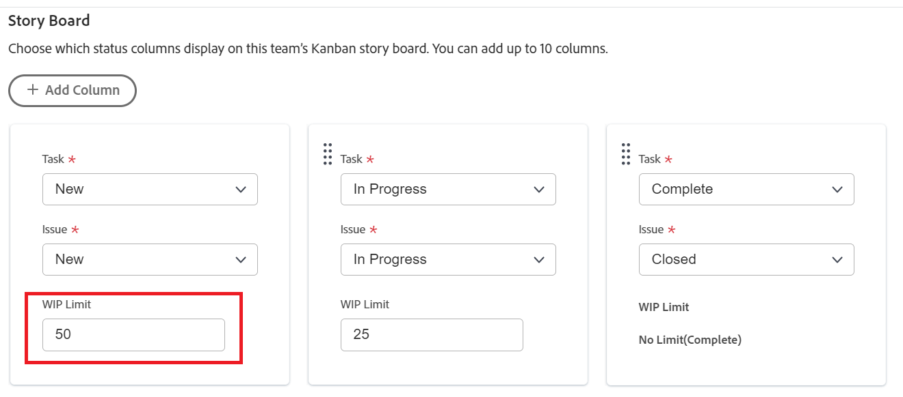

# 設定 [!UICONTROL 看板]

您可以在建立團隊期間或之後，為敏捷團隊配置下列選項。 在以下位置建立敏捷小組（看板或看板） [!DNL Adobe Workfront] 如 [建立敏捷的團隊](../../agile/get-started-with-agile-in-workfront/create-an-agile-team.md).

## 存取需求

您必須具備下列存取權，才能執行本文中的步驟：

<table style="table-layout:auto"> 
 <col> 
 </col> 
 <col> 
 </col> 
 <tbody> 
  <tr> 
   <td role="rowheader"><strong>[!DNL Adobe Workfront] 計劃*</strong></td> 
   <td> 
任何
 </td> 
  </tr> 
  <tr> 
   <td role="rowheader"><strong>[!DNL Adobe Workfront] 授權*</strong></td> 
   <td> 
[!UICONTROL工作]或更高版本
 </td> 
  </tr> 
 </tbody> 
</table>

&#42;若要了解您擁有的計畫或授權類型，請連絡您的 [!DNL Workfront] 管理員。

## 設定是以點還是小時來預估動態

您可以設定使用點或小時來預估動態。

要配置如何為您敏捷的團隊估計故事：

1. 按一下 **[!UICONTROL 主菜單]** 圖示  在 [!DNL Workfront]，然後按一下 **[!UICONTROL 團隊]**.

1. 按一下 **[!UICONTROL 交換組]** 表徵圖，然後從下拉菜單中選擇新團隊，或在搜索欄中搜索團隊。
1. 選擇要管理的敏捷團隊。
1. 按一下 **[!UICONTROL 更多]** ，然後選取 **[!UICONTROL 編輯]**.

   僅包含 [!UICONTROL 計畫] 或 [!UICONTROL 工作] 許可證請參閱此選項。\
   

1. 在 **[!UICONTROL 敏捷]** 區段中 **[!UICONTROL 預估中的動態]** 區域中，選擇是否要使用點或小時來估計文章的大小（工作負載）。 如果選擇「點」(Points)，請指定多少小時等於1點。 （預設為1點= 8小時。） 這是新增至動態的「計畫小時數」。

   **範例：** 如果您選擇以點數估計動態，而1點等於8小時，且動態估計為3點，則會在動態中新增24個計畫小時。

1. 按一下 **[!UICONTROL 儲存變更]**.

## 在敏捷動態展示板上設定狀態欄

您可以為敏捷團隊定義動態板上存在的狀態。 這些是顯示在動態板上的唯一狀態。

要定義與敏捷團隊關聯的故事板可用的狀態：

1. 按一下 **[!UICONTROL 主菜單]** 圖示  在 [!UICONTROL Workfront]，然後按一下 **[!UICONTROL 團隊]**.

1. 按一下 **[!UICONTROL 交換組]** 圖示 ，然後從下拉式選單中選取新團隊，或在搜尋列中搜尋團隊。

1. 選擇要管理的敏捷團隊。
1. 按一下 **[!UICONTROL 更多]** ，然後選取 **[!UICONTROL 編輯]**.

   僅包含 [!UICONTROL 計畫] 或 [!UICONTROL 工作] 許可證請參閱此選項。

   

1. 在 **[!UICONTROL 敏捷]** 區段，找到 **[!UICONTROL 展示板]** 的上界。

1. （選用）按一下 **[!UICONTROL 添加列]** 新增其他狀態欄至動態板。
1. （可選）使用拖放指示器拖曳任何狀態欄，以重新排序動態展示板上的狀態欄。 無法移動第一列，並且不能拖動第一列前面的另一列。

   

1. 選擇任務狀態。

   >[!IMPORTANT]
   >
   >只有鎖定的全系統狀態可供選擇；您無法選取群組特定狀態。 此外，第一欄的狀態一律對應至 **[!UICONTROL 新增]**.

   若您的 [!DNL Workfront] 管理員已配置它們；自訂狀態可依 [建立或編輯狀態](../../administration-and-setup/customize-workfront/creating-custom-status-and-priority-labels/create-or-edit-a-status.md).

1. 按一下 **[!UICONTROL 儲存變更]**.

## 設定其他欄位，以顯示在敏捷動態展示板上的動態資訊卡上

將欄位新增至動態卡片時，欄位是僅供檢視，填入欄位時則僅供顯示。

根據預設，任務和問題的動態卡片上會顯示以下類型的資料：

* 與任務或問題直接連結的動態名稱
* 具有直接連結至專案的專案名稱
* 此連結只會針對動態顯示，不會針對子工作顯示
* 任務或問題說明
* 當前承諾
* 通過調整完成百分比本身或通過調整完成的點數或小時數來查看和編輯完成百分比
* 已指派的使用者

您可以在動態卡片上顯示其他資料（包括自訂資料）。 基於任何原因，您可能想在動態卡上顯示其他欄位。 例如，如果正在迭代內為多個客戶處理動態，或想顯示「項目開始日期」或「項目完成日期」，則可能想要顯示「客戶ID」。

>[!NOTE]
>
>如果您在動態卡片上使用自訂欄位，名稱中不能包含句點/點。

要配置分配給敏捷團隊的動態資訊卡，以顯示其他欄位：

1. 按一下 **[!UICONTROL 主菜單]** 圖示  在 [!DNL Workfront]，然後按一下 **[!UICONTROL 團隊]**.

1. 按一下 **[!UICONTROL 交換組]** 圖示 ，然後從下拉式選單中選取新團隊，或在搜尋列中搜尋團隊。

1. 選擇要管理的敏捷團隊。
1. 按一下 **[!UICONTROL 更多]** ，然後選取 **[!UICONTROL 編輯]**.\
   僅包含 [!UICONTROL 計畫] 或 [!UICONTROL 工作] 許可證請參閱此選項。

   

1. 在 **[!UICONTROL 敏捷]** 區段，輸入欄位名稱以找到它。

   

1. 選取您要新增的欄位名稱。
1. 輸入 **[!UICONTROL 顯示名稱]** 讓欄位顯示在動態或發卡上。
1. 按一下 **[!UICONTROL 儲存變更]**.

## 配置在製品(WIP)限制

看板 [!DNL Workfront] 允許您通過限制在 [!UICONTROL 進行中] 欄 [!UICONTROL 看板] 展示板。

設定WIP限制時，您可以檢視WIP限制，甚至從 [!UICONTROL 看板] 敏捷故事板，如 [在 [!UICONTROL 看板] 展示板](../../agile/use-kanban-in-an-agile-team/work-in-progress-limit-on-the-kanban-board.md).

要限制看板小組的WIP，請執行以下操作：

1. 按一下 **[!UICONTROL 主菜單]** 圖示  在 [!DNL Adobe Workfront]，然後按一下 **[!UICONTROL 團隊]**.

1. 按一下 **[!UICONTROL 交換組]** 圖示 ，然後從下拉式選單中選取新團隊，或在搜尋列中搜尋團隊。

1. 選擇要管理的看板小組。
1. 按一下 **[!UICONTROL 更多]** ，然後選取 **[!UICONTROL 編輯]**.

   僅包含 [!UICONTROL 計畫] 或 [!UICONTROL 工作] 許可證請參閱此選項。

   

1. 在 **[!UICONTROL 敏捷]** 區段中 **[!UICONTROL 方法]** 部分，確保選中了「看板」。

1. 在 **[!UICONTROL 展示板]** 區段中 **[!UICONTROL WIP限制]** 欄位，指定 [!UICONTROL 看板] 敏捷的故事板。 您可以為每個欄設定不同的限制。 您可以為每欄設定的上限為100。\
   設定後，WIP限制會在 [!UICONTROL 看板] 每當超出動態板上任何欄的限制時，敏捷動態板。 此警告訊息只會在首次超過WIP限制時顯示。 任何狀態等於的欄上不會顯示此警告訊息 [!UICONTROL 完成].\
   WIP限制只是視覺警告，不會限制您的團隊在單一欄中的項目數超過您設定的限制。

   

1. 按一下 **儲存變更**.

## 配置要自動從積壓中添加的動態

您可以設定積壓工作中的動態，以自動新增至 [!UICONTROL 看板] 在項目從該欄移動後立即建立展示板。

1. 按一下 **[!UICONTROL 主菜單]** 圖示  在 [!DNL Adobe Workfront]，然後按一下 **[!UICONTROL 團隊]**.

1. 按一下 **[!UICONTROL 交換組]** 圖示 ，然後從下拉式選單中選取新團隊，或在搜尋列中搜尋團隊。

1. 選擇要管理的看板小組。
1. 按一下 **[!UICONTROL 更多]** ，然後選取 **[!UICONTROL 編輯]**.

   僅包含 [!UICONTROL 計畫] 或 [!UICONTROL 工作] 許可證請參閱此選項。

   

1. 選擇 **[!UICONTROL 自動添加積壓工作中的下一個文章]** 配置要自動從積壓中添加到 [!UICONTROL 看板] 故事板。

   每當動態移至動態展示板上代表「完成」狀態（相當於「完成」的狀態）的欄時，就會發生此情況。 從積壓中添加時，優先順序最高的主題將添加到主題板上。選擇此選項可配置積壓中的下一個項目，以便自動添加到 **[!UICONTROL 進行中]** 欄 **[!UICONTROL 進行中]** 欄。

1. 按一下 **[!UICONTROL 儲存變更]**.

## 設定卡片在 [!UICONTROL 看板] 展示板

您可以選擇完成的卡片在 [!UICONTROL 看板] 展示板。 流失的任務 [!UICONTROL 看板] 您仍可在其原始專案中存取展示板。

1. 按一下 **[!UICONTROL 主菜單]** 圖示  在 [!DNL Adobe Workfront]，然後按一下 **[!UICONTROL 團隊]**.

1. （選用）按一下 **[!UICONTROL 交換組]** 圖示 ，然後從下拉菜單中選擇新看板組，或在搜索欄中搜索組。
1. 選擇看板組。
1. 按一下 **[!UICONTROL 更多]** ，然後選取 **Edit**.

   僅包含 [!UICONTROL 計畫] 或 [!UICONTROL 工作] 許可證請參閱此選項。

   

1. 在 **[!UICONTROL 已完成的卡在看板板上停留的天數]** 下拉式功能表中，選取值。
1. 按一下 **[!UICONTROL 儲存變更]**.
