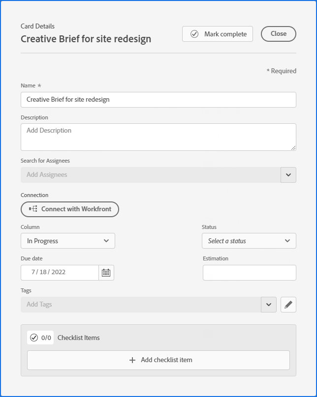

# 新增臨機卡至展示板

您可以快速將資訊卡新增至展示板，並指派給展示板上的成員。 此卡片可代表任務、問題、人員、群組，或您要加入展示板的任何類型的項目。

>[!NOTE]
>
>展示板上的臨機卡未連接到 [!DNL Adobe Workfront]. 有關已連接卡的詳細資訊，請參閱 [在主板上使用連接的卡](/help/quicksilver/agile/get-started-with-boards/connected-cards.md).

## 存取需求

您必須具備下列存取權，才能執行本文中的步驟：

<table style="table-layout:auto"> 
 <col> 
 </col> 
 <col> 
 </col> 
 <tbody> 
  <tr> 
   <td role="rowheader"><strong>[!DNL Adobe Workfront] 計劃*</strong></td> 
   <td> 
任何
 </td> 
  </tr> 
  <tr> 
   <td role="rowheader"><strong>[!DNL Adobe Workfront] 授權*</strong></td> 
   <td> 
[!UICONTROL Request]或更高版本
 </td> 
  </tr> 
 </tbody> 
</table>

&#42;若要了解您擁有的計畫、授權類型或存取權，請聯絡您的 [!DNL Workfront] 管理員。

## 新增具有完整詳細資料的臨機卡

臨機卡未連接到 [!DNL Adobe Workfront].

1. 按一下 **[!UICONTROL 主菜單]** 圖示  在 [!DNL Adobe] Workfront，然後按一下 **[!UICONTROL 展示板]**.
1. 存取展示板。 如需詳細資訊，請參閱 [建立或編輯展示板](../../agile/get-started-with-boards/create-edit-board.md).
1. 按一下 **[!UICONTROL 新增卡片] > [!UICONTROL 新卡片]**.
1. 在 **[!UICONTROL 卡片詳細資訊]** 框中，添加以下資訊：

   <table style="table-layout:auto"> 
    <col> 
    <col> 
    <tbody> 
     <tr> 
      <td role="rowheader"><strong>[!UICONTROL名稱]</strong> </td> 
      <td>卡片的名稱。</td> 
     </tr> 
     <tr> 
      <td role="rowheader"><strong>[!UICONTROL描述]</strong> </td> 
      <td>卡片的說明。</td> 
     </tr> 
     <tr> 
      <td role="rowheader"><strong>[!UICONTROL受分配者]</strong> </td> 
      <td> 
若要指派資訊卡，請開始在搜尋欄位中輸入名稱，然後在資訊卡顯示於清單時加以選取。 您可以新增個人和團隊，並且可以指派多個人員或團隊至資訊卡。
 
受分配者必須是板上的成員，否則他們不會出現在選擇清單中。 當團隊是展示板上的成員時，可將個別團隊成員指派給資訊卡。
</td>
     </tr> 
     <tr> 
      <td role="rowheader"><strong>[!UICONTROL列]</strong> </td> 
      <td>選取卡片的欄。 如果您離開 <strong>[!UICONTROL列]</strong> 欄位空白時，卡片會放置在展示板左側的第一欄中。</td>
     </tr>
     <tr> 
      <td role="rowheader"><strong>[!UICONTROL狀態]</strong> </td> 
      <td>選取卡片的狀態。 如果您按一下 <strong>[!UICONTROL標籤完成]</strong> 在卡片頂端，狀態會自動變更為[!UICONTROL完成]。</td> 
     </tr>
     <tr> 
      <td role="rowheader"><strong>[!UICONTROL估計]</strong></td> 
      <td>鍵入卡完成的預計小時數。 這只是手動輸入。</td>
     </tr>
     <tr> 
      <td role="rowheader"><strong>[!UICONTROL到期日]</strong></td> 
      <td>選擇卡的到期日。 </td>
     </tr>
     <tr> 
      <td role="rowheader"><strong>[!UICONTROL標籤]</strong></td> 
      <td>搜尋並選取卡片的標籤。 如需建立新標籤的詳細資訊，請參閱 <a href="../../agile/get-started-with-boards/add-tags.md" class="MCXref xref">新增標籤</a>.</td> 
     </tr>  
     <tr> 
      <td role="rowheader"><strong>[!UICONTROL檢查清單項]</strong> </td> 
      <td> 
按一下 <strong>[!UICONTROL添加檢查清單項]</strong>. 然後，鍵入項目的標題，然後按Enter鍵。 系統會自動新增另一個項目。 繼續輸入標題以添加更多項。
 
核對清單頂端的計數器會顯示已完成項目的數量和項目總數。
 
如需檢查清單項目的詳細資訊，請參閱 <a href="/help/quicksilver/agile/get-started-with-boards/manage-checklist-items.md">管理卡上的檢查清單項目</a>.
 </td> 
     </tr> 
    </tbody> 
   </table>

   

1. 按一下 **[!UICONTROL 關閉]** 將資訊卡新增至展示板。

   卡片上會顯示受分配者、標籤、到期日、檢查清單計數器、預計小時數和狀態。

## 快速新增臨機卡

您可以新增只有標題的臨機資訊卡，以快速填入展示板。

1. 存取您要新增資訊卡的展示板。
1. 按一下 **[!UICONTROL 新增]** 圖示  在要新增資訊卡的欄上。
1. 鍵入卡名並按Enter鍵。

   新卡的下方會自動新增另一張卡。

1. 繼續輸入卡片名稱以新增更多卡片。
1. 若要停止新增資訊卡，請按一下欄外部。
1. 若要新增更多詳細資訊，您必須編輯資訊卡。 如需詳細資訊，請參閱 [編輯現有的資訊卡](#edit-an-existing-card) 這篇文章。

## 編輯現有的資訊卡 {#edit-an-existing-card}

1. 進入展示板。
1. 按一下卡片名稱以編輯名稱。
1. 若要編輯卡片詳細資訊，請按一下卡片（而非卡片名稱中）。

   或

   按一下 **[!UICONTROL 更多]** 功能表 ![[!UICONTROL 更多功能表]](assets/more-icon-spectrum.png) 在「 」卡片上，然後選取 **[!UICONTROL 編輯]**.

1. 在 [!UICONTROL 卡片詳細資訊] 框中，視需要更新資訊，然後按一下 **[!UICONTROL 關閉]** 回到董事會。

   如果您已啟用欄位原則來更新欄位值，變更卡片上的狀態會自動將卡片移至對應的欄。 如需詳細資訊，請參閱文章中的「定義欄設定和原則」 [管理展示板欄](/help/quicksilver/agile/get-started-with-boards/manage-board-columns.md).
