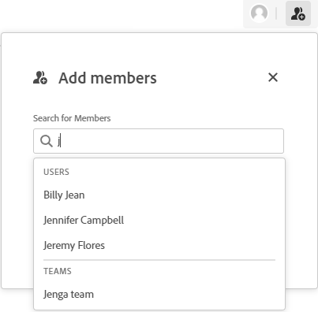

# 從展示板新增或移除成員

必須先將人員和團隊新增至展示板，才能檢視展示板並指派給資訊卡。

## 存取需求

您必須具備下列存取權，才能執行本文中的步驟：

<table style="table-layout:auto"> 
 <col> 
 </col> 
 <col> 
 </col> 
 <tbody> 
  <tr> 
   <td role="rowheader"><strong>[!DNL Adobe Workfront] 計劃*</strong></td> 
   <td> 
任何
 </td> 
  </tr> 
  <tr> 
   <td role="rowheader"><strong>[!DNL Adobe Workfront] 授權*</strong></td> 
   <td> 
[!UICONTROL Request]或更高版本
 </td> 
  </tr> 
 </tbody> 
</table>

&#42;若要了解您擁有的計畫、授權類型或存取權，請聯絡您的 [!DNL Workfront] 管理員。

## 新增成員至展示板

1. 按一下 **[!UICONTROL 主菜單]** 圖示  在 [!DNL Adobe] Workfront，然後按一下 **[!UICONTROL 展示板]**.
1. 建立新展示板或編輯現有展示板。 如需詳細資訊，請參閱 [建立或編輯展示板](../../agile/get-started-with-boards/create-edit-board.md).
1. 按一下 **[!UICONTROL 添加成員]** 圖示 .
1. 在 **[!UICONTROL 添加成員]** 框中，開始鍵入名稱，然後在名稱顯示在清單中時將其選中。

   您可以選取個別成員或團隊。 如果您選擇團隊，則團隊本身會新增至展示板。 接著，個別團隊成員便可指派至資訊卡。

   >[!NOTE]
   >
   >個別使用者必須 **[!UICONTROL 檢視]** 或 **[!UICONTROL 編輯]** 選項，或無法檢視展示板。

   

## 從展示板中刪除成員

1. 按一下 **[!UICONTROL 主菜單]** 圖示  在 [!DNL Adobe] Workfront，然後按一下 **[!UICONTROL 展示板]**.
1. 建立新展示板或編輯現有展示板。 如需詳細資訊，請參閱 [建立或編輯展示板](../../agile/get-started-with-boards/create-edit-board.md).
1. 按一下 **[!UICONTROL 添加成員]** 圖示 .
1. 在 **[!UICONTROL 添加成員]** 框中，按一下人員或團隊名稱旁的X以從展示板中刪除它們。

   

   從展示板刪除成員時，也會從指派給的任何資訊卡中刪除成員。 對於已連接的卡，分配也會在 [!DNL Workfront] 任務或問題。

   成員僅從此板中刪除。 它們不會從屬於它們的其他董事會中移除。

   >[!NOTE]
   >
   >您無法刪除展示板所有者。
