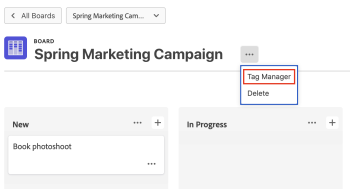

# 新增標籤

您可以將標籤新增至卡片，以視覺化方式顯示兩者相似。 然後，您可以按這些標籤進行篩選以顯示相關卡片。

>[!NOTE]
>
>標籤不會在展示板之間共用。

## 存取需求

+++ 展開以檢視本文中功能的存取需求。

您必須具有下列存取權才能執行本文中的步驟：

<table style="table-layout:auto"> 
 <col> 
 <col> 
 <tbody> 
  <tr> 
   <td role="rowheader">[!DNL Adobe Workfront]</td> 
   <td> 
任何
 </td> 
  </tr> 
  <tr> 
   <td role="rowheader">[!DNL Adobe Workfront] 授權</td> 
   <td> 
   
新增：[!UICONTROL Contributor]或以上
 
   
或

   
目前： [!UICONTROL Request]或以上

   </td> 
  </tr> 
 </tbody> 
</table>

如需有關此表格的詳細資訊，請參閱Workfront檔案中的[存取需求](/help/quicksilver/administration-and-setup/add-users/access-levels-and-object-permissions/access-level-requirements-in-documentation.md)。

+++

## 為展示板建立標籤

{{step1-to-boards}}

1. 存取展示板。 如需詳細資訊，請參閱[建立或編輯展示板](../../agile/get-started-with-boards/create-edit-board.md)。
1. 按一下主機板名稱旁的&#x200B;**[!UICONTROL 更多]**&#x200B;功能表，然後選擇&#x200B;**[!UICONTROL 標籤管理員]**。

   

1. 在[!UICONTROL 標籤管理員]對話方塊中，選取[!UICONTROL 面板標籤]區段中的&#x200B;[!UICONTROL **新增標籤**]。
1. 在反白顯示的方塊中輸入標簽名稱，然後從下拉式選單中選擇此標籤的顏色。 標籤會自動儲存。
1. （視條件而定）重複步驟4至5以建立其他標籤。
1. 按一下方塊右上角的&#x200B;**[!UICONTROL 完成]**。

   

## 為工作流程建立標籤

>[!IMPORTANT]
>
>工作串流僅適用於特定客戶群組。

工作流程標籤可用於工作流程中的所有面板。

{{step1-to-boards}}

1. 在儀表板上，按一下&#x200B;[!UICONTROL **檢視工作流程**]&#x200B;以開啟工作流程。
1. 開啟展示板。 按一下主機板名稱旁的&#x200B;**[!UICONTROL 更多]**&#x200B;功能表，然後選擇&#x200B;**[!UICONTROL 標籤管理員]**。

   或

   按一下「[!UICONTROL **設定**]」以開啟「[!UICONTROL 設定工作流程]」面板。 然後，按一下&#x200B;**[!UICONTROL 標籤管理員]**。

1. 在[!UICONTROL 標籤管理員]對話方塊中，選取「工作流程標籤」區段中的&#x200B;[!UICONTROL **新增標籤**]。
1. 在反白顯示的方塊中輸入標簽名稱，然後從下拉式選單中選擇此標籤的顏色。 標籤會自動儲存。
1. （視條件而定）重複步驟4至5以建立其他標籤。
1. 按一下方塊右上角的&#x200B;**[!UICONTROL 完成]**。

   

## 新增標籤至卡片

1. 存取展示板。
1. 若要編輯卡片詳細資料，請按一下卡片（不在卡片名稱中）。

   或

   按一下卡片上的&#x200B;**[!UICONTROL 更多]**&#x200B;功能表![[!UICONTROL 更多]](assets/more-icon-spectrum.png)，然後選取&#x200B;**[!UICONTROL 編輯]**。

1. 在&#x200B;**[!UICONTROL 標籤]**&#x200B;方塊中，輸入現有標籤的名稱，然後從搜尋結果中選取它。\
   或\
   按一下「**[!UICONTROL 編輯]**」圖示&#x200B;，然後在標籤管理員中建立新標籤。 按一下&#x200B;**完成**&#x200B;以返回卡片，然後選取卡片上的標籤。
1. 按一下 **關閉**。

## 編輯標籤

1. 存取展示板。
1. 按一下主機板名稱旁的&#x200B;**[!UICONTROL 更多]**&#x200B;功能表，然後選擇&#x200B;**[!UICONTROL 標籤管理員]**。

   

1. （視條件而定）按一下標簽名稱以編輯文字。
1. （視條件而定）按一下[!UICONTROL 色彩]下拉式功能表以變更標籤色彩。
1. 按一下&#x200B;**[!UICONTROL 完成]**。

## 從卡片移除標籤

1. 存取展示板。
1. 若要編輯卡片詳細資料，請按一下卡片（不在卡片名稱中）。

   或

   按一下卡片上的&#x200B;**[!UICONTROL 更多]**&#x200B;功能表![[!UICONTROL 更多]](assets/more-icon-spectrum.png)，然後選取&#x200B;**[!UICONTROL 編輯]**。

1. 尋找您要從卡片移除的標籤，然後按一下&#x200B;**[!UICONTROL 移除]**&#x200B;圖示。
1. 按一下 **[!UICONTROL 關閉]**。

## 刪除標籤

1. 存取展示板。
1. 按一下主機板名稱旁的&#x200B;**[!UICONTROL 更多]**&#x200B;功能表![[!UICONTROL 更多]](assets/more-icon-spectrum.png)，然後選擇&#x200B;**[!UICONTROL 標籤管理員]**。

   

1. 尋找您要刪除的標籤，然後按一下&#x200B;**[!UICONTROL 刪除]**&#x200B;圖示。
1. 按一下&#x200B;**[!UICONTROL 完成]**。
