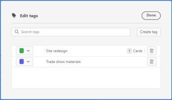

# 新增標籤

您可以將標籤新增至卡片，以視覺化方式顯示其類似。 然後，您可以依這些標籤來篩選，以顯示相關卡片。 標籤不會在展示板之間共用。

## 存取需求

您必須具備下列存取權，才能執行本文中的步驟：

<table style="table-layout:auto"> 
 <col> 
 </col> 
 <col> 
 </col> 
 <tbody> 
  <tr> 
   <td role="rowheader"><strong>[!DNL Adobe Workfront] 計劃*</strong></td> 
   <td> 
任何
 </td> 
  </tr> 
  <tr> 
   <td role="rowheader"><strong>[!DNL Adobe Workfront] 授權*</strong></td> 
   <td> 
[!UICONTROL Request]或更高版本
 </td> 
  </tr> 
 </tbody> 
</table>

&#42;若要了解您擁有的計畫、授權類型或存取權，請聯絡您的 [!DNL Workfront] 管理員。

## 為展示板建立標籤

1. 按一下 **[!UICONTROL 主菜單]** 圖示  在 [!DNL Adobe Workfront]，然後按一下 **[!UICONTROL 展示板]**.
1. 存取展示板。 如需詳細資訊，請參閱 [建立或編輯展示板](../../agile/get-started-with-boards/create-edit-board.md).
1. 按一下 **[!UICONTROL 更多]** 功能表  在展示板名稱旁，選擇 **[!UICONTROL 標籤管理]**.

   

1. 在 **[!UICONTROL 編輯標籤]** 對話框，選擇 **[!UICONTROL 建立標籤]**.
1. 在醒目提示的方塊中輸入標籤名稱，然後從下拉式選單中選擇此標籤的顏色。
1. 按一下 **[!UICONTROL 儲存]** 圖示來儲存標籤，或 **[!UICONTROL 取消]** 圖示取消建立標籤。

   

1. （條件性）重複步驟4-6以建立其他標籤。
1. 按一下 **[!UICONTROL 完成]** 在盒子的右上角。

   

## 將標籤新增至卡片

1. 存取展示板。
1. 若要編輯卡片詳細資訊，請按一下卡片（而非卡片名稱中）。

   或

   按一下 **[!UICONTROL 更多]** 功能表 ![[!UICONTROL 更多功能表]](assets/more-icon-spectrum.png) 在「 」卡片上，然後選取 **[!UICONTROL 編輯]**.

1. 在 **[!UICONTROL 標籤]** 框中，鍵入現有標籤的名稱，然後從搜索結果中選擇該名稱。\
   或\
   按一下 **[!UICONTROL 編輯]**&#x200B;圖示  並在「標籤管理器」中建立新標籤。 按一下 **完成** 才能回到卡片。 新標籤會自動新增至卡片。
1. 按一下 **關閉**。

## 編輯標籤

1. 存取展示板。
1. 按一下 **[!UICONTROL 更多]** 功能表  在展示板名稱旁，選擇 **[!UICONTROL 標籤管理]**.

   

1. （條件性）按一下標籤名稱以編輯文字。
1. （條件性）按一下 [!UICONTROL 色彩] 下拉式功能表來變更標籤顏色。
1. 按一下 **[!UICONTROL 完成]**.

## 從資訊卡移除標籤

1. 存取展示板。
1. 若要編輯卡片詳細資訊，請按一下卡片（而非卡片名稱中）。

   或

   按一下 **[!UICONTROL 更多]** 功能表 ![[!UICONTROL 更多功能表]](assets/more-icon-spectrum.png) 在「 」卡片上，然後選取 **[!UICONTROL 編輯]**.

1. 找到您要從資訊卡移除的標籤，然後按一下 **[!UICONTROL 移除]** 圖示 .
1. 按一下 **[!UICONTROL 關閉]**。

## 刪除標籤

1. 按一下 **[!UICONTROL 主菜單]** 圖示  在 [!DNL Adobe Workfront]，然後按一下 **[!UICONTROL 展示板]**.
1. 存取展示板。 如需詳細資訊，請參閱 [建立或編輯展示板](../../agile/get-started-with-boards/create-edit-board.md).
1. 按一下 **[!UICONTROL 更多]**&#x200B;功能表，然後選擇 **[!UICONTROL 標籤管理]**.

   

1. 找到您要刪除的標籤，然後按一下 **[!UICONTROL 刪除]** 圖示 .
1. 按一下 **[!UICONTROL 完成]**.
