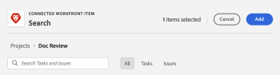

# 在展示板上使用連線的卡片

您可以在展示板上新增卡片，該卡片會連線至中的現有任務和問題。 [!DNL Workfront].

當在一個位置更新卡片的下列任一詳細資料時，就會在另一個位置自動更新：

* [!UICONTROL 名稱]
* [!UICONTROL 說明]
* [!UICONTROL 受託人]
* [!UICONTROL 狀態]
* [!UICONTROL 規劃完成日期]
* [!UICONTROL 預估] / [!UICONTROL 劇本點]

>[!NOTE]
>每個展示板只能新增一次單一連線任務或問題。 相同任務或問題可以連線到多個展示板。

## 存取需求

您必須具有下列存取權才能執行本文中的步驟：

<table style="table-layout:auto"> 
 <tbody> 
  <tr> 
   <td role="rowheader"><strong>[!DNL Adobe Workfront] 計劃*</strong></td> 
   <td> 
任何
 </td> 
  </tr> 
  <tr> 
   <td role="rowheader"><strong>[!DNL Adobe Workfront] 授權*</strong></td> 
   <td> 
[！UICONTROL Request]或更高版本
 </td> 
  </tr> 
  <tr>
   <td role="rowheader"><strong>存取層級設定*</strong></td>
   <td>
[！UICONTROL檢視]或更高的任務和問題存取權
</td>
  </tr>
  <tr>
   <td role="rowheader"><strong>物件許可權</strong></td>
   <td>
[！UICONTROL檢視]或對Workfront任務或問題的更高許可權
</td>
  </tr>
 </tbody> 
</table>

&#42;若要瞭解您擁有哪些計畫、授權型別或存取權，請聯絡您的 [!DNL Workfront] 管理員。

## 新增連線的卡片

1. 按一下 **[!UICONTROL 主要功能表]** 圖示  Adobe Workfront右上角，然後按一下 **[!UICONTROL 展示板]**.
1. 存取展示板。 如需詳細資訊，請參閱 [建立或編輯展示板](../../agile/get-started-with-boards/create-edit-board.md).
1. 按一下 **[!UICONTROL 新增卡片] > [!UICONTROL 已連線的卡片]**.
1. 選擇專案，然後選擇要作為卡片新增到展示板上的任務或問題。

   您可以選取多個物件，這些物件都會以個別卡片形式新增。

   >[!NOTE]
   >
   >* 搜尋結果中只能使用您擁有許可權的物件。 如果專案變暗，則表示該專案已加入展示板中。
   >* 當您依據以下條件篩選時 **[!UICONTROL 我擁有的專案]** 或 **[!UICONTROL 我參與的專案]**，則等同於「完成」、「廢棄」或「已拒絕」狀態的專案不會包括在內。 您仍然可以使用搜尋這些專案 **[!UICONTROL 全部]** 篩選。

1. 按一下 **[!UICONTROL 新增]**.

   

   卡片會新增至最左側的欄底部。 已連線 [!DNL Workfront] 物件與其受指派人會顯示在卡片上。

   >[!NOTE]
   >
   >若被指定者位於 [!DNL Workfront] 任務或問題不是討論區的成員，因此未指派給卡片。

   

1. 按一下  以開啟 [!DNL Workfront] 在新的瀏覽器分頁中檢視任務或問題。
1. 若要編輯卡片詳細資訊，請按一下卡片（不在卡片名稱中）。

   或

   按一下 **[!UICONTROL 更多]** 功能表  在卡片上，然後選取 **[!UICONTROL 編輯]**.

1. 在 **[!UICONTROL 卡片詳細資料]** 方塊中，新增或更新下列資訊：

   <table style="table-layout:auto"> 
    <tbody> 
     <tr> 
      <td role="rowheader"><strong>[！UICONTROL名稱]</strong></td> 
      <td>變更名稱也會變更已連線的名稱 [!DNL Workfront] 物件。</td> 
     </tr> 
     <tr> 
      <td role="rowheader"><strong>[！UICONTROL說明]</strong></td> 
      <td>變更說明也會變更已連線之上的說明 [!DNL Workfront] 物件。 您可以在說明中新增URL，這些URL在儲存卡片時就會變成可點按連結。</td> 
     </tr>
     <tr>
      <td role="rowheader"><strong>[！UICONTROL欄]</strong></td>
      <td>選取卡片的欄。</td>
     </tr>
     <tr>
      <td role="rowheader"><strong>[！UICONTROL狀態]</strong></td>
      <td>
選取卡片的狀態。 預設值為[！UICONTROL New]、[！UICONTROL In Progress]和[！UICONTROL Complete]，但為中的專案定義的任何自訂狀態 [!DNL Workfront] 也可供使用。

      
如果您已啟用欄原則來更新欄位值，則變更卡片上的狀態會自動將卡片移動到對應的欄。 如需詳細資訊，請參閱文章中的「定義欄設定和原則」 <a href="/help/quicksilver/agile/get-started-with-boards/manage-board-columns.md" class="MCXref xref">管理展示板欄</a>.

      
如果您按一下 <strong>[！UICONTROL標籤完成]</strong> 在卡片頂端，狀態會自動變更為「完成」。
</td>
     </tr>
     <tr>
      <td role="rowheader"><strong>[！UICONTROL計畫完成]</strong></td>
      <td>變更此日期也會變更已連線上的計畫完成日期 [!DNL Workfront] 物件。</td>
     </tr>
      <tr>
      <td role="rowheader"><strong>[！UICONTROL估計]</strong></td>
      <td>
卡片要完成的小時數。

變更預估也會變更連線上的劇本點值 [!DNL Workfront] 物件。
</td>
     </tr>
     <tr>
      <td role="rowheader"><strong>[！UICONTROL受託人]</strong></td>
      <td>
若要將更多人員或團隊指派給卡片，請在搜尋欄位中開始輸入名稱，然後在其顯示在清單中時選取它。 您可以新增個人和團隊。 已連線的卡片上只允許一個群組指派。

      
受指派人必須是展示板上的成員，否則他們不會出現在選取專案清單中。 當團隊是展示板上的成員時，可以將個別團隊成員指派給卡片。

      
您選取的任何受指派人也會指派至中的任務或問題 [!DNL Workfront].
</td>
     </tr>
     <tr>
      <td role="rowheader"><strong>[！UICONTROL標籤]</strong></td>
      <td>
搜尋並選取卡片的標籤。

      
如需建立新標籤的詳細資訊，請參閱 <a href="../../agile/get-started-with-boards/add-tags.md" class="MCXref xref">新增標籤</a>.
</td>
     </tr>
     <tr>
      <td role="rowheader"><strong>[！UICONTROL自訂欄位]</strong></td>
      <td>
您新增的任何自訂欄位都會顯示在此區域中。

      
如需詳細資訊，請參閱 <a href="/help/quicksilver/agile/get-started-with-boards/customize-fields-on-card.md">自訂卡片上顯示的欄位</a>.
</td>
     </tr>
     <tr> 
      <td role="rowheader"><strong>[！UICONTROL檢查清單]</strong> </td> 
      <td> 
按一下 <strong>[！UICONTROL新增檢查清單專案]</strong>. 然後，輸入專案的標題並按Enter。 系統會自動新增另一個專案。 繼續輸入標題以新增更多專案。
 
檢查清單頂端的計數器會顯示完成的專案數和專案總數。
 
如需檢查清單專案的詳細資訊，請參閱 <a href="/help/quicksilver/agile/get-started-with-boards/manage-checklist-items.md">管理卡片上的檢查清單專案</a>.
</td>
     </tr>
     <tr>
      <td role="rowheader"><strong>[！UICONTROL小時]</strong></td>
      <td>請參閱下方的「在連線卡上記錄時數」。</td>
     </tr>
     <tr>
      <td role="rowheader"><strong>[！UICONTROL註解]</strong></td>
      <td>
按一下 <strong>[！UICONTROL新註解]</strong> 欄位並輸入您的註解。 使用格式化工具來格式化文字，然後按一下 <strong>新增附件</strong> 圖示  將檔案附加至註解。 若要標籤人員或團隊，請使用註釋區域底部的搜尋方塊。 使用者不必是展示板的成員。 已連線卡片上的標籤使用者將收到電子郵件通知。

按一下 <strong>[！UICONTROL提交]</strong> 將註解新增至卡片。

      
<strong>注意：</strong> 卡片上的註解區域會使用新的Adobe Workfront註解體驗。 如需詳細資訊，請參閱 <a href="/help/quicksilver/workfront-basics/updating-work-items-and-viewing-updates/update-work.md">更新工作</a>.
</td>
     </tr>
     <tr> 
      <td role="rowheader"><strong>[！UICONTROL系統活動]</strong></td> 
      <td>
如果您有 <strong>系統活動</strong> 啟用為卡片區段，活動會顯示在此區域中。
 
如需詳細資訊，請參閱 <a href="/help/quicksilver/agile/get-started-with-boards/customize-fields-on-card.md">自訂卡片上顯示的欄位</a> 和 <a href="/help/quicksilver/administration-and-setup/set-up-workfront/system-tracked-update-feeds/system-tracked-update-feeds.md">系統追蹤更新</a>.
</td>
     </tr>     
    </tbody> 
   </table>

   使用左側導覽面板在卡片詳細資訊的欄位區段之間移動。

1. 按一下 **[!UICONTROL 關閉]** 以返回展示板。
卡片上會顯示連線物件、受指派人、標籤、到期日、檢查清單計數器、預估時數和狀態。

   

## 中斷連線的卡片

您可以將連線的卡片從其Workfront物件中斷連線，而卡片會保留在展示板上，作為您可編輯的臨機操作卡片。

若要中斷主機板層級的連線：

1. 存取展示板。
1. 按一下 **[!UICONTROL 更多]** 功能表  ，然後選取 **[!UICONTROL 中斷連線]**.
1. 按一下 **[!UICONTROL 中斷連線]** 於確認訊息上。

若要中斷卡層級的連線：

1. 存取主機板並開啟已連線的卡片。
1. 按一下 **[!UICONTROL 更多]** 功能表  在卡片詳細資訊的「連線」區域中，選取 **[!UICONTROL 中斷連線]**.
1. 按一下 **[!UICONTROL 中斷連線]** 於確認訊息上。

## 將Ad Hoc卡片轉換為已連線的卡片

建立Ad Hoc卡片後，您可以將其轉換為已連線的卡片。 如需臨時資訊卡的詳細資訊，請參閱 [新增臨機卡到展示板](/help/quicksilver/agile/get-started-with-boards/add-card-to-board.md).

1. 存取展示板並開啟Ad Hoc卡。
1. 驗證卡片上的名稱和說明。 它們將被新增到您在中建立的任務或問題中 [!DNL Workfront].
1. 在 [!UICONTROL 連線] 區域卡片詳細資料，按一下 **[!UICONTROL 與Workfront連線]**.
1. 於 [!UICONTROL 連線卡片] 視窗中，選取您要建立任務還是問題。
1. 搜尋並選取要新增任務或問題的專案。

   >[!NOTE]
   >
   >* 搜尋結果中只能使用您擁有許可權的物件。
   >* 當您依據以下條件篩選時 **[!UICONTROL 我擁有的專案]** 或 **[!UICONTROL 我參與的專案]**，等同於 [!UICONTROL 完成]， [!UICONTROL 廢棄]，或 [!UICONTROL 已拒絕] 不包含狀態。 您仍然可以使用搜尋這些專案 **[!UICONTROL 全部]** 篩選。

1. 按一下 **[!UICONTROL Connect]**.

   

   專案名稱會顯示在卡片詳細資訊的「連線」區域中。

1. 按一下 **[!UICONTROL 關閉]** 以返回展示板。

## 在連線的卡片上記錄時數

您必須擁有正確的許可權，才能記錄連線任務或問題的時數。

依預設，時間記錄欄位不會顯示在連線的卡片上。 您必須啟用 [!UICONTROL **小時**] 在 [!UICONTROL 設定] 區域在 [!UICONTROL 卡片]. 如需詳細資訊，請參閱 [自訂卡片上顯示的欄位](/help/quicksilver/agile/get-started-with-boards/customize-fields-on-card.md).

1. 輸入任務或問題的小時數。
1. 選取 [!UICONTROL 小時型別] 從下拉式選單中（如果它與預設值不同）。
1. 按一下 [!UICONTROL **記錄時間**].

   

   登入卡片的時間也會儲存在已連線的任務或問題上。

在卡片上的記錄時間與任務或問題的記錄時間相同。 如需詳細資訊，請參閱文章中的「在專案、任務或問題上記錄時間」 [記錄時間](/help/quicksilver/timesheets/create-and-manage-timesheets/log-time.md).

