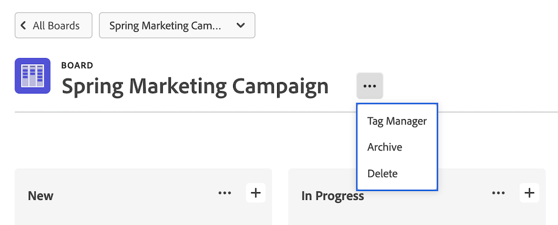
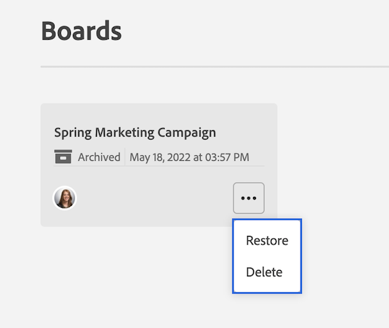

# 刪除或封存展示板

您可以在[!DNL Workfront]中刪除或封存展示板。 刪除展示板會將其從[!DNL Workfront]中永久移除，而封存展示板會保留所有卡片，並允許稍後再還原。

只有展示板擁有者可以刪除展示板。

## 存取權要求

+++ 展開以檢視這篇文章中所述功能的存取權要求。

<table style="table-layout:auto"> 
 <col> 
 <col> 
 <tbody> 
  <tr> 
   <td role="rowheader">Adobe Workfront 封裝</td> 
   <td> 
任何
 </td> 
  </tr> 
  <tr> 
   <td role="rowheader">Adobe Workfront授權</td> 
   <td> 
   
投稿人或以上
 
   
要求或更高版本

   </td> 
  </tr> 
 </tbody> 
</table>

如需詳細資訊，請參閱Workfront檔案中的[存取需求](/help/quicksilver/administration-and-setup/add-users/access-levels-and-object-permissions/access-level-requirements-in-documentation.md)。

+++

## 刪除展示板

當您刪除展示板時，該展示板會從[!DNL Workfront]中永久移除，且無法還原。 任何在展示板上的卡片也會隨展示板一起刪除。

{{step1-to-boards}}

1. 在控制面板上，選取要開啟的面板。
1. 按一下主機板名稱旁的&#x200B;**[!UICONTROL 更多]**&#x200B;功能表![[!UICONTROL 更多功能表]](assets/more-icon-spectrum.png)，然後選取&#x200B;**[!UICONTROL 刪除]**。 然後，在確認訊息上按一下&#x200B;**[!UICONTROL 刪除展示板]**。

   >[!NOTE]
   >
   >您只能刪除您建立或名為擁有者的面板，不能刪除您新增為成員的面板。

   

## 封存展示板

已封存的展示板會保留所有卡片和工作分派。 任何使用者都可以隨時封存或還原展示板。

{{step1-to-boards}}

1. 在控制面板上，選取要開啟的面板。
1. 按一下主機板名稱旁的&#x200B;**[!UICONTROL 更多]**&#x200B;功能表![[!UICONTROL 更多功能表]](assets/more-icon-spectrum.png)，然後選取&#x200B;**[!UICONTROL 封存]**。

   

## 還原展示板

封存的展示板可隨時還原。 任何使用者都可以還原已封存的展示板。

{{step1-to-boards}}

1. 在儀表板上，按一下篩選器圖示，然後選取&#x200B;**[!UICONTROL 已封存的面板]**。
1. 找到您要還原的主機板，按一下主機板名稱旁的&#x200B;**[!UICONTROL 更多]**&#x200B;功能表，然後選取&#x200B;**[!UICONTROL 還原]**。

   
