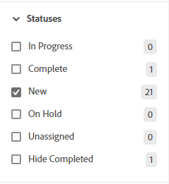
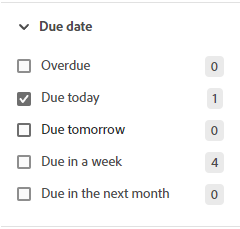

# 在展示板中篩選和搜尋

您可以篩選要顯示的展示板：

* 指派給特定人員的卡片
* 含特定標籤的卡片
* 具有特定狀態的卡片
* 在特定時間範圍內到期的卡片
* 已封存的卡片
* 卡片已連線至特定專案

排序展示板會排序欄中的所有卡片。 您無法排序單一欄，而且待處理專案或輸入欄並未排序。

搜尋也可協助您在展示板上找出特定卡片。

套用篩選器時，儀表板的篩選器上會顯示指示器。 按一下&#x200B;**[!UICONTROL 全部清除]**&#x200B;以移除面板中的所有篩選器，然後按一下收合圖示以關閉篩選器面板。

## 存取需求

您必須具有下列存取權才能執行本文中的步驟：

<table style="table-layout:auto"> 
 <col> 
 <col> 
 <tbody> 
  <tr> 
   <td role="rowheader"><strong>[!DNL Adobe Workfront] 計畫*</strong></td> 
   <td> 
任何
 </td> 
  </tr> 
  <tr> 
   <td role="rowheader"><strong>[!DNL Adobe Workfront] 授權*</strong></td> 
   <td> 
[！UICONTROL Request]或更高版本
 </td> 
  </tr> 
 </tbody> 
</table>

&#42;若要瞭解您擁有的計畫、授權型別或存取權，請連絡您的[!DNL Workfront]管理員。

## 依受指派人篩選展示板

1. 按一下[!DNL Adobe Workfront]右上角的&#x200B;**[!UICONTROL 主功能表]**&#x200B;圖示，然後按一下&#x200B;**[!UICONTROL 面板]**。
1. 存取展示板。 如需詳細資訊，請參閱[建立或編輯展示板](../../agile/get-started-with-boards/create-edit-board.md)。
1. 按一下「[!UICONTROL **篩選器**]」，展開「[!UICONTROL 成員]」區段，然後選取您要檢視其卡片的一或多個人員。 您也可以顯示未指派的卡片。

   

## 依標籤篩選展示板

1. 存取展示板。
1. 按一下「[!UICONTROL **篩選器**]」，展開「[!UICONTROL 標籤]」區段，然後選取您要看到的標籤。

   

## 依狀態篩選展示板

1. 存取展示板。
1. 按一下&#x200B;[!UICONTROL **篩選器**]，展開[!UICONTROL 狀態]區段，然後選取您要檢視的狀態型別。

   您也可以隱藏已完成的卡片。

   

## 依到期日篩選展示板

1. 存取展示板。
1. 按一下&#x200B;[!UICONTROL **篩選器**]，展開[!UICONTROL 到期日]區段，然後選取您要檢視的日期選項。

   僅顯示選定日期範圍內的卡片。

   

## 篩選展示板以顯示已封存的卡片

依預設，電路板上只會顯示作用中的卡片。 您可以篩選展示板以顯示任何已封存的卡片。

1. 存取展示板。
1. 按一下主機板右側的&#x200B;[!UICONTROL **[設定]**]&#x200B;以開啟[設定]面板。
1. 展開&#x200B;[!UICONTROL **卡片**]。
1. 開啟&#x200B;[!UICONTROL **在展示板上顯示封存的卡片**]。
1. 按一下&#x200B;[!UICONTROL **篩選器**]，展開[!UICONTROL 已封存的卡片]區段，然後選取&#x200B;**[!UICONTROL 已封存的卡片]**&#x200B;以顯示任何已封存的卡片。

   篩選器會顯示已封存的卡片數量。

   

   >[!NOTE]
   >
   >如果您尚未開啟顯示已封存卡片的組態設定，則篩選器中無法使用[!UICONTROL 已封存卡片]區段。 如需詳細資訊，請參閱[自訂卡片上顯示的欄位](/help/quicksilver/agile/get-started-with-boards/customize-fields-on-card.md)。

1. 再次選取&#x200B;**[!UICONTROL 已封存的卡片]**&#x200B;以清除選項並僅顯示作用中的卡片。

## 依連線篩選展示板

1. 存取展示板。
1. 按一下「[!UICONTROL **篩選器**]」，展開「[!UICONTROL 連線]」區段，然後選取您要檢視之連線卡片的[!DNL Workfront]個專案。

   您也可以顯示未連線到專案的卡片。

   

## 在展示板上排序

當您選取排序依據的選項時，所有欄都會排序。 您無法排序單一欄，而且待處理專案或輸入欄並未排序。

1. 存取展示板。
1. 按一下&#x200B;[!UICONTROL **排序方式**]&#x200B;並選取&#x200B;[!UICONTROL **名稱**]、[!UICONTROL **到期日**]、[!UICONTROL **預估**]、[!UICONTROL **狀態**]&#x200B;或&#x200B;[!UICONTROL **連線**]。

   連線（專案名稱）僅套用至已連線的卡片，其他選項將在欄中排序已連線的卡片和臨機操作卡。

   「使用者順序」選項會將卡片傳回至手動設定的順序，然後再套用任何其他排序選項。 這是欄的預設排序。

1. 選取&#x200B;[!UICONTROL **反向順序**]&#x200B;以反向排序選項排序欄。

   排序圖示上的箭頭指示欄是依遞增或遞減順序排序。

   套用預設以外的排序時，排序圖示上會顯示指示器。

   

## 在展示板中搜尋

1. 存取展示板。
1. 按一下「[!UICONTROL **搜尋**]」並輸入搜尋字詞。 然後，按下Enter。

   所有包含搜尋字詞的卡片都會顯示。

   按一下X以清除搜尋。

   
