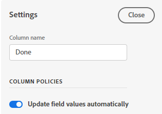

# 管理展示板欄

依預設，新展示板包含三欄。 您可以新增更多欄、變更欄的順序、重新命名欄，以及刪除您不需要的任何欄。

欄設定包含原則，可讓您定義將資訊卡移入該欄時，資訊卡會發生什麼情況的選項。

## 存取需求

您必須具備下列存取權，才能執行本文中的步驟：

<table style="table-layout:auto"> 
 <col> 
 </col> 
 <col> 
 </col> 
 <tbody> 
  <tr> 
   <td role="rowheader"><strong>[!DNL Adobe Workfront] 計劃*</strong></td> 
   <td> 
任何
 </td> 
  </tr> 
  <tr> 
   <td role="rowheader"><strong>[!DNL Adobe Workfront] 授權*</strong></td> 
   <td> 
[!UICONTROL Request]或更高版本
 </td> 
  </tr> 
 </tbody> 
</table>

&#42;若要了解您擁有的計畫、授權類型或存取權，請聯絡您的 [!DNL Workfront] 管理員。

## 新增欄至展示板

1. 按一下 **[!UICONTROL 主菜單]** 圖示  在 [!DNL Adobe Workfront]，然後按一下 **[!UICONTROL 展示板]**.
1. 存取展示板。 如需詳細資訊，請參閱 [建立或編輯展示板](../../agile/get-started-with-boards/create-edit-board.md).
1. 按一下 **[!UICONTROL 添加列]** 欄的右側。
1. 在新欄中輸入名稱，然後按一下 **[!UICONTROL 添加列]**.

   

>[!TIP]
>
>要添加進氣列，請參閱 [向展示板新增進紙欄](/help/quicksilver/agile/use-boards-agile-planning-tools/add-intake-column-to-board.md).

## 重新排序展示板上的欄

1. 進入展示板。
1. 將欄拖放至正確順序。 請務必選取欄頂端，再將其拖曳至其他位置。

   

## 重新命名展示板欄

1. 進入展示板。
1. 按一下欄名稱，輸入新名稱，然後按Enter鍵。

   或

   按一下 **[!UICONTROL 更多]** 功能表  在欄上選取 **[!UICONTROL 編輯]**. 在「設定」區域中，在 **[!UICONTROL 欄名稱]** 欄位，然後按一下 **[!UICONTROL 關閉]**.

## 刪除展示板欄

1. 進入展示板。
1. 按一下 **[!UICONTROL 更多]** 功能表  ，然後選取 **[!UICONTROL 刪除]**.

   >[!NOTE]
   >
   >無法刪除包含卡片的欄（包括已封存的卡片）。 如果您嘗試刪除包含卡片的欄，則必須為這些卡片選擇其他欄。

## 顯示卡計數

您可以使用組態設定來顯示每欄中的卡片數量。

如果您在欄上使用WIP限制，則不會新增個別的卡片計數器。 有關WIP限制的詳細資訊，請參閱 [管理 [!UICONTROL 正在進行中] 板上的(WIP)限制](/help/quicksilver/agile/use-boards-agile-planning-tools/manage-wip-limit-on-board.md).

1. 進入展示板。
1. 按一下 **[!UICONTROL 設定]** ，開啟「設定」面板。
1. 展開 **[!UICONTROL 欄]**.
1. 開啟 **[!UICONTROL 顯示列卡計數]**.

   

   卡片計數器會顯示在每欄的頂端。

1. 按一下 **[!UICONTROL 隱藏配置]** 關閉 [!UICONTROL 設定] 中。

## 定義欄設定和原則

1. 進入展示板。
1. 按一下 **[!UICONTROL 更多]** 功能表  ，然後選取 **[!UICONTROL 編輯]**.

   此 [!UICONTROL 設定] 框。 此 **[!UICONTROL 欄名稱]** 可讓您知道要為哪個欄定義設定。

1. 啟用 **[!UICONTROL 自動更新欄位值]** 策略，在將卡移動到此列時自動更改某些欄位值。

   

1. （選用）設定卡片狀態的值：

   1. 選取 **[!UICONTROL 狀態]** 框。

   1. 選取將資訊卡移至此欄時要套用至的狀態。

      

      也會顯示已連接卡的狀態轉換選項。 （狀態轉換不適用於臨機卡。） 這些選項決定了應用於中的任務或問題的狀態 [!DNL Workfront] 當已連接的卡移動到此列時。

   1. 要更改預設狀態轉換選擇，請按一下 **[!UICONTROL 編輯]** 圖示 .
   1. 選擇任務狀態和問題狀態。 僅預設 [!DNL Workfront] 狀態可用，而非自訂狀態。

   >[!NOTE]
   >
   >如果您在 [!DNL Workfront]，您第一次將連線卡片移至此欄時，系統會提示您選擇狀態。 例如，如果連接的項目有多個狀態類型，且所有狀態類型都對應 [!UICONTROL 已完成]，您必須選擇要使用的狀態 [!DNL Workfront]. 您可以將選擇設為預設值，因此每次將資訊卡移至欄時，不必進行選取。
   >如需狀態的詳細資訊，請參閱 [狀態概觀](/help/quicksilver/administration-and-setup/customize-workfront/creating-custom-status-and-priority-labels/statuses-overview.md).

1. （選用）為卡片指派者設定值：

   1. 選取 **[!UICONTROL 受分配者]** 框。
   1. 選取動作。

      * **[!UICONTROL 添加受分配者]:** 您選擇的受分配者在移動到此列時，會添加到卡上的現有受分配者清單中。
      * **[!UICONTROL 覆蓋受分配者]:** 您選擇的受分配者將覆蓋所有其他受分配者，並在被移動到此列時成為卡上唯一的受分配者。
   1. 從下拉清單中選擇受分配者。 只有展示板上的成員可供選擇。 如需詳細資訊，請參閱 [從展示板新增或移除成員](/help/quicksilver/agile/get-started-with-boards/add-members-to-board.md).

      

1. （選用）為卡片標籤設定值：

   1. 選取 **[!UICONTROL 卡片]** 框。
   1. 選取動作。

      * **[!UICONTROL 在標籤上新增]:** 將您選取的標籤移至此欄時，會新增至卡片上的現有標籤清單。
      * **[!UICONTROL 覆蓋標籤]:** 您選取的標籤會覆寫所有其他標籤，並在移至此欄時成為資訊卡上唯一的標籤。
   1. 從下拉式清單中選取標籤。 只有已在 [!UICONTROL 標籤管理] 可供選擇。 如需新增標籤的相關資訊，請參閱 [新增標籤](/help/quicksilver/agile/get-started-with-boards/add-tags.md).

      

1. 啟用 **[!UICONTROL 正在進行的工作限制]** 限制可新增至欄的卡數的原則。 然後，在 **[!UICONTROL 設定限制]** 欄位。

   

   如需詳細資訊，請參閱 [管理展示板上的在製品(WIP)限制](/help/quicksilver/agile/use-boards-agile-planning-tools/manage-wip-limit-on-board.md).

1. 按一下 **[!UICONTROL 關閉]** 退出「設定」區域，並檢視欄及其卡片。
