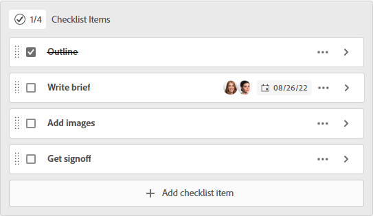

# 管理卡上的檢查清單項目

在資訊卡上使用檢查清單，可將工作細分為較小的增量，或在資訊卡中新增附註。 臨機卡和已連線卡上都提供檢查清單項目。

如需資訊卡，請參閱 [新增臨機卡至展示板](/help/quicksilver/agile/get-started-with-boards/add-card-to-board.md), [在主板上使用連接的卡](/help/quicksilver/agile/get-started-with-boards/connected-cards.md)，和 [管理卡片](/help/quicksilver/agile/get-started-with-boards/move-board-items.md).

## 存取需求

您必須具備下列存取權，才能執行本文中的步驟：

<table style="table-layout:auto"> 
 <col> 
 </col> 
 <col> 
 </col> 
 <tbody> 
  <tr> 
   <td role="rowheader"><strong>[!DNL Adobe Workfront] 計劃*</strong></td> 
   <td> 
任何
 </td> 
  </tr> 
  <tr> 
   <td role="rowheader"><strong>[!DNL Adobe Workfront] 授權*</strong></td> 
   <td> 
[!UICONTROL Request]或更高版本
 </td> 
  </tr> 
 </tbody> 
</table>

&#42;若要了解您擁有的計畫、授權類型或存取權，請聯絡您的 [!DNL Workfront] 管理員。

## 將檢查清單新增至資訊卡

1. 按一下 **[!UICONTROL 主菜單]** 圖示  在Adobe Workfront的右上角，然後按一下 **[!UICONTROL 展示板]**.
1. 存取展示板。 如需詳細資訊，請參閱 [建立或編輯展示板](../../agile/get-started-with-boards/create-edit-board.md).
1. 按一下資訊卡以開啟 [!UICONTROL 卡片詳細資訊] 框。

   或

   按一下 **[!UICONTROL 更多]** 功能表  在「 」卡片上，然後選取 **[!UICONTROL 編輯]**.

1. 若要新增項目，請按一下 **[!UICONTROL 添加檢查清單項]**. 然後，鍵入項目的標題，然後按Enter鍵。 系統會自動新增另一個項目。 繼續輸入標題以添加更多項。

   核對清單頂端的計數器會顯示已完成項目的數量和項目總數。

1. 按一下  開啟 [!UICONTROL 檢查清單項目詳細資訊] 框。

   

1. （可選）為核對清單項添加說明、受分配者、到期日和估計小時數。

   如需這些欄位的相關資訊，請參閱 [新增臨機卡至展示板](/help/quicksilver/agile/get-started-with-boards/add-card-to-board.md) 或 [在主板上使用連接的卡](/help/quicksilver/agile/get-started-with-boards/connected-cards.md).

1. 按一下 **[!UICONTROL 關閉]** 返回卡片詳細資訊和檢查清單項的完整清單。

   受分配者和到期日將出現在項目上。

1. 若要複製項目，請按一下 **[!UICONTROL 更多]** 功能表  在項目上選取 **[!UICONTROL 複製]**.
1. 若要刪除檢查清單項目，請按一下 **[!UICONTROL 更多]** 功能表  在項目上選取 **[!UICONTROL 刪除]**.

## 完成檢查清單項目

1. 存取展示板，找出檢查清單所在的資訊卡。
1. 按一下資訊卡以開啟 [!UICONTROL 卡片詳細資訊] 框。

   或

   按一下 **[!UICONTROL 更多]** 功能表  在「 」卡片上，然後選取 **[!UICONTROL 編輯]**.

1. 選取已完成項目旁的核取方塊。

   計數器會更新以顯示已完成的項目。

   如果需要將項目新增至清單，可以清除核取方塊。

   

1. 按一下 **[!UICONTROL 關閉]** 回到董事會。

   卡片上的計數器也會更新。
