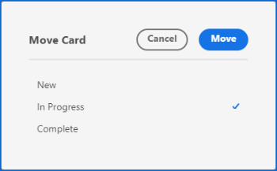
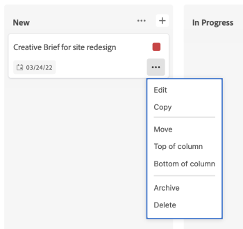

# 管理卡片

您可以將卡片移至展示板上的任何欄，或複製卡片。

如果您已啟用欄位原則來更新欄位值，則當您在不同欄位之間移動卡片時，會自動更新狀態、受指派人和標籤。 如需詳細資訊，請參閱文章[管理展示板欄](/help/quicksilver/agile/get-started-with-boards/manage-board-columns.md)中的「定義欄設定和原則」。

>[!NOTE]
>
>您無法將卡片從一個展示板移動到另一個展示板。

## 存取權要求

+++ 展開以檢視這篇文章中所述功能的存取權要求。

<table style="table-layout:auto"> 
 <col> 
 <col> 
 <tbody> 
  <tr> 
   <td role="rowheader">Adobe Workfront 封裝</td> 
   <td> 
任何
 </td> 
  </tr> 
  <tr> 
   <td role="rowheader">Adobe Workfront授權</td> 
   <td> 
   
投稿人或以上
 
   
要求或更高版本

   </td> 
  </tr> 
 </tbody> 
</table>

如需詳細資訊，請參閱Workfront檔案中的[存取需求](/help/quicksilver/administration-and-setup/add-users/access-levels-and-object-permissions/access-level-requirements-in-documentation.md)。

+++

## 在欄之間移動卡片

{{step1-to-boards}}

1. 存取展示板。 如需詳細資訊，請參閱[建立或編輯展示板](../../agile/get-started-with-boards/create-edit-board.md)。
1. 將卡片拖放至另一欄，放置您希望卡片顯示的位置。

   或

   按一下卡片上的&#x200B;**[!UICONTROL 更多]**&#x200B;功能表，然後選取&#x200B;**[!UICONTROL 移動]**。 然後，在&#x200B;**[!UICONTROL 移動專案]**&#x200B;方塊上，選擇其他資料行並選取&#x200B;**[!UICONTROL 移動]**。

   

   >[!NOTE]
   >
   >當您使用&#x200B;**[!UICONTROL 移動專案]**&#x200B;方塊時，卡片會一律移至欄的頂端。

## 將卡片移至欄的頂端或底部

1. 存取展示板。
1. 將卡片拖放至您要其顯示在欄中的位置。

   或

   按一下卡片上的&#x200B;**[!UICONTROL 更多]**&#x200B;功能表，然後選取&#x200B;**[!UICONTROL 資料行]**&#x200B;頂端或&#x200B;**[!UICONTROL 資料行]**&#x200B;底部。

   

## 複製卡片

複製臨機操作卡會複製卡片上的所有欄位，包括檢查清單專案。

>[!NOTE]
>
>您無法複製已連線的卡片。

1. 存取展示板。
1. 按一下卡片上的&#x200B;**[!UICONTROL 更多]**&#x200B;功能表![[!UICONTROL 更多]](assets/more-icon-spectrum.png)，然後選取&#x200B;**[!UICONTROL 複製]**。

   

   在相同欄新增一張卡片，標題為「副本 — [原始卡片名稱]」。
