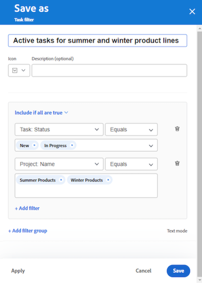

# 將輸入欄新增到展示板

<!-- Audited: 5/2025 -->

您可以選擇新增輸入欄到您的展示板，當根據您定義的篩選器將任務和問題新增到[!DNL Workfront]中時，該欄會自動提取作為已連線卡片的任務和問題。 輸入欄可做為Kanban團隊的待處理欄、支援團隊檢視新增至請求佇列之問題的輸入位置，或您所需的任何其他目的。

展示板上只允許有一個輸入欄，且一律顯示為最左側的欄。

動態展示板上沒有輸入欄。 不過，您可以更新篩選器，以定義將哪些卡片帶入動態展示板。 在動態板上變更這些篩選器時，不會成為Workfront任務或問題一部分的卡片設定（例如標籤）會重設。

>[!NOTE]
>
>基於安全考量，只有展示板的擁有者才能在「設定」面板變更展示板篩選器。

輸入欄限製為300個任務和300個問題。 在輸入欄中的專案預設順序如下：

任務：

* 主要順序：專案名稱
* 次要順序：工作分解結構

問題：

* 主要順序：專案名稱
* 次要順序：參考編號

>[!IMPORTANT]
>
>如果有多位使用者同時使用主機板，建議經常重新整理主機板。 重新整理頁面有助於將展示板上的視覺變更保持最新，並防止重複卡片從引入欄移至展示板之類的問題。
>
>若要與Workfront同步並將新任務和問題帶入展示板或輸入欄，請按一下展示板名稱旁的[更多]功能表![[!UICONTROL [更多]功能表]](assets/more-menu.png)，並選取[同步連線專案]。

如需欄的詳細資訊，請參閱[管理面板欄](/help/quicksilver/agile/get-started-with-boards/manage-board-columns.md)。 如需有關已連線卡片的資訊，請參閱[使用主機板上的已連線卡片](/help/quicksilver/agile/get-started-with-boards/connected-cards.md)。

## 存取需求

+++ 展開以檢視本文中功能的存取需求。

<table style="table-layout:auto"> 
 <col> 
 <col> 
 <tbody> 
  <tr> 
   <td role="rowheader">[!DNL Adobe Workfront]</td> 
   <td> 
任何
 </td> 
  </tr> 
  <tr> 
   <td role="rowheader">[!DNL Adobe Workfront] 授權</td> 
   <td> 
   
新增：[！UICONTROL Contributor]或以上
 
   
或

   
目前： [！UICONTROL Request]或以上

   </td> 
  </tr> 
 </tbody> 
</table>

如需有關此表格的詳細資訊，請參閱Workfront檔案中的[存取需求](/help/quicksilver/administration-and-setup/add-users/access-levels-and-object-permissions/access-level-requirements-in-documentation.md)。

+++

## 使用簡單篩選器建立輸入欄

{{step1-to-boards}}

1. 在控制面板上，選取展示板。
1. 按一下主機板右側的&#x200B;**[設定]**&#x200B;以開啟&#x200B;**[設定]**&#x200B;面板。
1. 選取&#x200B;**展示板**&#x200B;區段。 新欄位隨即顯示。
1. 開啟&#x200B;**動態擷取專案到展示板**。 空白輸入欄會顯示在展示板的左側。

   

1. （選擇性）搜尋並選取[!DNL Workfront] [!UICONTROL **專案**]。
1. （選擇性）搜尋並選取使用者或團隊&#x200B;[!UICONTROL **指派**]。
1. 按一下&#x200B;**套用**。 物件會在看板輸入欄中顯示為已連線的卡片。

   

## 使用進階篩選器建立輸入欄

{{step1-to-boards}}

1. 在控制面板上，選取展示板。
1. 按一下主機板右側的&#x200B;**[設定]**&#x200B;以開啟&#x200B;**[設定]**&#x200B;面板。
1. 選取&#x200B;**展示板**&#x200B;區段。 新欄位隨即顯示。
1. 開啟&#x200B;**動態擷取專案到展示板**。 空白輸入欄會顯示在展示板的左側。

1. 按一下&#x200B;[!UICONTROL **使用進階篩選器**]。

1. 按一下&#x200B;**[!UICONTROL 新增篩選來源]**，然後選取&#x200B;**[!UICONTROL 任務]**&#x200B;或&#x200B;**[!UICONTROL 問題]**。

   

   >[!NOTE]
   >
   >您可以篩選輸入欄以同時包含任務和問題，但您必須為每個物件型別個別設定篩選器。
   >
   >此外，已儲存的篩選器和系統預設篩選器可供您選取。

1. 在篩選器面板上，按一下&#x200B;**[!UICONTROL 新增篩選器]**。

1. 建立您的篩選器，然後按一下&#x200B;**[!UICONTROL 另存新檔]**。

   

   上述範例顯示特定專案中處於[!UICONTROL 新專案]或[!UICONTROL 進行中]狀態之任務的篩選器。

   >[!NOTE]
   >
   >建議不要在面板篩選器上使用「我」（已登入的使用者）萬用字元，因為不保證會一律顯示已登入使用者的任務或問題。 設定包含正確任務和問題的展示板後，您可以篩選展示板以顯示特定受指派人的專案。 如需詳細資訊，請參閱[在展示板中篩選和搜尋](/help/quicksilver/agile/get-started-with-boards/filter-search-in-board.md)。

   如需建立篩選的詳細資訊，請參閱文章[在 [!DNL Adobe Workfront]](/help/quicksilver/reports-and-dashboards/reports/reporting-elements/create-filters.md)中建立或編輯篩選中，標準產生器中的建立或編輯篩選區段。

1. 為篩選器命名，然後按一下[儲存]。**** 該篩選器會出現在您儲存的篩選器清單中，並自動套用至輸入欄。

   

1. 按一下篩選器面板頂端的X以將其關閉。

1. （選擇性）若要與其他人共用篩選，請將游標停留在已儲存的篩選上，按一下&#x200B;**[!UICONTROL 更多]**&#x200B;功能表，然後選取&#x200B;**[!UICONTROL 共用]**。 在&#x200B;**篩選器共用**&#x200B;方塊中，選擇要共用的使用者或團隊。 如需詳細資訊，請參閱[共用篩選器、檢視或群組](/help/quicksilver/reports-and-dashboards/reports/reporting-elements/share-filter-view-grouping.md)。
1. （選擇性）若要在輸入欄中同時包含任務和問題，請按一下&#x200B;**[!UICONTROL 篩選來源]**，然後選取其他物件以建立另一個篩選器。
1. 新增完篩選器後，請檢閱輸入欄，確認顯示正確的任務和問題。

   

   >[!NOTE]
   >
   >您可以隨時更新篩選器，方法是開啟「設定」面板，按一下&#x200B;**[!UICONTROL 篩選來源]**，然後選取&#x200B;**[!UICONTROL 工作]**&#x200B;或&#x200B;**[!UICONTROL 問題]**。

## 使用輸入欄

您必須將輸入欄中的卡片移至其他展示板欄，才能對其進行編輯。 您可以按一下卡片，以唯讀檢視開啟它，或按一下，以新的瀏覽器標籤開啟任務或問題。

您可以手動重新排序輸入欄上的專案。

攝入欄右上角的圖示會顯示欄中目前有多少卡片，以及已套用多少篩選器。

1. （選擇性）若要搜尋輸入欄中的專案，請按一下欄上的。
1. （可選）若要將卡片從輸入欄移入另一欄，請將卡片拖放至您要顯示的位置。

   或

   按一下卡片上的&#x200B;**[!UICONTROL 更多]**&#x200B;功能表，然後選取&#x200B;**[!UICONTROL 移動]**。 然後，在&#x200B;**移動[專案]**&#x200B;方塊上，選擇其他資料行並選取&#x200B;**[!UICONTROL 移動]**。

1. （選擇性）若要刪除輸入資料行，請按一下&#x200B;**[!UICONTROL 更多]**&#x200B;功能表，然後選取&#x200B;**[!UICONTROL 刪除]**。
