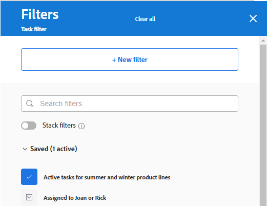

# 將輸入欄新增到展示板

您可以選擇將輸入欄新增到展示板，在將任務和問題新增到時，會自動提取為已連線的卡片 [!DNL Workfront]，根據您定義的篩選器而定。 引入欄可作為Kanban團隊的待辦專案欄、支援團隊檢視問題新增到請求佇列時的引入位置，或您所需的任何其他目的。

一個展示板上只允許有一個輸入欄，它始終顯示為最左側的欄。

動態展示板上沒有輸入欄。

在屬於工作流程一部分的展示板上無法使用輸入欄。 反之，您可以設定待處理專案欄來從卡片清單提取卡片。 如需在工作流程中新增待處理專案欄至面板的相關資訊，請參閱 [在工作流程展示板上設定待處理專案](/help/quicksilver/agile/use-boards-agile-planning-tools/configure-backlog-workstream-board.md).

輸入欄限製為300個任務和300個問題。 它們按專案上定義的優先順序排序。 如需優先順序的相關資訊，請參閱 [更新任務優先順序](/help/quicksilver/manage-work/tasks/task-information/task-priority.md) 和 [更新問題優先順序](/help/quicksilver/manage-work/issues/issue-information/update-issue-priority.md).

如需欄的詳細資訊，請參閱 [管理展示板欄](/help/quicksilver/agile/get-started-with-boards/manage-board-columns.md). 如需有關已連線卡片的資訊，請參閱 [在展示板上使用連線的卡片](/help/quicksilver/agile/get-started-with-boards/connected-cards.md).

## 存取需求

您必須具有下列存取權才能執行本文中的步驟：

<table style="table-layout:auto"> 
 <col> 
 </col> 
 <col> 
 </col> 
 <tbody> 
  <tr> 
   <td role="rowheader"><strong>[!DNL Adobe Workfront] 計劃*</strong></td> 
   <td> 
任何
 </td> 
  </tr> 
  <tr> 
   <td role="rowheader"><strong>[!DNL Adobe Workfront] 授權*</strong></td> 
   <td> 
[!DNL Request] 或更高
 </td> 
  </tr> 
 </tbody> 
</table>

&#42;若要瞭解您擁有哪些計畫、授權型別或存取權，請聯絡您的 [!DNL Workfront] 管理員。

## 使用簡單篩選器建立輸入欄

1. 按一下 **[!UICONTROL 主要功能表]** 圖示  Adobe Workfront右上角，然後按一下 **[!UICONTROL 展示板]**.
1. 存取展示板。 如需詳細資訊，請參閱 [建立或編輯展示板](../../agile/get-started-with-boards/create-edit-board.md).
1. 按一下 **[!UICONTROL 設定]** 以開啟「設定」面板。
1. 展開 **[!UICONTROL 展示板]**.
1. 開啟 **[!UICONTROL 將專案動態攝取到展示板]**.

   

   輸入欄會新增在展示板的左側。 套用篩選器前，該區段會保持空白。

1. （選用）搜尋並選取 [!DNL Workfront] [!UICONTROL **專案**].
1. （選用）搜尋並選取使用者或團隊 [!UICONTROL **指定任務**].
1. 選取 [!UICONTROL **包含已完成的工作**] 以在輸入欄中顯示具有「完成」狀態的任務和問題。

   >[!NOTE]
   >
   >如果未選取此選項，則當處於其他狀態的卡片標籤為完成時，它們將「從」展示板上「掉落」，並且不再顯示。

1. 按一下 [!UICONTROL **套用**].

   所有物件都會以連線的卡片形式顯示在展示板輸入欄中。

   

## 使用進階篩選器建立輸入欄

1. 按一下 **[!UICONTROL 主要功能表]** 圖示  Adobe Workfront右上角，然後按一下 **[!UICONTROL 展示板]**.
1. 存取展示板。 如需詳細資訊，請參閱 [建立或編輯展示板](../../agile/get-started-with-boards/create-edit-board.md).
1. 按一下 **[!UICONTROL 設定]** 以開啟「設定」面板。
1. 展開 **[!UICONTROL 展示板]**.
1. 開啟 **[!UICONTROL 將專案動態攝取到展示板]**.

   輸入欄會新增在展示板的左側。 套用篩選器前，該區段會保持空白。

1. 按一下 [!UICONTROL **使用進階篩選**].
1. 按一下 **[!UICONTROL 新增篩選來源]** 並選取 **[!UICONTROL 任務]** 或 **[!UICONTROL 問題]**.

   

   >[!NOTE]
   >
   >您可以篩選輸入欄以包含任務和問題，但您必須為每個物件型別個別設定篩選器。
   >
   >此外，儲存的篩選器和系統預設篩選器可供您選取。

1. 在篩選面板上，按一下 **[!UICONTROL 新增篩選器]** 以開始使用。

   

1. 建立您的篩選器並按一下 **[!UICONTROL 另存新檔]**.

   

   此範例顯示特定專案中處於以下狀態之任務的篩選器： [!UICONTROL 新增] 或 [!UICONTROL 進行中]，和會指派給我。

   如需建立篩選的詳細資訊，請參閱文章中的「在標準產生器中建立或編輯篩選」一節 [在中建立或編輯篩選器 [!DNL Adobe Workfront]](/help/quicksilver/reports-and-dashboards/reports/reporting-elements/create-filters.md).

1. 命名篩選器並按一下 **[!UICONTROL 儲存]**.

   

   為篩選器指定唯一名稱可讓您稍後搜尋。

1. 該篩選器會顯示在已儲存的篩選器清單中，並自動套用至輸入欄。 按一下篩選器面板頂端的X以將其關閉。

   

1. （可選）若要與其他人共用篩選，請將游標停留在已儲存的篩選上，按一下 **[!UICONTROL 更多]** 功能表 ，並選取 **[!UICONTROL 共用]**. 在「篩選條件共用」方塊中選擇要共用的使用者或團隊。 如需詳細資訊，請參閱 [共用篩選、檢視或群組](/help/quicksilver/reports-and-dashboards/reports/reporting-elements/share-filter-view-grouping.md).
1. （選用）若要在輸入欄中同時包含任務和問題，請按一下 **[!UICONTROL 篩選來源]** 並選取其他物件以建立另一個濾鏡。
1. 新增完篩選器後，請檢閱輸入欄，確認顯示正確的任務和問題。

   

   >[!NOTE]
   >
   >您可以隨時更新篩選器，方法是開啟「設定」面板，按一下 **[!UICONTROL 篩選來源]**，並選取 **[!UICONTROL 任務]** 或 **[!UICONTROL 問題]**.

## 使用輸入欄

不可編輯輸入欄中的卡片，除非您將卡片移動到其他展示板欄。 您可以按一下卡片，以唯讀檢視開啟它，或按一下  在新的瀏覽器標籤中開啟任務或問題。

您可以手動重新排序輸入欄上的專案。

攝入欄右上角的圖示會顯示欄中目前有多少卡片，以及已套用多少篩選器。

1. （選用）若要搜尋輸入欄中的專案，請按一下  在欄上。
1. （可選）若要將卡片從輸入欄移動到另一欄，請將卡片拖放至您要顯示的位置。

   或

   按一下 **[!UICONTROL 更多]** 功能表  ，然後選取「 」 **[!UICONTROL 移動]**. 然後，在 **[!UICONTROL 移動專案]** 方塊，選擇其他欄並選取 **[!UICONTROL 移動]**.

1. （可選）若要刪除輸入欄，請按一下 **[!UICONTROL 更多]** 功能表  並選取 **[!UICONTROL 刪除]**.
