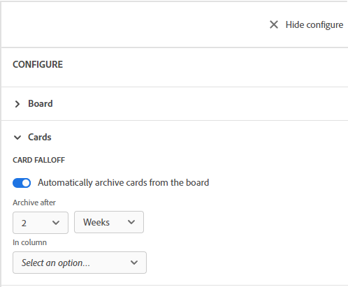

# 設定卡片流失

您可以設定展示板，讓資訊卡依排程封存或「流失」展示板。 您可以在特定欄中設定卡片，以便在特定天數或周內從展示板上掉下來。

當資訊卡從展示板上掉下來時，就會封存資訊。 您可以使用篩選來顯示已封存的卡片。 如需詳細資訊，請參閱 [在展示板中篩選和搜尋](/help/quicksilver/agile/get-started-with-boards/filter-search-in-board.md).

## 存取需求

您必須具備下列存取權，才能執行本文中的步驟：

<table style="table-layout:auto"> 
 <col> 
 </col> 
 <col> 
 </col> 
 <tbody> 
  <tr> 
   <td role="rowheader"><strong>[!DNL Adobe Workfront] 計劃*</strong></td> 
   <td> 
任何
 </td> 
  </tr> 
  <tr> 
   <td role="rowheader"><strong>[!DNL Adobe Workfront] 授權*</strong></td> 
   <td> 
[!UICONTROL Request]或更高版本
 </td> 
  </tr> 
 </tbody> 
</table>

&#42;若要了解您擁有的計畫、授權類型或存取權，請聯絡您的 [!DNL Workfront] 管理員。

## 設定卡片流失

1. 按一下 **[!UICONTROL 主菜單]** 圖示  在 [!DNL Adobe Workfront]，然後按一下 **[!UICONTROL 展示板]**.
1. 存取展示板。 如需詳細資訊，請參閱 [建立或編輯展示板](../../agile/get-started-with-boards/create-edit-board.md).
1. 按一下 **[!UICONTROL 設定]** ，開啟「設定」面板。
1. 展開 **[!UICONTROL 卡片]**.
1. 開啟 **[!UICONTROL 從展示板自動封存資訊卡]**.

   

1. 選取從展示板封存資訊卡的時間。 您可以選擇最多4週或最多30天。

   日期由上次修改卡片的時間決定。

1. 選取要從中移除卡片的欄。
1. 按一下 **[!UICONTROL 儲存]** 在確認訊息上。
1. 按一下 **[!UICONTROL 隱藏配置]** 關閉 [!UICONTROL 設定] 中。 重新整理展示板時，會自動套用配置設定。
