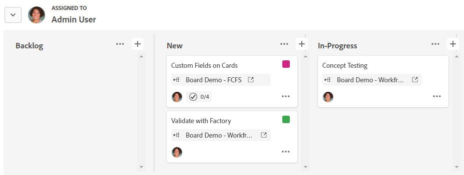

# 在展示板上使用群組

您可以依受指派人或標籤將看板上的卡片分組。 當您選取群組依據的選項時，卡片會以泳道格式顯示。 未指派的卡片或沒有標籤的卡片會出現在自己的泳道中。

>[!NOTE]
>
>攝入欄中的任何卡片都不會包含在群組中，而且在套用群組時攝入欄會隱藏。 如需輸入資料行的詳細資訊，請參閱[將輸入資料行新增到展示板](/help/quicksilver/agile/use-boards-agile-planning-tools/add-intake-column-to-board.md)。

## 存取權要求

+++ 展開以檢視這篇文章中所述功能的存取權要求。

<table style="table-layout:auto"> 
 <col> 
 <col> 
 <tbody> 
  <tr> 
   <td role="rowheader">Adobe Workfront 封裝</td> 
   <td> 
任何
 </td> 
  </tr> 
  <tr> 
   <td role="rowheader">Adobe Workfront授權</td> 
   <td> 
   
投稿人或以上
 
   
要求或更高版本

   </td> 
  </tr> 
 </tbody> 
</table>

如需詳細資訊，請參閱Workfront檔案中的[存取需求](/help/quicksilver/administration-and-setup/add-users/access-levels-and-object-permissions/access-level-requirements-in-documentation.md)。

+++

## 展示板上的群組卡片

{{step1-to-boards}}

1. 存取展示板。 如需詳細資訊，請參閱[建立或編輯展示板](../../agile/get-started-with-boards/create-edit-board.md)。
1. 按一下「**[!UICONTROL 群組]**」以開啟展示板左側的群組面板。

   >[!NOTE]
   >
   >群組依據的預設設定是&#x200B;**[!UICONTROL 無]**。 您可以隨時選取此選項來移除群組，並只顯示展示板上的欄。

1. 若要將卡片分組，請選取&#x200B;**[!UICONTROL 受指派人]**&#x200B;或&#x200B;**[!UICONTROL 標籤]**。

   卡片會自動分組。 按一下群組名稱旁的箭頭，可收合併展開該群組。

   

1. 選取將卡片移至其他群組時發生的情況。

   * **[!UICONTROL 加入受指派人] / [!UICONTROL 加入標籤]：**&#x200B;新群組中的受指派人或標籤會加入卡片上的現有受指派人或標籤清單。
   * **[!UICONTROL 覆寫受指派人] / [!UICONTROL 覆寫標籤]：**&#x200B;新群組中的受指派人或標籤會覆寫所有其他受指派人或標籤，並成為卡片上的唯一受指派人或標籤。

   ![[!UICONTROL 依選項分組]](assets/group-by-rail.png)

1. 按一下「**[!UICONTROL 隱藏群組]**」以隱藏群組面板並顯示完整版面。
