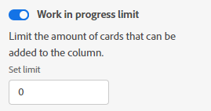

# 管理展示板上的[!UICONTROL 進行中工作] (WIP)限制

您可以為展示板上的每個欄設定[!UICONTROL 進行中工作] (WIP)限制。

WIP限制只是視覺上的警告，不會限制您在每一欄中擁有的料號超過您設定的限制。

## 存取權要求

+++ 展開以檢視這篇文章中所述功能的存取權要求。

<table style="table-layout:auto"> 
 <col> 
 <col> 
 <tbody> 
  <tr> 
   <td role="rowheader">Adobe Workfront 封裝</td> 
   <td> 
任何
 </td> 
  </tr> 
  <tr> 
   <td role="rowheader">Adobe Workfront授權</td> 
   <td> 
   
投稿人或以上
 
   
要求或更高版本

   </td> 
  </tr> 
 </tbody> 
</table>

如需詳細資訊，請參閱Workfront檔案中的[存取需求](/help/quicksilver/administration-and-setup/add-users/access-levels-and-object-permissions/access-level-requirements-in-documentation.md)。

+++

## 設定欄位的在製品限制

{{step1-to-boards}}

1. 存取展示板。 如需詳細資訊，請參閱[建立或編輯展示板](../../agile/get-started-with-boards/create-edit-board.md)。
1. 找到您要新增WIP限制的欄。

   若要新增欄，請參閱[管理面板欄](/help/quicksilver/agile/get-started-with-boards/manage-board-columns.md)。

1. 按一下欄上的&#x200B;**[!UICONTROL 更多]**&#x200B;功能表，然後選取&#x200B;**[!UICONTROL 編輯]**&#x200B;以開啟[設定]區域。
1. 在[!UICONTROL 資料行原則]下，啟用&#x200B;**[!UICONTROL 進行中工作]限制**&#x200B;原則以限制可新增至資料行的卡片數目。
1. 在&#x200B;**[!UICONTROL 設定限制]**&#x200B;欄位中輸入限制數字。

   的WIP限制

   卡片的數量和限制會顯示在欄的最上方。 如果欄包含超過限制的卡片，計數器會變成紅色。

   

1. 按一下&#x200B;**[!UICONTROL 關閉]**&#x200B;以結束[!UICONTROL 設定]區域並檢視資料行及其卡片。
