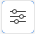

# 檢閱反複專案量度

量度可用於工作流程中的每個反複專案，位於反複專案流程板和控制面板上。

## 存取需求

您必須具有下列存取權才能執行本文中的步驟：

<table style="table-layout:auto"> 
 <col> 
 </col> 
 <col> 
 </col> 
 <tbody> 
  <tr> 
   <td role="rowheader"><strong>[!DNL Adobe Workfront] 計劃*</strong></td> 
   <td> 
任何
 </td> 
  </tr> 
  <tr> 
   <td role="rowheader"><strong>[!DNL Adobe Workfront] 授權*</strong></td> 
   <td> 
[！UICONTROL Request]或更高版本
 </td> 
  </tr> 
 </tbody> 
</table>

## 檢閱反複專案板上的反複專案量度

{{step1-to-boards}}

1. 若要開啟工作流程，請按一下 [!UICONTROL **檢視工作流程**].
1. 選取 [!UICONTROL 反複專案程式] 展示板。
1. 檢閱右上角展示板上方的量度區域。 按一下向上和向下箭頭，可在版序之間移動。

   會顯示下列量度：指派給疊代的總點數、疊代中尚未完成的剩餘點數，以及疊代中完成的點數。

1. （可選）按一下 [!UICONTROL **反複專案詳細資料**] 圖示  以開啟所選反複專案的詳細資訊對話方塊。

## 檢閱控制面板上的反複專案量度

{{step1-to-boards}}

工作流程串流目前反複專案的儀表板上會顯示下列量度：指派給反複專案的總點數、完成的點數，以及反複專案中尚未完成的剩餘點。

若要檢閱其他版序的量度，您必須開啟版序面板。
