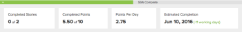

# 反複專案完成狀態概觀

本文所述的完成資訊會顯示在待執行工作圖表上方。

反複專案的完成百分比：

此資訊會指出目前於待執行工作表中選取之日的反複專案完成狀態。 依預設，會根據當天的日期顯示完成狀態。

下列資訊可供使用：

* **[!UICONTROL 完成百分比]：**&#x200B;反複運算的整體進度

  [!UICONTROL 完成百分比]會根據疊代內每個內文或任務的完成百分比進行調整，包括僅部分完成的內文或任務。

  [!UICONTROL 完成百分比]狀態列的顏色會顯示為紅色或綠色，以符合實際待執行工作速率的顏色。 當待執行工作速率小於理想值（比理想的待執行工作速率計算還要多一點或小時）時，以紅色顯示；當待執行工作速率等於或高於理想值（比理想的待執行工作速率計算還要少或等於每天的待執行工作點）時，以綠色顯示。

* **[!UICONTROL 已完成的內文]：** （僅供反複專案使用）標示為[!UICONTROL 完成]的內文數目。 這相對於反複專案中的內文總數而顯示。 例如，「6個中的3個」表示反複運算中6個劇本中有3個已標示為[!UICONTROL 完成]。
* **[!UICONTROL 已完成點數/時數]：** （僅供反複專案使用）標示為[!UICONTROL 完成]的點數或時數。 顯示在反複運算中與總點數或時數相關的專案。 例如，「5 / 11」表示反複運算中11個本文中有5個標示為[!UICONTROL 完成]。 此數字與[!UICONTROL 完成百分比]計算直接相關，並且會在更新[!UICONTROL 完成百分比]的同時更新。

  點數和小時數與劇本相關聯。 當內文標示為[!UICONTROL 完成]時，與該內文相關聯的點數或時數會標示為完成。

  依預設，會使用點。 您可以修改團隊的設定來變更此設定，如[建立敏捷團隊](../../../agile/get-started-with-agile-in-workfront/create-an-agile-team.md)中所述。

* **[!UICONTROL 每日點/小時]：** （僅適用於反複專案）從反複專案開始到當天，每天標示為[!UICONTROL 完成]的平均點數或小時。

  這是以總完成點數或時數除以當天的總天數來計算的。 （部分天數會記錄為整天。）

  規劃未來的反複專案時，此資訊會很有用。

* **[!UICONTROL 預估完成]：**&#x200B;根據目前每日點/時數的速率（適用於反複專案），預估完成反複專案的日期。

  當[!UICONTROL 預估完成]日期晚於為反複專案定義的結束日期時，剩餘的工作日數會在[!UICONTROL 預估完成]日期旁以紅色括弧顯示。

  當[!UICONTROL 預估完成]日期早於疊代的計畫結束日期時，剩餘的工作日數會以綠色顯示。 (疊代的結束日期是在計畫疊代時指定的，如[建立疊代](../../../agile/use-scrum-in-an-agile-team/iterations/create-an-iteration.md)中所述；專案的結束日期是[!UICONTROL 計畫完成日期]，或如果[!UICONTROL 計畫完成日期]是過去的日期，則為目前日期。 專案的[!UICONTROL 計畫完成日期]是根據專案中任務的期間所計算。) 規劃反複專案時，如果您為非工作日設定反複專案結束日期，且反複專案正在追蹤以準時完成，則會為您設定的反複專案結束日期之前的最後一個工作日設定「預估完成日期」（因為未排定在非工作日燒錄工作）。

  例如，「（+9天）」表示「預估完成日期」比疊代的計畫結束日期晚9個工作日。

  如需詳細資訊，請參閱[反複專案完成狀態總覽](#Understanding-How-Days-Off-Affect-the-Burndown-Chart)。
