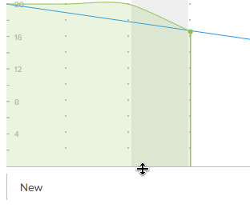

# 調整待執行工作圖表的大小並收合

您可以調整或收合待執行工作圖表，以調整它在故事板上所佔用的空間。

您對待執行工作圖表的大小或可見性所做的任何變更只會顯示給您，並在清除瀏覽器快取時重設。

## 存取權要求

+++ 展開以檢視這篇文章中所述功能的存取權要求。

<table style="table-layout:auto"> 
 <col> 
 </col> 
 <col> 
 </col> 
 <tbody> 
  <tr> 
   <td role="rowheader">Adobe Workfront 封裝</td> 
   <td> 
任何
 </td> 
  </tr> 
  <tr> 
   <td role="rowheader">Adobe Workfront授權</td> 
   <td> 
淺色或更高
 
   
評論或以上
 </td> 
  </tr>
 </tbody> 
</table>

如需詳細資訊，請參閱Workfront檔案中的[存取需求](/help/quicksilver/administration-and-setup/add-users/access-levels-and-object-permissions/access-level-requirements-in-documentation.md)。

+++

## 調整待執行工作圖表的大小

{{step1-to-team}}

1. （選擇性）按一下&#x200B;**[!UICONTROL 切換群組]**&#x200B;圖示，然後從下拉式功能表中選取新的[!UICONTROL Scrum]群組，或在搜尋列中搜尋群組。

1. 移至包含您要調整大小之待執行工作圖表的反複專案。
1. 暫留在待執行工作圖表的底線上，然後將圖表拖曳至所需的大小。
   

## 收合待執行工作圖表

{{step1-to-team}}

1. （選擇性）按一下&#x200B;**[!UICONTROL 切換群組]**&#x200B;圖示，然後從下拉式功能表中選取新的[!UICONTROL Scrum]群組，或在搜尋列中搜尋群組。

1. 移至包含您要摺疊之待執行工作圖表的反複專案。
1. 按一下[!UICONTROL 完成百分比]狀態列左側的箭頭圖示。
