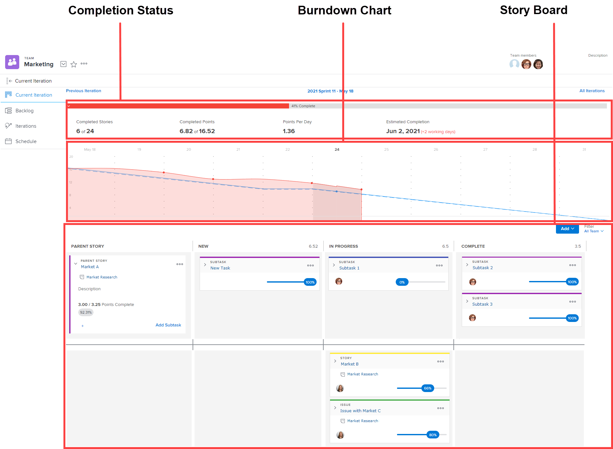

# 反複專案概觀

敏捷反複專案包含三個區域：完成狀態、待執行工作及劇本面板。

如需有關待執行工作圖表和完成狀態的資訊，請參閱[[!UICONTROL 待執行工作]](../../../agile/use-scrum-in-an-agile-team/burndown/burndown.md)區段。

如需故事板的詳細資訊，請參閱[[!UICONTROL Scrum]故事板](../../../agile/use-scrum-in-an-agile-team/scrum-board/scrum-board.md)區段。
