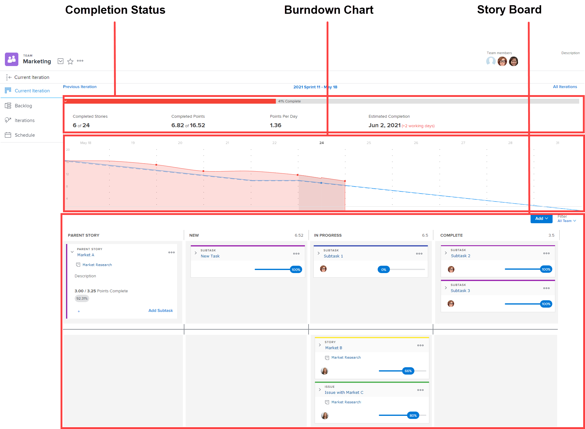

# 反覆項目概觀

敏捷迭代由三個區域組成：完成狀態、燃耗和展示板。

有關燃耗圖和完成狀態的資訊，請參見 [[!UICONTROL Burndown]](../../../agile/use-scrum-in-an-agile-team/burndown/burndown.md) 區段。

如需動態展示板的詳細資訊，請參閱 [[!UICONTROL Scrum] 展示板](../../../agile/use-scrum-in-an-agile-team/scrum-board/scrum-board.md) 區段。
