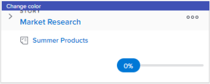

# 在[!UICONTROL Scrum]板上依色彩分類劇本

## 變更內文的預設色彩關聯

內文的預設色彩關聯會依據內文板是位於疊代還是專案而有所不同：

* **[!UICONTROL 反複專案]**：在反複專案上，內文板圖磚會根據內文相關聯的專案進行色彩編碼。 （每個專案都會任意指定故事板上的顏色。） 您可以為每個敏捷團隊變更此預設行為。 疊代上敏捷內文的顏色可以與專案（預設）、內文優先順序、所有者或自由形式繫結。 如需詳細資訊，請參閱[設定Scrum](../../../agile/get-started-with-agile-in-workfront/configure-scrum.md)文章中的[設定如何針對敏捷故事板上的劇本使用顏色指標](../../../agile/get-started-with-agile-in-workfront/configure-scrum.md#configur4)。

* **[!UICONTROL 專案]**：在專案上，任何子任務都與父任務的顏色相符，因此任何指定泳道中的所有劇本顏色都相同。 如果任務沒有任何子任務或沒有父任務，則在建立顏色時，顏色會隨機指派給任務。 您可以修改敏捷檢視來變更此預設行為。 專案中敏捷內文的顏色可以與父內文（預設）、內文優先順序、所有者或自由形式繫結。 如需詳細資訊，請參閱 [!DNL Adobe Workfront]](../../../reports-and-dashboards/reports/reporting-elements/views-overview.md)中[檢視總覽中的[建立或自訂[!UICONTROL 敏捷]檢視](../../../reports-and-dashboards/reports/reporting-elements/views-overview.md#customizing-an-agile-view)。

## 存取需求

您必須具有下列存取權才能執行本文中的步驟：

<table style="table-layout:auto"> 
 <col> 
 </col> 
 <col> 
 </col> 
 <tbody> 
  <tr> 
   <td role="rowheader"><strong>[!DNL Adobe Workfront] 計畫*</strong></td> 
   <td> 
任何
 </td> 
  </tr> 
  <tr> 
   <td role="rowheader"><strong>[!DNL Adobe Workfront] 授權*</strong></td> 
   <td> 
[！UICONTROL Work]或更高版本
 </td> 
  </tr> 
  <tr> 
   <td role="rowheader"><strong>存取層級設定*</strong></td> 
   <td> 
[！UICONTROL Worker]或更高版本
 
注意：如果您還是沒有存取權，請詢問您的[!DNL Workfront]管理員是否對您的存取層級設定了其他限制。 如需[!DNL Workfront]管理員如何變更您的存取層級的詳細資訊，請參閱<a href="../../../administration-and-setup/add-users/configure-and-grant-access/create-modify-access-levels.md" class="MCXref xref">建立或修改自訂存取層級</a>。
 </td> 
  </tr> 
 </tbody> 
</table>

&#42;若要瞭解您擁有的計畫、授權型別或存取權，請連絡您的[!DNL Workfront]管理員。

## 使用自由格式時變更內文的色彩

如果敏捷團隊設定已設定為[!UICONTROL 將卡片顏色關聯至]選項設為[!UICONTROL 自由表單]，使用者可以手動變更個別本文圖磚的顏色。 這對於傳達對團隊或組織來說很重要的其他型別的資訊很有用：

1. 按一下[!DNL Adobe] Workfront右上角的&#x200B;**[!UICONTROL 主要功能表]**&#x200B;圖示，然後按一下&#x200B;**[!UICONTROL 團隊]**。

1. （選擇性）按一下&#x200B;**[!UICONTROL 切換群組]**&#x200B;圖示，然後從下拉式功能表中選取新的Scrum群組或在搜尋列中搜尋群組。

1. 在左側面板中，選取&#x200B;**[!UICONTROL 反複專案]**&#x200B;以選擇特定反複專案，或選取&#x200B;**[!UICONTROL 目前反複專案]**。
1. 將滑鼠停留在內文圖磚頂端的彩色橫幅上。

   

1. 按一下&#x200B;**[!UICONTROL 變更顏色]**，然後選取所要的顏色。

   
