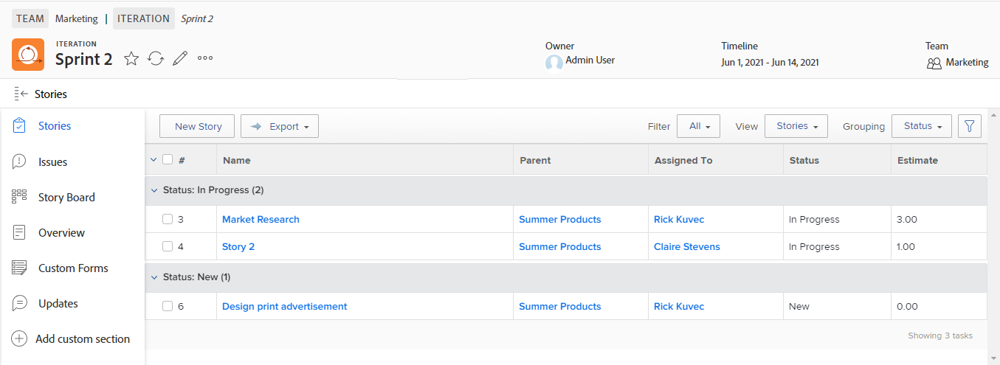

# 建立敏捷的故事

您可以以各種方式在迭代上建立敏捷的故事。 建立敏捷的動態後，您可以將子任務新增至動態。

在小版本中添加文章或子任務時，「持續時間類型」(Duration Type)設定為 [!UICONTROL 簡單] 而「任務約束」(Task Constraint)設定為「固定日期」(Fixed Dates)，且日期在小版本中被鎖定。 不能修改小版本中的「持續時間類型」或「任務約束」。 此外，任務持續時間必須大於0分鐘。

有關如何在文章添加到小版本後管理文章的資訊，請參見 [迭代](../../agile/use-scrum-in-an-agile-team/iterations/iterations.md).

## 存取需求

您必須具備下列存取權，才能執行本文中的步驟：

<table style="table-layout:auto"> 
 <col> 
 </col> 
 <col> 
 </col> 
 <tbody> 
  <tr> 
   <td role="rowheader"><strong>[!DNL Adobe Workfront] 計劃*</strong></td> 
   <td> 
任何
 </td> 
  </tr> 
  <tr> 
   <td role="rowheader"><strong>[!DNL Adobe Workfront] 授權*</strong></td> 
   <td> 
[!UICONTROL工作]或更高版本
 </td> 
  </tr> 
  <tr> 
   <td role="rowheader"><strong>訪問級別配置*</strong></td> 
   <td> 
[!UICONTROL Worker]或更高版本
 
注意：如果您仍無法存取，請詢問您的 [!DNL Workfront] 管理員。 若要了解 [!DNL Workfront] 管理員可修改您的存取層級，請參閱 <a href="../../administration-and-setup/add-users/configure-and-grant-access/create-modify-access-levels.md" class="MCXref xref">建立或修改自訂存取層級</a>.
 </td> 
  </tr> 
  <tr> 
   <td role="rowheader"><strong>物件權限</strong></td> 
   <td> 
[!UICONTROL管理]對文章所在項目的訪問
 
有關請求其他訪問的資訊，請參閱 <a href="../../workfront-basics/grant-and-request-access-to-objects/request-access.md" class="MCXref xref">請求對對象的訪問 </a>.
 </td> 
  </tr> 
 </tbody> 
</table>

&#42;若要了解您擁有的計畫、授權類型或存取權，請聯絡您的 [!DNL Workfront] 管理員。

## 在迭代中建立敏捷的故事

1. 轉到要建立動態的敏捷迭代：

   1. 按一下 **[!UICONTROL 主菜單]** 圖示  在 [!DNL Adobe Workfront]，然後按一下 **[!UICONTROL 團隊]**.

   1. （選用）按一下 **[!UICONTROL 交換組]** 圖示 ，然後從下拉式選單中選取新的Scrum團隊，或在搜尋列中搜尋團隊。

   1. 在左側面板中，選取 **[!UICONTROL 迭代]** 要選擇特定的小版本，或選擇 **[!UICONTROL 當前迭代]**.
   1. 按一下要建立動態的特定小版本的名稱。

   

1. 按一下 **[!UICONTROL 新動態].**
1. 指定下列資訊：

   <table style="table-layout:auto">
    <col>
    <col>
    <tbody>
     <tr>
      <td role="rowheader"><strong>[!UICONTROL文章名稱]</strong></td>
      <td>輸入動態名稱。</td>
     </tr>
     <tr>
      <td role="rowheader"><strong>[!UICONTROL描述]</strong></td>
      <td>輸入動態說明。</td>
     </tr>
     <tr>
      <td role="rowheader"><strong>[!UICONTROL就緒]</strong></td>
      <td>如果文章已準備好要添加到小版本，請選擇此選項。 選取此選項時，它會向使用者指出積壓工作中哪些動態已準備好新增至小版本。 無論文章是否被標籤，都可以將其添加到小版本 <strong>[!UICONTROL就緒]。</strong></td>
     </tr>
     <tr>
      <td role="rowheader"><strong>[!UICONTROL估計]（點）</strong></td>
      <td>指定動態的估計值。 如果您的敏捷團隊已設定為以點數估計動態，則預設為1點等於8小時。 在文章中將預估值新增為[!UICONTROL計畫小時數]。 例如，如果您將動態估計為3點，預設行為是將24個[!UICONTROL計畫小時]新增至動態。 如果動態包含子任務，請記住，所有子任務的合併估計將決定父動態的估計。 如需詳細資訊，請參閱 <a href="../../agile/use-scrum-in-an-agile-team/iterations/add-stories-to-existing-iteration.md" class="MCXref xref">將動態添加到現有小版本</a>.</td>
     </tr>
     <tr>
      <td role="rowheader"><strong>[!UICONTROL父項項目]</strong></td>
      <td>開始鍵入與此文章關聯的項目名稱。 依預設，動態顏色會顯示為此專案中其他動態的相同顏色。 項目的狀態必須設定為[!UICONTROL當前]。 如果專案的狀態為[!UICONTROL目前]以外的任何值，則下拉式功能表中不會顯示它。</td>
     </tr>
     <tr>
      <td role="rowheader"><strong>[!UICONTROL父任務]</strong></td>
      <td>選擇父項目後，您可以選擇父項任務。 當您選擇父任務時，系統會將文章建立為所選項目上父任務的子任務。 開始輸入動態的父任務名稱，然後在下拉清單中顯示時按一下。</td>
     </tr>
     <tr>
      <td role="rowheader"><strong>[!UICONTROL自訂Forms]</strong></td>
      <td>選取要新增至動態的任何自訂表單。</td>
     </tr>
    </tbody>
   </table>

1. 按一下 **[!UICONTROL 儲存動態]**.

## 在積壓工作中建立敏捷的故事

您可以根據敏捷積壓工作建立敏捷故事，如一節所述 [建立關於積壓的新動態](../../agile/work-in-an-agile-environment/manage-the-agile-backlog.md#creating-new-stories) 在文章中 [[!UICONTROL 管理] 敏捷的積壓](../../agile/work-in-an-agile-environment/manage-the-agile-backlog.md).

## 將任務或問題新增為敏捷故事

您可以將現有任務或問題作為文章添加到小版本中。 如需詳細資訊，請參閱 [將動態添加到現有小版本](../../agile/use-scrum-in-an-agile-team/iterations/add-stories-to-existing-iteration.md) 或 [從 [!UICONTROL Scrum] 展示板](../../agile/use-scrum-in-an-agile-team/scrum-board/add-story-from-scrum-board.md).

## 建立敏捷故事的子任務

您可以使用下列其中一種方法，為敏捷故事建立子任務：

* 使用 **[!UICONTROL 子任務]** 標籤，如 [建立子任務](../../manage-work/tasks/create-tasks/create-subtasks.md#creating-subtasks) in [建立子任務](../../manage-work/tasks/create-tasks/create-subtasks.md).

* 直接從故事板，如 [建立小版本](../../agile/use-scrum-in-an-agile-team/iterations/create-an-iteration.md).
