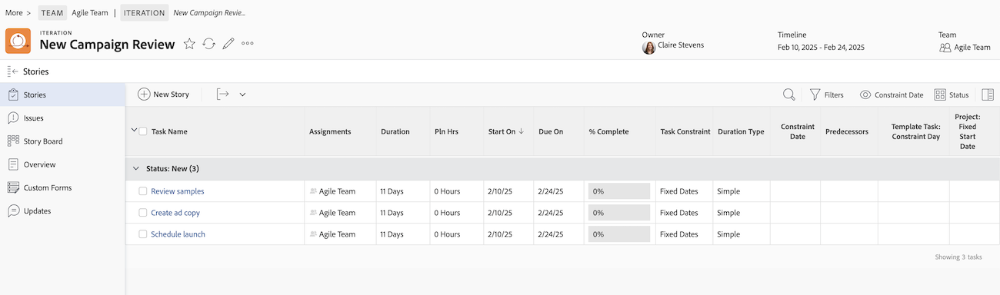

# 建立敏捷劇本

您可以用各種方式在反複專案上建立敏捷劇本。 建立敏捷內文後，您可以將子任務新增至內文。

當您在反複專案中新增內文或子任務時，「期間型別」會設為[!UICONTROL 簡單]，「任務限制」會設為「固定日期」，且日期會鎖定在反複專案中。 您無法修改反複專案中的「期間型別」或「任務限制」。 此外，任務持續時間必須大於0分鐘。

如需內文新增至疊代後如何管理的詳細資訊，請參閱[疊代](../../agile/use-scrum-in-an-agile-team/iterations/iterations.md)。

## 存取需求

+++ 展開以檢視本文中功能的存取需求。

<table style="table-layout:auto"> 
 <col> 
 </col> 
 <col> 
 </col> 
 <tbody> 
  <tr> 
   <td role="rowheader">Adobe Workfront套件</td> 
   <td> 
任何
 </td> 
  </tr> 
  <tr> 
   <td role="rowheader">Adobe Workfront授權</td> 
   <td> 
標準
 
   
工作或更高
 </td> 
  </tr>
  <tr> 
   <td role="rowheader">物件許可權</td> 
   <td>管理內文所在專案的存取權 </td> 
  </tr> 
 </tbody> 
</table>

如需有關此表格的詳細資訊，請參閱Workfront檔案中的[存取需求](/help/quicksilver/administration-and-setup/add-users/access-levels-and-object-permissions/access-level-requirements-in-documentation.md)。

+++

## 在反複專案中建立敏捷劇本

1. 前往您要建立劇本的敏捷反複專案：

   {{step1-to-team}}

   1. （選擇性）按一下&#x200B;**[!UICONTROL 切換群組]**&#x200B;圖示，然後從下拉式功能表中選取新的Scrum群組或在搜尋列中搜尋群組。

   1. 在左側面板中，選取&#x200B;**[!UICONTROL 反複專案]**&#x200B;以選擇特定反複專案，或選取&#x200B;**[!UICONTROL 目前反複專案]**。
   1. 按一下要建立內文的特定反複專案名稱。

   

1. 按一下&#x200B;**[!UICONTROL 新增劇本].**
1. 指定下列資訊：

   <table style="table-layout:auto">
    <col>
    <col>
    <tbody>
     <tr>
      <td role="rowheader"><strong>[！UICONTROL劇本名稱]</strong></td>
      <td>輸入劇本的名稱。</td>
     </tr>
     <tr>
      <td role="rowheader"><strong>[！UICONTROL說明]</strong></td>
      <td>輸入劇本的說明。</td>
     </tr>
     <tr>
      <td role="rowheader"><strong>[！UICONTROL就緒]</strong></td>
      <td>如果內文已準備好加入反複專案，請選取此選項。 選取此選項時，它會向使用者指出哪些待處理專案中的內文已準備好新增到疊代。 無論內文是否標示為<strong>[！UICONTROL就緒]，皆可新增至反複專案。</strong></td>
     </tr>
     <tr>
      <td role="rowheader"><strong>[！UICONTROL估計] （點）</strong></td>
      <td>指定劇本的預估。 如果您的敏捷團隊設定為以點為單位估計劇本，則預設的1點等於8小時。 預估會新增為內文上的[！UICONTROL計畫時數]。 例如，如果您估計內文為3點，預設行為是新增24個[！UICONTROL規劃時數]至內文。 如果內文包含子任務，請記住，所有子任務的合併估計值會決定父內文的估計值。 如需詳細資訊，請參閱<a href="../../agile/use-scrum-in-an-agile-team/iterations/add-stories-to-existing-iteration.md" class="MCXref xref">將劇本新增至現有反複專案</a>。</td>
     </tr>
     <tr>
      <td role="rowheader"><strong>[！UICONTROL父專案]</strong></td>
      <td>開始輸入此劇本將關聯的專案名稱。 預設情況下，內文顏色會顯示為此專案中其他內文的相同顏色。 專案狀態必須設定為[！UICONTROL目前]。 如果專案狀態不是[！UICONTROL目前]，則不會顯示在下拉式功能表中。</td>
     </tr>
     <tr>
      <td role="rowheader"><strong>[！UICONTROL父系任務]</strong></td>
      <td>選擇父項專案後，您就可以選擇父項任務。 當您選取父系任務時，內文會建立為所選專案上父系任務的子任務。 開始輸入內文父系工作的名稱，然後當它出現在下拉式清單中時按一下它。</td>
     </tr>
     <tr>
      <td role="rowheader"><strong>[！UICONTROL自訂Forms]</strong></td>
      <td>選取任何自訂表單以新增到劇本中。</td>
     </tr>
    </tbody>
   </table>

1. 按一下&#x200B;**[!UICONTROL 儲存劇本]**。

## 在待處理專案中建立敏捷劇本

您可以從敏捷待辦專案建立敏捷劇本，如文章[管理](../../agile/work-in-an-agile-environment/manage-the-agile-backlog.md#creating-new-stories)敏捷待辦專案[[!UICONTROL 中的]在待辦專案上建立新劇本](../../agile/work-in-an-agile-environment/manage-the-agile-backlog.md)一節所述。

## 將任務或問題新增為敏捷故事

您可以將現有任務或問題新增為劇本至疊代。 如需詳細資訊，請參閱[將劇本新增至現有反複專案](../../agile/use-scrum-in-an-agile-team/iterations/add-stories-to-existing-iteration.md)或[從[!UICONTROL Scrum]展示板](../../agile/use-scrum-in-an-agile-team/scrum-board/add-story-from-scrum-board.md)新增劇本和問題。

## 建立敏捷劇本的子任務

您可以使用下列其中一種方法來建立敏捷內文的子任務：

* 使用&#x200B;**[!UICONTROL 子任務]**&#x200B;標籤，如[建立子任務](../../manage-work/tasks/create-tasks/create-subtasks.md#creating-subtasks)中的[建立子任務](../../manage-work/tasks/create-tasks/create-subtasks.md)中所述。

* 直接從劇本面板，如[建立反複專案](../../agile/use-scrum-in-an-agile-team/iterations/create-an-iteration.md)中所述。
