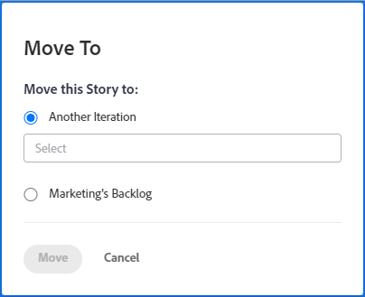

# 敏捷的故事

您可以將敏捷故事移動到不同的小版本（對於Scrum團隊），或者移至積壓（對於看板和Scrum團隊）。

## 存取需求

您必須具備下列存取權，才能執行本文中的步驟：

<table style="table-layout:auto"> 
 <col> 
 </col> 
 <col> 
 </col> 
 <tbody> 
  <tr> 
   <td role="rowheader"><strong>[!DNL Adobe Workfront] 計劃*</strong></td> 
   <td> 
任何
 </td> 
  </tr> 
  <tr> 
   <td role="rowheader"><strong>[!DNL Adobe Workfront] 授權*</strong></td> 
   <td> 
[!UICONTROL工作]或更高版本
 </td> 
  </tr> 
  <tr> 
   <td role="rowheader"><strong>訪問級別配置*</strong></td> 
   <td> 
[!UICONTROL Worker]或更高版本
 
注意：如果您仍無法存取，請詢問您的 [!DNL Workfront] 管理員。 若要了解 [!DNL Workfront] 管理員可修改您的存取層級，請參閱 <a href="../../administration-and-setup/add-users/configure-and-grant-access/create-modify-access-levels.md" class="MCXref xref">建立或修改自訂存取層級</a>.
 </td> 
  </tr> 
  <tr> 
   <td role="rowheader"><strong>物件權限</strong></td> 
   <td> 
[!UICONTROL管理]對文章的訪問
 
有關請求其他訪問的資訊，請參閱 <a href="../../workfront-basics/grant-and-request-access-to-objects/request-access.md" class="MCXref xref">請求對對象的訪問 </a>.
 </td> 
  </tr> 
 </tbody> 
</table>

&#42;若要了解您擁有的計畫、授權類型或存取權，請聯絡您的 [!DNL Workfront] 管理員。

## 將物料從小版本或看板板移至積壓

1. 轉至包含要移至積壓的物料的物料的小版本或看板板。
1. 按一下頁面頂端的小版本標題。
1. 在 **[!UICONTROL 故事]** 頁簽，選擇要移動的動態。
1. 按一下 **[!UICONTROL 更多]** > **[!UICONTROL 移至]**.

   此 **[!UICONTROL 移動動態]** 對話框。

   

1. 選擇 *team_name*&#x200B;積壓。\
   在上述範例中，團隊名&#x200B;稱為 **行銷。**

1. 按一下 **[!UICONTROL 移動動態]**.

## 將文章移動到其他小版本

您可以為Scrum團隊將一個故事移至不同的小版本。

>[!NOTE]
>
>此 **[!UICONTROL 移至]** 選項無法供迭代的父動態使用。 您只能將子任務移動到另一個小版本。

1. 轉至包含要移動的文章的小版本。
1. 按一下頁面頂端的小版本標題。
1. 在 **[!UICONTROL 故事]** 頁簽，選擇要移動的動態。
1. 按一下 **[!UICONTROL 更多]** > **[!UICONTROL 移至]**.

   此 **[!UICONTROL 移動動態]** 對話框。

   

1. 選擇 **[!UICONTROL 另一個迭代]**，然後在下拉式功能表中，選取您要移動文章的小版本。

   >[!NOTE]
   >
   >工作項 [!UICONTROL 計劃開始日期] 和 [!UICONTROL 計畫完成日期] 受 [!UICONTROL 編輯團隊] 頁面。 如需詳細資訊，請參閱 [[!UICONTROL 設定] 將工作項添加到迭代時如何應用日期](../../agile/get-started-with-agile-in-workfront/configure-scrum.md#configur5) 在文章中 [配置Scrum](../../agile/get-started-with-agile-in-workfront/configure-scrum.md).

1. 按一下 **[!UICONTROL 移動動態]**.
