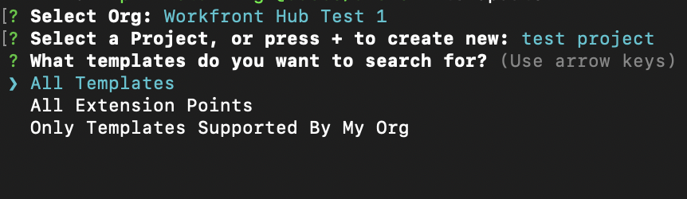

# 使用Adobe App Builder為Workfront建立自訂應用程式

由Adobe App Builder支援的Workfront UI擴充功能可讓客戶和合作夥伴建立自訂的使用者體驗。 這些工具可提升效率、提供順暢、連線的體驗，並大幅提升使用者滿意度，協助企業實現其獨特願景。

例如，如果沒有Workfront UI擴充功能，專案經理可能需要在Workfront和單獨的時間追蹤系統之間切換以記錄時數。 有了UI擴充功能，可直接將時間追蹤整合到Workfront體驗中，藉此簡化工作流程並節省時間。 此外，您可以新增自訂元件，以提升可用性、自動化重複工作，並透過如中繼資料標籤和內容預覽等功能，增強內容管理。 Adobe App Builder也提供擴充能力及強大的身分管理(IMS)，確保安全且有效率的自訂，規模不限。

Workfront UI擴充功能提供幾個主要優點：

* 精確自訂：標準軟體介面通常無法滿足所有業務需求。 UI擴充功能可讓開發人員修改及擴充預設使用者介面，以滿足特定業務需求。
* 系統整合： UI擴充功能有助於整合其他系統，確保順暢的工作流程與資料一致性。
* 擴充性：隨著企業成長，可以開發UI擴充功能來新增功能，而不需要徹底的系統檢修。
* 縮短開發時間：預先建立的擴充功能點和工具，大幅減少實施自訂功能所需的時間和精力。
* 增強使用者採用率：最佳化的使用者體驗可大幅提升軟體採用率。 為符合使用者偏好設定而設計的自訂UI元素可以提高採用率和整體滿意度。
* 運用Workfront UI擴充功能，企業可建立量身打造的使用者體驗，藉以提高效率、整合和使用者滿意度。

在Adobe App Builder中建立應用程式後，Workfront管理員可以使用版面配置範本將其新增到Workfront主功能表和左側導覽面板。 具有版面配置範本的使用者按一下應用程式後，就會看到應用程式內嵌在Workfront中，而不必另外開啟。

本文說明如何存取App Builder並使用範本建立應用程式。

如需將自訂應用程式新增至版面配置範本的相關資訊，請參閱[使用版面配置範本自訂主功能表](/help/quicksilver/administration-and-setup/customize-workfront/use-layout-templates/customize-main-menu.md)和[使用版面配置範本自訂左側面板](/help/quicksilver/administration-and-setup/customize-workfront/use-layout-templates/customize-left-panel.md)。

## 先決條件

您必須具備下列條件：

* 啟用IMS的Workfront帳戶
* 具有節點v18和npm的開發機器
* App Builder授權

## 存取Adobe App Builder

若要建立UI擴充功能，您必須能在Adobe Developer Console中存取Adobe App Builder 。

[Adobe Developer網站](https://developer.adobe.com/uix/docs/guides/get-access/)提供其他指示。

### 將開發人員新增至Adobe Admin Console

>[!IMPORTANT]
>
>請確定您已針對下列所有步驟選取正確的IMS組織。 如果您屬於多個組織，則可能會選取錯誤的組織。 請確定您是在正確的組織底下操作，組織通常列於右上角。

1. 導覽至生產環境： https://adminconsole.adobe.com/

1. 在&#x200B;**使用者**&#x200B;區段中，按一下&#x200B;**開發人員** > **新增開發人員**。

   

   >[!NOTE]
   >
   >如果您看不到管理開發人員的選項，表示您沒有允許開發人員存取的產品。

1. 新增使用者的電子郵件。 它應該搜尋已從Admin Console中新增的現有使用者。

1. 將必要的產品新增至開發人員設定檔，然後按一下[儲存]。**&#x200B;**\
   

### 存取App Builder

組織必須與其客戶經理合作，才能購買App Builder。

如果AppBuilder已正確設定，您應該會在建立新專案時看到從範本建立專案。

## 在Adobe Developer Console中建立新專案

您必須使用Adobe Developer Console來建置您的UI擴充功能。

[Adobe Developer網站](https://developer.adobe.com/uix/docs/guides/creating-project-in-dev-console/)提供其他指示。

1. 使用您的Adobe ID登入Adobe Developer Console 。

1. 選擇您的帳戶，以及您的設定檔或組織。

1. 按一下[快速入門]區域中的[從範本建立專案]&#x200B;**&#x200B;**，或按一下[從範本建立新專案]&#x200B;**>[從範本建立專案]**。

   >[!IMPORTANT]
   >
   >如果您沒有看見從範本建立專案的選項，表示您在Admin Console中的設定有誤，且無法存取App Builder目錄。 只有在您有權存取AppBuilder時，才會顯示此選項。

   

1. 選取&#x200B;**App Builder**。

1. 輸入&#x200B;**專案標題**&#x200B;和&#x200B;**應用程式名稱**。 兩者都有預設值，但如果您自訂值，稍後更容易識別您想要的專案。

1. 保留&#x200B;**包含執行階段**&#x200B;已選取。

1. 按一下「**儲存**」。

## 使用Adobe IO (aio) CLI

Adobe提供開放原始碼CLI，可用來建立App Builder應用程式。

GitHub和Adobe Developer網站上提供其他指示：

* https://github.com/adobe/aio-cli
* https://developer.adobe.com/app-builder/docs/getting_started/first_app/

1. 若要安裝工具，（請先確定您位於節點v18）執行： `npm install -g @adobe/aio-cli`。
1. 啟動您的終端機，並使用下列命令登入AIO： `aio login`。 如果您無法登入正確的IMS組織，請嘗試`aio login -f`強制登入提示。 使用`aio where`檢視您登入正確的IMS組織的組織。 如需詳細資訊，請使用`aio config`。
1. 透過執行`aio app init example-app`開始設定您的應用程式，請務必將「example-app」取代為您的應用程式名稱。 如果您不確定應用程式名稱，可以使用命令`aio console project list`檢視應用程式名稱清單。
1. 從提供的選項中選取您的組織和專案。
   
   

1. 瀏覽所有可用的範本，並為您的專案選擇&#x200B;**@adobe/workfront-ui-ext-tpl**。
   
1. 選取並輸入您在Adobe Developer Console中建立的專案名稱。
   

1. 回應應用程式的提示：

   * 為擴充功能命名。
   * 提供擴充功能的描述性摘要。
   * 選取要開始使用的初始版本編號。
   * 如果您在出現「您接下來想要做什麼？」的提示時選取「將自訂按鈕新增至主要功能表專案」，範本將會建立主要導覽按鈕的程式碼。

   

1. 選取「我已完成」以確認完成。 正在從範本產生程式碼。
   
1. 等到您看到應用程式初始化完成的訊息為止。 然後，您可以在IDE中開啟專案（建議使用Visual Studio Code）並存取src資料夾。

   如需專案中資料夾和檔案的詳細資訊，請參閱[Adobe開發人員網站](https://developer.adobe.com/app-builder/docs/get_started/app_builder_get_started/first-app#anatomy-of-an-app-builder-application)。

## 在VSCode中建置擴充功能

透過Workfront主功能表或次要導覽（左側面板）啟用導覽時，需要App.js檔案設定。

必須有ExtensionRegistration.js檔案設定，才能在Workfront配置範本中顯示擴充功能。

下列範例說明如何使用UI擴充功能，將自訂應用程式新增至Workfront主功能表和物件的左側面板。

### 設定ExtensionRegistration.js

若要在Workfront主功能表中允許自訂應用程式：

1. 前往ExtensionRegistration.js。

在ExtensionRegistration函式中，您應該會看到下列程式碼。 範本已為您建立此程式碼。 可以新增此程式碼以建立其他功能表專案。 請務必取代ID和URL。

    &quot;
    mainMenu： &lbrace;
    
    getItems() &lbrace;
    
    return &lbrack;
    
    &lbrace;
    
    id： &#39;main-menu-label&#39;，
    
    url： &#39;/index.html#/main-menu-label&#39;，
    
    label： &#39;Main menu label&#39;，
    
    icon： icon1，
    
    &rbrace;，
    
    &rbrack;；
    
    &rbrace;，
    
    &rbrace;
    &quot;&#39;

1. 新增下列程式碼片段：
   
此範例顯示主要功能表專案。 您必須將ID、標籤、圖示和URL更新為您的應用程式正確的名稱。 新增多個專案時，請確定ID是唯一的。

1. 儲存您的工作。

### 在Workfront左側面板導覽中允許自訂應用程式

若要允許在Workfront左側面板導覽中使用自訂應用程式：

1. 前往ExtensionRegistration.js。
1. 在ExtensionRegistration函式中，新增下列程式碼片段：

   ```
   secondaryNav: {  
   
   TASK: {  
   
       getItems() {       return [         {           id: "TASK", 
   
   label: "My TASK",           icon: metricsIcon,           url: "/myTask",  
   
           },  
   
       ];  
   
       },  
   
   },  
   
   },  
   ```

   

   * 此範例顯示名為「我的任務」的左側面板導覽專案。 您必須將ID、標籤、圖示和URL更新為您的應用程式正確的名稱。

   * 此範例顯示Project物件型別的左側面板導覽專案。 您必須針對Workfront支援的每個物件分別建立這些專案。 下列物件可供使用：專案、任務、問題、投資組合和方案。

1. 儲存您的工作。

### 設定App.js

1. 前往App.js。

1. 此範本將是一個主要功能表選項的路由。 路由會定義URL路徑與針對這些路徑演算的元件之間的對應。 若要新增路由，請使用下列程式碼片段，請務必以您的程式碼片段取代確切的路徑和元素。

   ```
       <Route 
   
               exact path="custom-application" 
   
               element={<Customapplication />} 
   
           /> 
   ```

   
1. 儲存您的工作。

如需開發及執行應用程式的詳細資訊，請參閱[Adobe開發人員網站](https://developer.adobe.com/app-builder/docs/get_started/app_builder_get_started/first-app#develop-the-application)。

## 共用內容

共用內容可將資料從Workfront共用至UI擴充功能。 透過共用內容可用的資料包括使用者資料和應用程式內容。


### 使用者

Workfront的UI擴充功能會共用使用者資料。 可透過共用內容使用的使用者物件包含Workfront使用者ID和使用者的電子郵件地址。

`user = (conn?.sharedContext?.get("user")); // {ID: '1', email: 'test@aaa.com'} userID = user.ID userEmail = user.email `

### 應用程式內容

使用次要導覽擴充功能點新增自訂應用程式時，自訂應用程式通常會使用內容資料，例如專案ID或檔案ID。 對於這些資料，共用內容包含物件程式碼和物件ID。

以下是取得檔案應用程式相關資訊環境的範例：

`context = conn?.sharedContext; // Using the connection created above, grab the document details from the host tunnel. // conn?.host?.document?.getDocumentDetails().then(setDocDetails); `

## 在Workfront中測試應用程式

針對Workfront開發App Builder應用程式時，您可能需要在Workfront中測試應用程式而不發佈。

在您的App Builder應用程式中，您可以啟動`aio app run`以進行本機開發。 這將為您提供URL，通常類似於`https://localhost:9080`。 或者，您可以執行`aio app deploy`以取得靜態Adobe網域。 請務必記下這些URL以供日後使用。

接下來，導覽至您要在瀏覽器中針對其開發的特定頁面。 開啟開發人員工具，並存取workfront.com或workfront.adobe.com的本機儲存空間。 您必須在此新增專案。 使用`extensionOverride`作為索引鍵，使用先前註明的App Builder URL作為值。

如果設定正確完成，當您在Workfront中重新載入版面配置範本頁面時，您將會看到App Builder應用程式的按鈕。 將應用程式按鈕新增至物件的主要功能表和左側面板，並確認它們是否正確顯示在這些區域中。

Adobe開發人員網站上提供其他指示，使用AEM的範例： https://developer.adobe.com/uix/docs/guides/preview-extension-locally/

## 發佈應用程式並核准提交

若要發佈並核准應用程式，請依照[Adobe開發人員網站](https://developer.adobe.com/uix/docs/guides/publication/)上的指示操作。
