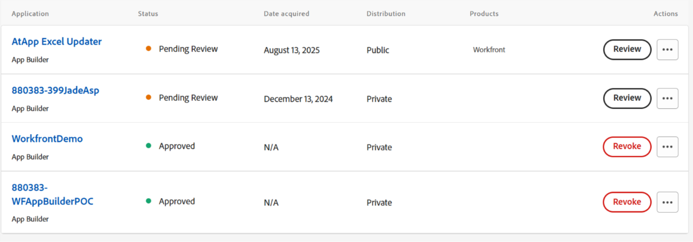

# 從Adobe Exchange取得並安裝應用程式

您現在可以直接從Adobe Exchange安裝合作夥伴為Workfront建置的應用程式。 這項功能可讓客戶連結至不斷成長的Adobe合作夥伴生態系統，這些合作夥伴提供專門建置的工具，可改善生產力、簡化營運並延伸Workfront功能。 透過Adobe Exchange，客戶可以使用UI擴充功能，探索及安裝順暢整合至Workfront的應用程式。

Adobe Exchange是跨Adobe Experience Cloud (包括Adobe Workfront)的協力廠商應用程式、擴充功能和整合的中央交易市場。 對於Workfront客戶而言，這是探索和安裝應用程式的首選目的地，這些應用程式可增強功能、簡化工作流程，並與外部系統整合。

## Adobe合作夥伴應用程式

Workfront合作夥伴網路是不斷成長的技術合作夥伴生態系統，其中獨立軟體廠商(ISV)使用Adobe App Builder和Workfront UI擴充功能，建立可擴充、安全且可擴充的應用程式。

Workfront合作夥伴可運用Workfront UI擴充功能，這是一個功能強大的架構，可讓應用程式直接內嵌至Workfront介面。 從Adobe Exchange安裝應用程式後，Workfront管理員可以將這些應用程式新增至版面配置範本，讓使用者可在每日工作流程中看見及存取這些應用程式。 這項緊密整合可確保使用者無需離開Workfront環境，即可與合作夥伴建立的工具（例如控制面板、核准流程或行銷活動追蹤器）互動。

### AtApp

#### 即時結果，直接在Adobe Workfront中

AtApp與Adobe Workfront客戶合作，將日常瓶頸轉化為可重複的解決方案，並提供可預見的成果。 其不斷成長的解決方案資料庫可運用人們工作地點的即時資料，協助提高準確性、速度及問責性。 AtApp可讓領導檢視目前的情況，並規劃後續的情況。 使用者可以探索目前可用且可立即安裝的AtAppStore Adobe Exchange應用程式、選取符合其目前優先順序的應用程式，並隨著需求成長進行擴充。

* [Excel Updater](https://exchange.adobe.com/apps/ec/abtt1rq7o9/atapp-excel-updater)： Excel Updater解決方案可讓您以符合成本效益的方式將資料整合至Workfront，而不需要學習API、撰寫程式碼或設定伺服器，非常適合用於單次和重複性的資料載入。

* [重新計算Helper](https://exchange.adobe.com/apps/ec/abv755903t/atapp-recalc-helper)： Recalc Helper解決方案可讓您從Workfront中，快速重新計算符合所選篩選條件之所有專案的自訂表單計算運算式、專案時間表或專案財務。

* UberTimesheet： UberTimesheet解決方案可讓每個人都在事後透過瀏覽器、平板電腦或智慧型手機輕鬆追蹤時間，藉此改善及擴大使用者對Workfront的採用。

### 工作焦點

WorkFocus是Adobe金牌解決方案合作夥伴，專門負責Adobe Workfront、Workfront Fusion、Workfront Planning、Firefly、AEM Assets和企業自動化。 我們建立由我們的專屬FCoE應用程式支援的Fusion Center of Excellence (FCoE)，協助組織以負責任的方式擴充自動化作業。

#### Fusion Center of Excellence (FCoE)應用程式

WorkFocus Fusion Center of Excellence應用程式可讓組織在整個企業內控管、擴展Adobe Workfront Fusion並最大化其價值。

許多團隊都在努力應對零散的Fusion案例、對自動化所有權和價值的瞭解有限、不一致的標準以及自動化蔓延等問題。 FCoE應用程式為Fusion自動化提供了中央記錄系統，解決了這些難題。

主要功能包括：

* Fusion案例的集中控管與所有權
* 從接收到支援的案例生命週期管理
* ROI和價值實現追蹤
* 企業級標準、檔案和錯誤處理
* 適合企業採用的可擴充作業模式

如此一來，Fusion可加快實現價值的時間、降低風險，並帶來可衡量的業務影響。

#### 開始使用WorkFocus

WorkFocus團隊邀請組織排程自訂的Fusion Center of Excellence展示，並設定應用程式的免費試用。

展望未來，藍圖包括於2026年推出Workfront卓越核心中心及Workfront卓越規劃中心。 透過成為Fusion Center of Excellence的客戶，組織便有機會影響這些即將推出的解決方案的藍圖，並協助塑造企業Workfront治理的未來。

WorkFocus渴望討論如何成為Workfront、Workfront Fusion、Workfront Planning、Firefly、AEM Assets和端對端內容Supply chain的戰略合作夥伴。

## 必要條件和許可權

**App Builder布建**

* 客戶必須在其Adobe Admin Console中布建App Builder。 這是從Adobe Exchange安裝應用程式的先決條件。

**企業組織管理員或開發人員**

* 可以搜尋App，按一下&#x200B;**取得**，然後繼續安裝。

* 如果組織中的某人已取得應用程式，他們可能會看到&#x200B;**開始安裝**&#x200B;或&#x200B;**管理**。

**非管理員使用者**

* 可能會起始贏取，但會提示您登入，如果應用程式需要管理員同意或特殊授權，則可能會遇到限制。

## 從Adobe Exchange取得並安裝應用程式

Adobe客戶可直接從Adobe Exchange Marketplace瀏覽、搜尋及安裝應用程式，以便在Workfront中使用。

使用Adobe App Builder建置的應用程式在Adobe Exchange上列為&#x200B;_App Builder應用程式_。 每個應用程式清單都包含檔案、熒幕擷取畫面和使用說明，協助客戶瞭解應用程式的價值。

若要檢視Workfront應用程式，請導覽至Adobe Exchange並搜尋與Workfront相容的應用程式。 您也可以篩選Workfront App Builder應用程式的清單：

1. 按一下左側面板中的&#x200B;**Experience Cloud**。
1. 在左側面板中尋找&#x200B;**產品**，然後選取&#x200B;**Workfront**。
1. 展開&#x200B;**應用程式型別**，然後選擇&#x200B;**App Builder**。

### 取得應用程式

應用程式可能需要向Adobe Exchange購買或允許安裝，但需要由應用程式開發人員授權。

若要取得應用程式

1. 按一下應用程式的名稱。
1. 按一下位於應用程式清單右上角的按鈕。
1. 按一下&#x200B;**是，繼續**，然後接受使用者授權合約。
   

### 系統管理員的動作

當使用者從Adobe Exchange取得應用程式時，他們可能會看到以下訊息： _您的系統管理員必須先核准您的贏取，您才能安裝及使用您的應用程式。_

這表示應用程式需要管理員層級的核准才能繼續安裝。 系統管理員可從以下區域找到請求：

**通知**

當組織中的使用者取得應用程式時，通常會透過電子郵件通知系統管理員。

**Admin Console**

系統管理員可以在[https://adminconsole.adobe.com/](https://adminconsole.adobe.com/)登入Admin Console，並導覽至「產品>應用程式整合」，以檢視所有已取得或要求的應用程式。

系統管理員存取請求後，即可檢閱和核准應用程式。 有些應用程式可能會提示管理員同意資料存取，並將應用程式指派給產品設定檔或特定使用者。

核准後，應用程式即可供安裝。

## 安裝應用程式

取得應用程式後，可直接安裝至Workfront中。 管理員可透過Workfront介面管理已安裝的應用程式，確保應用程式已正確設定，且使用者可存取。

1. 找到您要安裝的應用程式，然後開啟畫面右側的「動作」功能表。
1. 按一下檢視應用程式詳細資料。
1. 在畫面左側選取環境或新增環境。
1. 按一下&#x200B;**部署**。
   
1. 指派安裝或使用許可權（如有需要）。

   如果您的組織透過產品設定檔或使用者群組控制應用程式存取，請將應用程式指派給適當的設定檔或群組，讓使用者可繼續安裝及使用。

## 新增到版面範本

部署後，可在Workfront配置範本中使用合作夥伴應用程式。 您可以將應用程式新增至主要或次要導覽，以便在Workfront使用。

若要將應用程式新增至版面配置範本，請開啟版面配置範本，然後前往「主要功能表」或「次要功能表」區域。 使用新增圖示新增應用程式。

## 聯絡應用程式支援

應用程式擁有者支援從Adobe Exchange安裝的擴充功能。 在管理應用程式中，您可以按一下&#x200B;**取得支援**&#x200B;以取得任何問題的說明。
