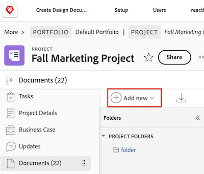

# 從您的檔案系統新增檔案至Adobe Workfront

您可以在Adobe Workfront的下列區域中，將檔案新增至專案、任務或問題：

* 全域檔案區域
* Workfront物件的檔案區域
* Workfront展示板上的已連線卡片

您也可以上傳檔案的新版本，並將連結新增至協力廠商雲端廠商(例如Google Drive、Dropbox和Microsoft OneDrive)的檔案。 如需新增檔案新版本的詳細資訊，請參閱 [上傳檔案的新版本](../../documents/managing-documents/upload-new-document-version.md). 如需關於新增來自第三方雲端廠商的檔案的資訊，請參閱 [從外部應用程式連結檔案](../../documents/adding-documents-to-workfront/link-documents-from-external-apps.md).

您可以上傳至Workfront的檔案型別和大小沒有限制。 不過，為了成功，上傳必須在5分鐘內完成，而且您必須有足夠的可用儲存空間。

如果您需要有關將檔案新版本上傳到Workfront的資訊，請參閱 [上傳檔案的新版本](../../documents/managing-documents/upload-new-document-version.md).

## 存取需求

您必須具備下列條件：

<table style="table-layout:auto"> 
 <col> 
 <col> 
 <tbody> 
  <tr> 
   <td role="rowheader">Adobe Workfront計畫*</td> 
   <td> 
 任何
 </td> 
  </tr> 
  <tr> 
   <td role="rowheader">Adobe Workfront授權*</td> 
   <td> 
要求或更高版本
 </td> 
  </tr> 
  <tr> 
   <td role="rowheader">存取層級設定*</td> 
   <td> 
編輯檔案的存取權
 
注意：如果您還是沒有存取權，請詢問您的Workfront管理員，他們是否在您的存取層級中設定其他限制。 如需有關Workfront管理員如何修改您的存取層級的資訊，請參閱 <a href="../../administration-and-setup/add-users/configure-and-grant-access/create-modify-access-levels.md" class="MCXref xref">建立或修改自訂存取層級</a>.
 </td> 
  </tr> 
 </tbody> 
</table>

&#42;若要瞭解您擁有的計畫、授權型別或存取權，請聯絡您的Workfront管理員。

## 新增檔案至Workfront

您可以從工作站的檔案系統新增檔案至Workfront。 您也可以連結來自協力廠商應用程式(例如Google Drive和SharePoint)的檔案。

>[!NOTE]
>
>雖然檔案上傳沒有大小限制，但檔案下載限製為4GB。

若要新增檔案：

1. 前往您要新增檔案的專案、任務或問題。
1. 按一下 **檔案** 標籤，然後按一下 **新增** 下拉式功能表。

   

1. 根據您要新增的檔案型別，執行下列任一項作業：

   <table style="table-layout:auto"> 
    <col> 
    <col> 
    <tbody> 
     <tr> 
      <td role="rowheader">從您工作站上的檔案系統上傳檔案</td> 
      <td> 
       <ol> 
        <li value="1">從 <strong>新增</strong> 下拉式功能表，選取 <strong>檔案。</strong></li> 
        <li value="2"> 
瀏覽並選取您要從工作站上的檔案系統新增的檔案。 
 
當您選取其他檔案時，可以按住Shift鍵來選取多個檔案。
 </li> 
        <li value="3">按一下 <strong>開啟</strong>.</li> 
       </ol> 
       
<b>注意</b>：您也可以直接從檔案管理員將檔案拖放至檔案清單中。</td> 
     </tr> 
     <tr> 
      <td role="rowheader">從第三方應用程式(例如Google Drive或SharePoint)上傳檔案</td> 
      <td> 
       <ol> 
        <li value="1"> 
從 <strong>新增</strong> 下拉式功能表，選取 <strong>從 &lt;name_of_third-party_application&gt;</strong>.
 
例如，若要從Google Drive上傳檔案，請按一下 <strong>從Google Drive</strong>.
 </li> 
        <li value="2"> 
按照提示在第三方應用程式中選取檔案。 
 
如需連結檔案的詳細資訊，請參閱 <a href="../../documents/adding-documents-to-workfront/link-documents-from-external-apps.md" class="MCXref xref">從外部應用程式連結檔案</a>.
 </li> 
       </ol> </td> 
     </tr> 
     <tr> 
      <td role="rowheader">向其他Workfront使用者請求檔案</td> 
      <td> 
       <ol> 
        <li value="1">從 <strong>新增</strong> 下拉式功能表，選取 <strong>請求檔案</strong>.</li> 
        <li value="2">在 <strong>您向誰請求</strong> 方塊中，輸入您向其請求檔案的使用者名稱。</li> 
        <li value="3">在 <strong>告知您正在請求的內容</strong> 方塊中，鍵入檔案的名稱。</li> 
        <li value="4"> 
按一下 <strong>傳送要求</strong>.
 
您的請求會顯示在「檔案」標籤上。
 
如需請求檔案的詳細資訊，請參閱 <a href="../../documents/adding-documents-to-workfront/request-a-document.md" class="MCXref xref">請求檔案</a>.
 </li> 
       </ol> </td> 
     </tr> 
    </tbody> 
   </table>

## 檔案安全性

Workfront網站可透過檔案以下列方式防止病毒和其他惡意內容進入網站：

* [Workfront如何偵測損毀的檔案](#how-workfront-detects-corrupted-files)
* [檔案名稱限制](#file-name-restrictions)

### Workfront如何偵測損毀的檔案 {#how-workfront-detects-corrupted-files}

您的組織僅在提出請求時才會啟用檔案掃描。

如果已啟用檔案掃描，則會在上傳檔案時掃描25 MB以下的檔案。 不會掃描超過25 MB的檔案。

如果Workfront偵測到檔案損毀，Workfront會停止上傳程式，並顯示檔案損毀訊息。 當Workfront偵測到潛在的惡意內容且檔案已設定為要移除時，您也會收到電子郵件通知。

損毀的檔案會在偵測到24小時內移除，除非您手動移除。 如果您刪除損壞的檔案，Workfront會將此動作作為更新加以追蹤。 如果您允許Workfront將其移除，則不會記錄任何更新。

### 檔案名稱限制 {#file-name-restrictions}

上傳至Workfront的檔案無法在檔案名稱中包含某些字元。 如果檔案在檔案名稱中包含下列任一字元，則上傳檔案時，會從檔案名稱中移除這些字元： `< > { }`.
