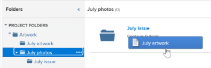

# 從外部應用程式連結檔案

<!-- Audited: 01/2024 -->

您可以從下列來源將檔案和資料夾連結至Adobe Workfront：

<table style="table-layout:auto"> 
 <col> 
 <col> 
 <tbody> 
  <tr> 
   <td role="rowheader">現有的第三方雲端檔案提供者</td> 
   <td>這些功能包括： 
    <ul> 
     <li>方塊</li> 
     <li>Dropbox</li> 
     <li>Dropbox業務</li> 
     <li>WebDAM</li> 
     <li>Microsoft OneDrive</li> 
     <li>Microsoft SharePoint</li> 
     <li>Google Drive</li> 
     <li>Quip</li>
    </ul></td> 
  </tr> 
  <tr> 
   <td role="rowheader">Workfront Proof </td> 
   <td>您可以在Workfront中提供原本在Workfront Proof中建立的校樣。</td> 
  </tr> 
  <tr data-mc-conditions="QuicksilverOrClassic.Quicksilver"> 
   <td role="rowheader">Experience Manager Assets Essentials </td> 
   <td>您可以從Experience Manager Assets Essentials將檔案連結到Workfront。 如需詳細資訊，請參閱<a href="../../documents/adobe-workfront-for-experience-manager-assets-essentials/workfront-for-aem-asset-essentials.md" class="MCXref xref">適用於Experience Manager Assets Essentials的Adobe Workfront</a>。</td> 
  </tr>

<tr> 
   <td role="rowheader">其他檔案提供者（透過自訂檔案整合）</td> 
   <td> 
這些整合功能可在「設定」區域中設定。
 </td>
  </tr> 
 </tbody> 
</table>

連結檔案或資料夾之前，您的Workfront管理員必須為每個檔案提供者或自訂檔案整合啟用此功能，如[設定檔案整合](../../administration-and-setup/configure-integrations/configure-document-integrations.md)中所述。

您可以校訂和核准連結至外部雲端提供者的檔案，就像直接上傳至Workfront的檔案一樣。

## 存取需求

+++ 展開以檢視本文中功能的存取需求。

您必須具有下列存取權才能執行本文中的步驟：

<table style="table-layout:auto"> 
 <col> 
 <col> 
 <tbody> 
  <tr> 
   <td role="rowheader">Adobe Workfront計畫</td>
   <td> 
 任何
 </td>
  </tr> 
  <tr> 
   <td role="rowheader">Adobe Workfront授權</td>
   <td>
新增：投稿人或更高版本

    
或

    
目前：要求或以上
 </td>
  </tr> 
  <tr> 
   <td role="rowheader">存取層級設定</td> 
   <td> 
編輯檔案的存取權
 </td> 
  </tr> 
 </tbody> 
</table>

如需有關此表格的詳細資訊，請參閱Workfront檔案中的[存取需求](/help/quicksilver/administration-and-setup/add-users/access-levels-and-object-permissions/access-level-requirements-in-documentation.md)。

+++

## 檔案儲存

從外部應用程式連結至Workfront的檔案會儲存於外部雲端提供者，而非儲存在Workfront中。

適用下列例外：

* 若由檔案服務提供，縮圖和預覽影像可能會儲存在Workfront伺服器上。
* 在Workfront中使用校訂時，檔案會複製並新增至校訂伺服器。

## 檔案大小限制

協力廠商雲端服務提供者：

* 單一檔案：5 GB以下
* 多個檔案：1 GB以下（所有檔案總數）

## 從外部應用程式將檔案連結至Workfront

您可以將現有檔案與外部雲端服務供應商連結。 這包括任何共用檔案。

### 先決條件 {#prerequisites}

連結檔案或資料夾之前，您的Workfront管理員必須為每個檔案提供者或自訂檔案整合啟用此功能，如[設定檔案整合](../../administration-and-setup/configure-integrations/configure-document-integrations.md)中所述。

### 將外部檔案連結至Workfront {#link-an-external-document-to-workfront}

您可以從外部應用程式(例如Workfront和Google OneDrive)將檔案連結至Microsoft。

>[!IMPORTANT]
>
>Dropbox會根據檔案路徑來儲存檔案。 因此，如果從Dropbox連結的檔案遭到移動、重新命名或刪除，就無法在Workfront中存取。

1. 移至Workfront中您想要檔案的&#x200B;**檔案**&#x200B;區域。
1. 按一下「新增&#x200B;**」**，然後按一下您要將檔案連結至Workfront的外部檔案提供者。

   例如，若要從Dropbox連結檔案，請按一下[從Dropbox連結] **&#x200B;**。

   您已經授權的外部提供者會出現在清單頂端。

1. （視條件而定）如果系統提示您登入外部服務，請在顯示的方塊中輸入服務的登入認證，然後按一下&#x200B;**登入**。
1. （視條件而定）如果系統提示您授權外部應用程式，請按一下&#x200B;**授權**&#x200B;按鈕。

   您只需執行此操作一次。

1. 在出現的&#x200B;**連結外部檔案和資料夾**&#x200B;方塊的搜尋方塊中，輸入您要搜尋的專案名稱，然後按&#x200B;**Enter**&#x200B;檢視來自外部應用程式的所有結果，無論這些結果位於哪個資料夾中。

   或

   瀏覽並選取您要連結的檔案。

   雖然您可以選取多個檔案，但只會連結在目前檢視中選取的檔案。 例如，如果您選取檔案，然後進入資料夾，則不會連結您最初選取的檔案。

1. （視條件而定）如果您是Workfront DAM客戶，請按一下&#x200B;**縮圖**&#x200B;圖示，將檔案顯示為縮圖影像。

   >[!NOTE]
   >
   >Workfront DAM客戶在從Workfront DAM連結檔案時，可檢視縮圖。 也會針對Workfront DAM客戶顯示其他服務(例如Dropbox和Box)的縮圖。 但是，不支援在Workfront中檢視Workfront DAM以外服務的縮圖，而且在從SharePoint或Google Drive連結檔案時，不會顯示縮圖。

1. 按一下&#x200B;**連結**。

   在Workfront中，雲端提供者的圖示會出現在檔案旁。

   >[!NOTE]
   >
   >* 如果用來連結檔案的下載URL超過2048個字元，則檔案無法連結。
   >* 對於連結到Box的檔案，在您重新整理頁面之前，不會顯示Box中檔案的連結。

### 新增連結檔案的新版本 {#add-a-new-version-of-a-linked-document}

您可以從外部應用程式新增連結至Workfront的檔案的新版本。

1. 移至連結檔案的&#x200B;**檔案**&#x200B;區域，然後選取連結的檔案。

   >[!IMPORTANT]
   >
   >檔案必須位於連結的資料夾之外，才能建立新版本。

1. 按一下&#x200B;**新增** > **版本**，然後按一下外部檔案提供者。

   例如，若要從Dropbox連結檔案的新版本，請按一下[從Dropbox連結] **&#x200B;**。

   您已經授權的外部提供者會出現在清單頂端。

1. （視條件而定）如果系統提示您登入外部服務，請在顯示的方塊中輸入服務的登入認證，然後按一下&#x200B;**登入**。
1. （視條件而定）如果系統提示您授權外部應用程式，請按一下&#x200B;**授權**。

   您只需執行此操作一次。

1. 在出現的&#x200B;**連結外部檔案和資料夾**&#x200B;方塊的搜尋方塊中，輸入您要搜尋的專案名稱，然後按&#x200B;**Enter**&#x200B;檢視來自外部應用程式的所有結果，無論這些結果儲存在哪個資料夾中。

   或

   瀏覽並選取您要連結的檔案。

   您可以選取多個檔案；不過，只會連結在目前檢視中選取的檔案。 例如，如果您選取檔案，然後進入資料夾，則不會連結您最初選取的檔案。

1. （視條件而定）如果您是Workfront DAM客戶，請按一下&#x200B;**縮圖**&#x200B;圖示，將檔案顯示為縮圖影像。

   >[!NOTE]
   >
   >Workfront DAM客戶在從Workfront DAM連結檔案時，可檢視縮圖。 也會針對Workfront DAM客戶顯示其他服務(例如Dropbox和Box)的縮圖。 但是，不支援在Workfront中檢視Workfront DAM以外服務的縮圖，而且在從SharePoint或Google Drive連結檔案時，不會顯示縮圖。

1. 按一下&#x200B;**連結**。

   在Workfront中，雲端提供者的圖示會出現在檔案旁邊，表示這些檔案已連結至外部雲端提供者。

   >[!NOTE]
   >
   >對於連結到Box的檔案，在您重新整理頁面之前，不會顯示Box中檔案的連結。

如需有關從您的檔案系統新增檔案版本至Workfront的資訊，請參閱[從您的檔案系統新增檔案至Adobe Workfront](../../documents/adding-documents-to-workfront/add-documents-from-file-system.md#add-documents-to-workfront)中的[新增檔案至Adobe Workfront](../../documents/adding-documents-to-workfront/add-documents-from-file-system.md)。

### 連結Workfront Proof檔案 {#link-workfront-proof-documents}

您可以將校訂連結至原本存在於Workfront Proof中的Workfront。 當您從Workfront Proof連結校訂時，所有與校訂相關的評論和其他中繼資料都可在Workfront中使用。

您只能連結在Workfront Proof中您擁有檢視存取權的校訂。

1. 移至Workfront中您想要檔案的&#x200B;**檔案**&#x200B;區域。
1. 按一下[新增] **&#x200B;**，然後按一下&lbrack;來自Workfront Proof的&#x200B;**&#x200B;**。

   >[!NOTE]
   >
   >此功能表中的選項可能會因環境中設定的協力廠商提供者而異。

1. 在出現的&#x200B;**從Workfront Proof連結校樣**&#x200B;方塊中，開始輸入您要在Workfront中提供的校樣名稱。

   當您輸入時，清單會經過篩選。

1. 選取最多10個要連結的校訂。

   任何變暗的校訂名稱都無法連結，因為校訂已與Workfront中的檔案相關聯。

1. 按一下&#x200B;**連結**。

   最新版本的校訂連結至Workfront。 開啟校訂時，校訂檢視器中會提供所有版本。

### 在Workfront中建立Google檔案 {#create-a-google-document-from-within-workfront}

您可以在Workfront中建立新的Google檔案。 您無法在Workfront中為其他雲端服務供應商建立新檔案。

1. 移至Workfront中您想要檔案的&#x200B;**檔案**&#x200B;區域。
1. 按一下&#x200B;**新增** > **Google檔案**，然後選取您要建立的Google檔案型別。
1. 如果出現&#x200B;**新增Google磁碟機帳戶**&#x200B;方塊，請按一下&#x200B;**授權Google磁碟機**。

   Google檔案已新增至&#x200B;**檔案**&#x200B;索引標籤。

   >[!NOTE]
   >
   > 「我的磁碟機」和「與我共用」會顯示兩個不同的結果。 如果您在[我的磁碟機]中找不到檔案，請存取[與我共用]資料夾。

## 上傳檔案並從Workfront連結至外部雲端提供者

您可以上傳檔案，並將其從Workfront連結至外部雲端提供者。 這會將檔案的儲存空間從Workfront移至外部雲端提供者。 當檔案在外部應用程式中變更時，會自動在Workfront中更新。

>[!NOTE]
>
>將資產傳送至外部檔案供應者時，會建立資產的新版本。

沒有Workfront存取許可權的使用者如果擁有應用程式的存取許可權，便可以在外部應用程式中檢視檔案。

1. 選取在Workfront中上傳的檔案。
1. 按一下&#x200B;**更多** >**傳送至**，然後選取您要儲存連結檔案的雲端提供者。

   您也可以使用[檔案詳細資訊]頁面上的[更多]功能表![[更多]功能表](assets/more-icon.png)來執行此操作。

1. 在提供者的應用程式中，選取您要儲存檔案的資料夾。

   這可以是提供者的應用程式中的任何資料夾，包括共用資料夾。

1. 按一下「**儲存**」。

   外部提供者的標誌會出現在檔名稱旁，表示檔案現在已連結至Workfront並由外部雲端提供者儲存。

   

## 連結資料夾

當您在Workfront和外部雲端提供者之間連結資料夾時，該資料夾及其所有內容都會連結。 如果沒有Workfront存取許可權的使用者從外部檔案應用程式新增、移除和修改檔案，則其變更會同步至Workfront。

### 資料夾存取權 {#folder-access-rights}

從外部檔案應用程式同步資料夾內容時，Workfront會使用最初連結資料夾之使用者的認證。 這會產生以下使用者體驗：

* 如果使用者無權檢視外部應用程式中的檔案和資料夾，但有權透過Workfront檢視連結的資料夾，則他們只能檢視Workfront中的檔案和資料夾名稱，不能檢視其內容。
* 當有人存取Workfront中由其他使用者連結至Workfront的連結資料夾（例如連結資料夾中的子資料夾）內的內容時，內容會使用原本連結資料夾的使用者Workfront登入認證（而非存取內容的使用者認證）同步至Workfront。

>[!IMPORTANT]
>
>* 如果從Workfront系統中移除最初連結資料夾的使用者，使用者將無法再透過Workfront存取連結資料夾上的內容。 在此情況下，資料夾必須由在外部應用程式中擁有資料夾存取權的作用中Workfront使用者重新連結。
>* 如果連結資料夾的使用者無法再存取外部應用程式，Workfront就無法再存取資料夾內容。 例如，如果最初連結資料夾的使用者離開公司，就可能發生這種情況。 為確保繼續存取，有權存取資料夾的使用者必須重新連結資料夾。

### 連結一或多個外部資料夾 {#link-one-or-more-external-folders}

1. 移至Workfront中您要資料夾的區域，然後按一下左側面板中的&#x200B;**檔案** 。

1. 按一下[新增]&#x200B;**&#x200B;**，然後按一下您要將資料夾連結至Workfront的外部檔案提供者。
1. （視條件而定）如果您尚未授權外部服務，請指定外部提供者的登入認證，然後按一下&#x200B;**登入**。

   您已經授權的外部提供者會出現在清單頂端。

1. 在出現的&#x200B;**連結外部檔案和資料夾**&#x200B;方塊中，瀏覽並選取您要連結的資料夾。

   或

   輸入您要搜尋的資料夾名稱，然後按&#x200B;**Enter**。

   您可以選取多個資料夾；不過，只會連結在目前檢視中選取的資料夾。 例如，如果您選取資料夾，然後進入資料夾，則您最初選取的資料夾不會連結。

   >[!NOTE]
   >
   >從Google Drive連結資料夾時，您只能連結位於個人磁碟機（我的磁碟機）和Team Drive中的資料夾。 您無法從「與我共用」區域連結資料夾。

1. 按一下&#x200B;**連結**。

   在Workfront中，雲端提供者的標誌會顯示在資料夾旁，表示已連結至外部雲端提供者。

1. （選擇性）若要重新命名資料夾，讓Workfront中的資料夾名稱不同於外部檔案應用程式中的資料夾名稱，請在&#x200B;**資料夾**&#x200B;區段中選取資料夾，按一下資料夾名稱旁邊顯示的[更多]功能表，然後按一下[重新命名]&#x200B;**&#x200B;**。

   

這不會重新命名外部應用程式中的資料夾。

### 將子資料夾新增至連結的資料夾  {#add-subfolders-to-a-linked-folder}

您可以在現有的連結資料夾中建立新資料夾。 您也可以將另一個資料夾拖曳到現有的連結資料夾中。

1. 若要在現有連結資料夾中建立新資料夾，請移至現有資料夾，然後依照[建立檔案資料夾](../../documents/organizing-documents/create-documents-folder.md)中的說明建立新資料夾。

   或

   若要將現有資料夾拖曳至現有的連結資料夾，請移至您想要子資料夾的「檔案」區域，然後將其拖曳至連結資料夾。

   

   >[!NOTE]
   >
   >將現有Workfront資料夾拖曳至連結資料夾時，適用下列限制：
   >
   >* 您正在拖曳的資料夾無法連結，也無法包含任何已連結的內容。
   >* 您要拖曳的資料夾（包括其內容）不可超過50 MB。

## 將檔案新增至連結的資料夾

當您透過Workfront將檔案新增至連結資料夾時，會自動新增為連結檔案。

1. 選取您想要檔案的連結資料夾，按一下&#x200B;**新增>檔案**，然後瀏覽至檔案並將其新增至資料夾。

   或

   在您想要檔案的&#x200B;**檔案**&#x200B;區域中，將檔案拖曳至連結的資料夾。

   您檔案的新版本會自動在外部應用程式中建立，並連結至Workfront。

>[!NOTE]
>
> * 檔案正在移動時，檔案選項不可用。
>
> * 檔案移至Experience Manager Assets後，Workfront的檔案清單中將不再顯示。
>
> * 您在檔案移動時對它所做的任何動作或編輯都不會顯示在Experience Manager Assets的檔案中，因此將會遺失。

## 刪除連結的檔案或資料夾

當您從外部應用程式中刪除連結的檔案或資料夾時，該檔案或資料夾會保留在Workfront系統中，直到您也從Workfront中刪除它為止。

1. 選取連結的檔案或資料夾，然後按一下&#x200B;**刪除**。
1. 在出現的確認方塊中，按一下&#x200B;**是，取消連結**。

   檔案會從Workfront網站取消連結。 在外部應用程式中不受影響。

## 關於重新命名連結的檔案和資料夾

當您重新命名連結的檔案或資料夾時，變更只會顯示在您執行變更的應用程式中。 例如，如果您在Workfront中重新命名連結的檔案，新名稱僅會顯示在Workfront中。

如果您希望名稱在Workfront和外部應用程式中保持一致，則必須在兩個位置將其重新命名。

>[!IMPORTANT]
>
>請勿重新命名連結至Dropbox的Workfront檔案，否則會導致Workfront中的檔案無法存取。 請改為在Dropbox中重新命名檔案，然後重新同步檔案。
