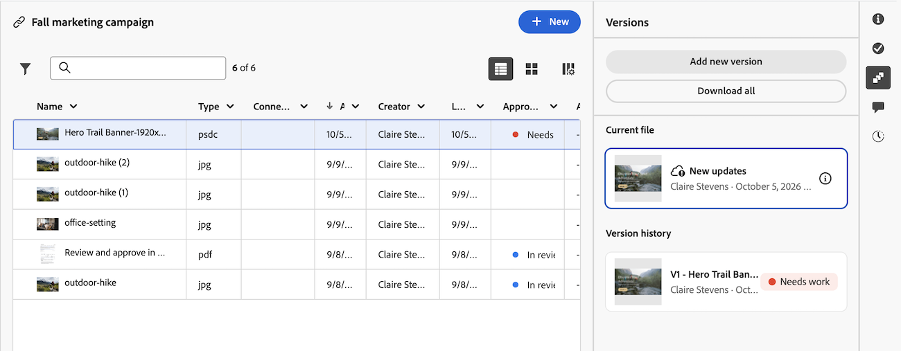

# 在Creative Cloud應用程式中使用Workfront檔案

在Workfront專案面板中提供Creative Cloud專案後，您可以直接從Photoshop、Illustrator或InDesign處理其檔案。

## 先決條件

* 您的組織必須採用支援Adobe雲端儲存空間的Workfront版本。
* Workfront與Photoshop、Illustrator或InDesign必須有權使用同一個Adobe Identity Management System (IMS)組織。

## 存取權要求

+++ 展開以檢視這篇文章中所述功能的存取權要求。

<table style="table-layout:auto"> 
 <col> 
 <col> 
 <tbody> 
  <tr> 
   <td role="rowheader">Adobe Workfront版本</td> 
   <td>工作流程Ultimate，已啟用Adobe雲端儲存空間</td> 
  </tr> 
  <tr> 
   <td role="rowheader">物件許可權</td> 
   <td>
      
檢視專案的存取權，以便在Creative Cloud專案面板中檢視

      
編輯專案的存取權以新增、編輯或刪除專案

   </td> 
  </tr> 
 </tbody> 
</table>

如需詳細資訊，請參閱Workfront檔案中的[存取需求](/help/quicksilver/administration-and-setup/add-users/access-levels-and-object-permissions/access-level-requirements-in-documentation.md)。

+++

## 存取Workfront專案

Workfront專案中的「檔案」資料夾結構會反映在「專案」面板中。 當您從專案資料夾開啟檔案、編輯該檔案並儲存時，您的變更會出現在Workfront中。

>[!NOTE]
>
>專案面板不支援舊版Workfront儲存專案：僅限Adobe雲端儲存專案。

若要存取Photoshop、Illustrator或InDesign中的Workfront專案：

1. 開啟Photoshop、Illustrator或InDesign。
1. 在應用程式左側的&#x200B;**專案**&#x200B;面板中，選取您要開啟的Workfront專案。

   

1. 開啟專案中的檔案以進行編輯。 儲存變更後，它們會自動儲存回Workfront專案。

>[!TIP]
>
>若要編輯Photoshop、Illustrator或InDesign無法開啟的檔案型別，例如Word或Excel檔案，請改用Adobe Cloud Drive。 如需詳細資訊，請參閱[Adobe Cloud Drive總覽](/help/quicksilver/documents/adobe-cloud-drive/adobe-cloud-drive-overview.md)。

## 從Creative Cloud應用程式將新檔案儲存至Workfront

您可以將新檔案儲存至Workfront，也可以從Photoshop、Illustrator或InDesign將現有檔案的新副本儲存至Workfront。

若要將新檔案儲存至Workfront：

1. 開啟Photoshop、Illustrator或InDesign，然後建立新檔案。
1. 在頂端功能表中，執行下列任一項作業：
   * 若要儲存新檔案，請按一下&#x200B;**儲存**。
   * 若要儲存現有檔案的新復本，請按一下[另存新檔]。**&#x200B;**
1. 在&#x200B;**另存新檔**&#x200B;對話方塊中，選取&#x200B;**儲存至雲端檔案**，然後選擇您需要的Workfront專案。

   >[!NOTE]
   >
   >將檔案儲存在Workfront專案中時，另存新檔對話方塊不會開啟。 您可以選取Workfront專案、儲存至其他資料夾或選擇其他Workfront專案。

   

1. 選擇檔案資料夾，然後按一下[儲存]。**&#x200B;** 如果您未選擇資料夾，檔案會儲存至專案根資料夾。

   

## 請求對檔案的核准

您可以在Workfront中新增檔案核准，新增至您從Photoshop、Illustrator、InDesign或Adobe Cloud Drive上傳的任何檔案，就像任何其他檔案一樣。 如需詳細資訊，請參閱[建立檔案核准工作流程](/help/quicksilver/review-and-approve-work/document-reviews-and-approvals/manage-document-approvals/create-a-document-approval.md)。

## 從Creative Cloud應用程式管理Workfront中的檔案版本

將檔案從Photoshop、Illustrator或InDesign儲存至Workfront時，您儲存的變更會顯示在「版本」標籤的「目前」檔案中，並標有「新更新」徽章。

您可以請求對目前檔案的核准，而不是上傳檔案的新版本。 如需詳細資訊，請參閱[要求核准目前的檔案](#request-approval-on-the-current-file)。

### 請求核准目前檔案

若要在Workfront中請求對檔案目前檔案的核准：

1. 前往Workfront中的專案，其中包含您要請求核准的檔案。
1. 開啟檔案並移至&#x200B;**版本**&#x200B;標籤。
1. 在目前的檔案中，按一下&#x200B;**更多**&#x200B;功能表，然後按一下&#x200B;**要求核准**。
1. 在&#x200B;**要求核准**&#x200B;對話方塊中，依照[建立檔案核准工作流程](/help/quicksilver/review-and-approve-work/document-reviews-and-approvals/manage-document-approvals/create-a-document-approval.md)中的步驟來建立核准。

   

