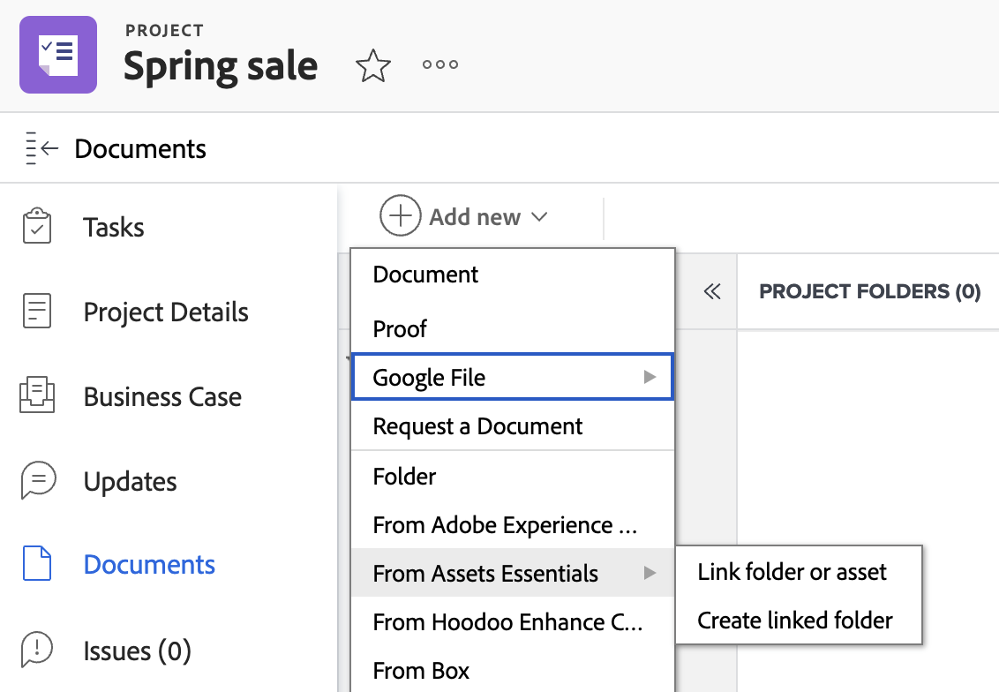

# 建立連結至Experience Manager Assets或Assets Essentials的資料夾

您可以在Workfront中建立連結至Experience Manager Assets或Assets Essentials的資料夾。 由於資料夾已連結，因此新增至資料夾的任何資產都會自動顯示在Workfront和Experience Manager中。 如果資產位於連結的資料夾中，您不需要手動傳送。

## 存取需求

您必須具備下列條件：

<table>
  <tr>
   <td><strong>Adobe Workfront計畫*</strong>
   </td>
   <td>任何
   </td>
  </tr>
  <tr>
   <td><strong>Adobe Workfront授權*</strong>
   </td>
   <td>計劃
   </td>
  </tr>
  <tr>
   <td><strong>產品</strong>
   </td>
   <td>您必須有Experience Manager Assetsas a Cloud Service或Assets Essentials，且必須以使用者身分新增至產品。
   </td>
  </tr>
  <tr>
   <td><strong>Experience Manager權限</strong>
   </td>
   <td>您必須擁有Experience Manager整合中目的地資料夾的寫入存取權。
   </td>
  </tr>
  <tr>
   <td><strong>訪問級別配置</strong>
   </td>
   <td>您必須是Workfront管理員。 如需Workfront管理員的相關資訊，請參閱 <strong>授予使用者完整的管理存取權</strong>.
   </td>
  </tr>
</table>

*若要了解您擁有的計畫、授權類型或存取權，請聯絡您的Workfront管理員。

## 必要條件

開始之前，

* 您的Workfront管理員必須設定Experience Manager整合。 如需詳細資訊，請參閱 [設定Experience Manager Assetsas a Cloud Service整合](/help/quicksilver/administration-and-setup/configure-integrations/configure-aacs-integration.md) 或 [設定Experience Manager Assets Essentials整合](/help/quicksilver/documents/adobe-workfront-for-experience-manager-assets-essentials/setup-asset-essentials.md).

## 建立連結的資料夾

連結的資料夾是在Workfront管理員設定整合時所指定的位置建立。 每個整合只能有一個連結資料夾的資料夾位置。

已連結資料夾的名稱會根據與關聯的Portfolio、方案、項目自動建立，且無法更改。 如果項目未與Portfolio或項目群關聯，則連結的資料夾將顯示項目名稱和建立日期。

要建立連結的資料夾：

1. 前往您要資料夾的專案。
1. 選擇 **新增**，然後前往Experience Manager整合您的管理員設定。
   >[!NOTE]
   >
   >Workfront管理員可選擇此整合的任何名稱，因此可能不會特別提及Experience Manager Assets或Assets Essentials。

1. 選擇 **建立連結的資料夾**. 系統會根據設定整合時指定的位置，自動在Experience Manager中建立資料夾。
   
