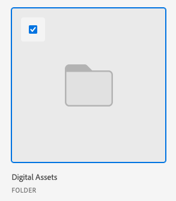

# 從Experience Manager Assets或Assets Essentials連結資產和資料夾

您可以從Experience Manager Assets或Assets Essentials將資產或資料夾連結到任何支援檔案的Adobe Workfront物件。 從Assets Essentials傳送的Assets不會計入Workfront的整體檔案儲存中。 從Workfront上傳並傳送至Assets Essentials的檔案確實會計入整體儲存空間。

從Workfront傳送資產至Experience Manager Assets或Assets Essentials時，會先對應中繼資料欄位。 如果您的Workfront管理員已啟用物件中繼資料同步，則欄位在任一應用程式中變更後仍會保持最新狀態。

## 存取需求

+++ 展開以檢視本文中功能的存取需求。

<table style="table-layout:auto"> 
 <col> 
 <col> 
 <tbody> 
  <tr> 
   <td role="rowheader">Adobe Workfront套件</td> 
   <td> 
 任何
 </td> 
  </tr> 
  <tr> 
   <td role="rowheader">Adobe Workfront授權</td> 
   <td> 
   
投稿人或以上
 
   
要求或更高版本
 </td> 
  </tr> 
  <tr> 
   <td role="rowheader">其他產品</td> 
   <td>您必須擁有Experience Manager as a Cloud Service或Assets Essentials，並且您必須在Admin Console中作為使用者新增到產品中。</td> 
  </tr> 
   <tr> 
    <td role="rowheader">Experience Manager許可權</td> 
    <td>您必須擁有資料夾的寫入許可權。</td> 
   </tr>
  <tr> 
   <td role="rowheader">存取層級設定</td> 
   <td> 
編輯檔案的存取權
 </td> 
  </tr> 
  <tr> 
   <td role="rowheader">物件許可權</td> 
   <td> 
檢視存取許可權或更高
 </td> 
  </tr> 
 </tbody> 
</table>

如需有關此表格的詳細資訊，請參閱Workfront檔案中的[存取需求](/help/quicksilver/administration-and-setup/add-users/access-levels-and-object-permissions/access-level-requirements-in-documentation.md)。

+++

## 先決條件

開始之前，

* 您的Workfront管理員必須設定Experience Manager整合。 如需詳細資訊，請參閱[設定Experience Manager Assets as a Cloud Service整合](/help/quicksilver/administration-and-setup/configure-integrations/configure-aacs-integration.md)或[設定Experience Manager Assets Essentials整合](/help/quicksilver/documents/adobe-workfront-for-experience-manager-assets-essentials/setup-asset-essentials.md)。

## 從Experience Manager Assets或Assets Essentials連結資產

您可以將Experience Manager Assets或Assets Essentials中的資產連結至Workfront。 資產連結後，您可以

* [校訂Experience Manager Assets或Assets Essentials的連結資產](../../documents/adobe-workfront-for-experience-manager-assets-essentials/proof-linked-asset-aem.md)
* [上傳檔案的新版本](../../documents/managing-documents/upload-new-document-version.md)

1. 移至Workfront中要新增檔案的&#x200B;**檔案**&#x200B;區域。
1. 選取「**新增**」，然後選取管理員設定的Experience Manager整合。

   >[!NOTE]
   >
   >Workfront管理員可以選擇任何名稱來進行這項整合，因此可能不會特別提及Assets或Assets Essentials。

1. 選取您想要的資產。

   

1. 按一下&#x200B;**選取**。

## 從Experience Manager Assets或Assets Essentials連結資料夾

檢視檔案夾內個別資產的許可權取決於Experience Manager Assets或Assets Essentials許可權。

1. 移至Workfront中您想要資料夾的&#x200B;**檔案**&#x200B;區域。
1. 選取「**新增**」，然後選取管理員設定的Experience Manager整合。

   >[!NOTE]
   >
   >Workfront管理員可以選擇任何名稱來進行這項整合，因此可能沒有特別提及Assets或Assets Essentials。

1. 選取您想要的資料夾。

   

1. 按一下&#x200B;**選取**。

## 從Experience Manager Assets或Assets Essentials連結新版本

您可以從Assets Essentials提取新資產，並將其作為新版本新增到現有資產。 如果檔案已連結並在Assets Essentials中新增了新版本，新版本會自動顯示在Workfront中。

若要從Assets Essentials連結新版本：

1. 移至Workfront中要新增檔案的&#x200B;**檔案**&#x200B;區域。
1. 選取您要取代為新版本的資產。 您無法在連結的資料夾中建立新版本的資產。
1. 選取「**新增** > **版本**」，然後選取系統管理員設定的Experience Manager整合。

   >[!NOTE]
   >
   >Workfront管理員可以選擇任何名稱來進行這項整合，因此可能沒有特別提及Assets或Assets Essentials。

1. 選取您想要的資產。

   

1. 按一下&#x200B;**選取**。

>[!TIP]
>
>如果您前往&#x200B;**檔案詳細資料** > **版本**，即可檢視資產的所有版本。
