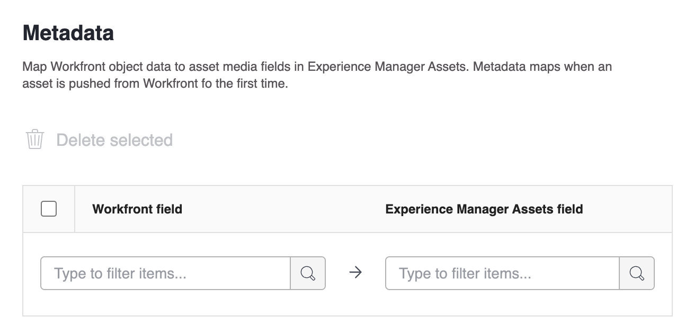

# 設定Experience Manager Assets Essentials整合

使用Experience Manager Assets Essentials中的內容連接您的工作&#x200B;:

* 將資產和中繼資料從Adobe Workfront推送至Experience Manager Assets Essentials &#x200B;
* 將資產從Experience Manager Assets Essentials連結至您在Workfront中的專案和工&#x200B;作
* 加速推送至Experience Manager Assets Essentials之資產的版本設定工作流程

## 存取需求

您必須具備下列條件：

<table>
  <tr>
   <td><strong>Adobe Workfront計畫*</strong>
   </td>
   <td>任何
   </td>
  </tr>
  <tr>
   <td><strong>Adobe Workfront授權*</strong>
   </td>
   <td>計劃
   </td>
  </tr>
  <tr>
   <td><strong>Experience Manager授權</strong>
   </td>
   <td>標準
   </td>
  </tr>
  <tr>
   <td><strong>產品</strong>
   </td>
   <td>您必須有Experience Manager Assets Essentials，且必須以Admin Console使用者身分新增至產品中。
   </td>
  </tr>
  <tr>
   <td><strong>訪問級別配置</strong>
   </td>
   <td>您必須是Workfront管理員。 如需Workfront管理員的相關資訊，請參閱 <strong>授予使用者完整的管理存取權</strong>.
   </td>
  </tr>
</table>

*若要了解您擁有的計畫、授權類型或存取權，請聯絡您的Workfront管理員。

## 設定整合

1. 按一下 **主菜單** 圖示，然後按一下 **設定**.
1. 選擇  **檔案**  在左側面板中，選取 **Experience Manager整合**.
1. 選擇 **新增Experience Manager整合**.
1. 指定下列項目：

   <table>
   <tr>
      <td><strong>名稱</strong>
      </td>
      <td>在「文檔」區域的「添加新」按鈕中輸入希望用戶看到的名稱。
      </td>
   </tr>
   <tr>
      <td><strong>導覽URL</strong>
      </td>
      <td>系統會自動填入導覽URL。 此URL可從主功能表連結至貴組織的Assets Essentials執行個體，以供快速存取。
      </td>
   </tr>
   <tr>
      <td>
      <strong>Experience Manager Assets存放庫</strong>
      </td>
      <td>
      系統會自動填入與您的組織ID相關聯的Experience Manager存放庫。
      </td>
   </tr>
   </table>

1. 按一下 **儲存** 或繼續 [設定中繼資料（選用）](#set-up-metadata-optional) 一節。

## 設定中繼資料（選用）

將 Workfront 物件資料對應到 Experience Manager Assets 中的資產媒體欄位。中繼資料會在第一次從 Workfront 中推播資產時進行對應。

### 必要條件

開始之前，您必須

* 在Experience Manager Assets Essentials中設定中繼資料結構，如 [設定Adobe Workfront和Experience Manager Assets之間的資產中繼資料對應](https://experienceleague.adobe.com/docs/experience-manager-cloud-service/content/assets/integrations/configure-asset-metadata-mapping.html?lang=en).
* （選用）在Workfront中設定自訂表單欄位。 Workfront有許多內建的自訂欄位可供您使用。 不過，您也可以建立自己的自訂欄位。 如需詳細資訊，請參閱 [建立或編輯自訂表單](/help/quicksilver/administration-and-setup/customize-workfront/create-manage-custom-forms/create-or-edit-a-custom-form.md).

### 資產

首次從Workfront推送資產時，會對應中繼資料。 內建或自訂欄位的檔案會在第一次將資產傳送至Experience Manager Assets Essentials時，自動對應至指定的欄位。

1. 在 **Workfront欄位** 欄，選擇內建或自訂Workfront欄位。
   >[!NOTE]
   >
   >您可以將單一Workfront欄位對應至多個Experience Manager Assets欄位。 您無法將多個Workfront欄位對應至單一Experience Manager Assets欄位。
1. 在 **Experience Manager** 欄位，選擇Experience Manager Assets欄位。
1. 視需要重複步驟1和2。
   
1. 按一下 **儲存** 或繼續 [設定連結的資料夾（可選）](#set-up-linked-folders-optional) 一節。

## 設定連結的資料夾（可選）

{{setup-linked-folder}}
