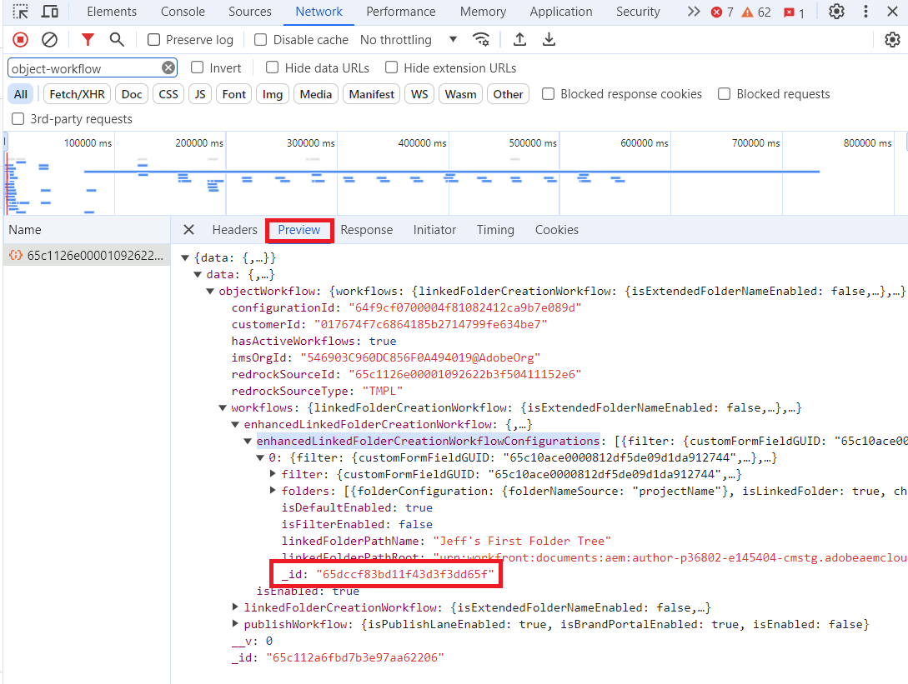

# 使用Workfront Fusion將Workfront問題轉換為包含Adobe Experience Manager工作流程的專案

如果您透過Workfront Fusion建立專案，並想在專案中加入Adobe Experience Manager工作流程，您必須使用特定的Fusion模組設定，如本文所述。

>[!NOTE]
>
>工作流程僅適用於Adobe Experience Manager as a Cloud Service整合。 無法將其與Adobe Experience Manager Assets Essentials整合。<br>
>新檔案區域未提供此功能。


## 存取權要求

+++ 展開以檢視這篇文章中所述功能的存取權要求。

<table>
  <tr>
    <td><strong>Adobe Workfront 封裝</strong></td>
   <td> <p>任何 Adobe Workfront Workflow 封裝及任何 Adobe Workfront Automation and Integration 封裝</p><p>Workfront Ultimate</p><p>Workfront Prime 和 Select 封裝，以及額外購買的 Workfront Fusion。</p> </td> 
  </tr>
  <tr>
   <td><strong>Adobe Workfront 授權</strong></td>
   <td><p>投稿人或以上</p><p>要求或更高版本</p></td>
  </tr>
  <tr>
   <td><strong>產品</strong></td>
   <td>
     <p><b>Adobe Experience Manager：</b></p>
     <ul>
       <li>
         <p>您必須擁有Experience Manager Assets as a Cloud Service或Assets Essentials，並且您必須在Admin Console中作為使用者新增到產品中。</p>
       </li>
       <li>
        <p>您必須擁有Adobe Experience Manager存放庫的寫入許可權。</p>
       </li>
     </ul>
     <p><b>Workfront Fusion：</b></p>
     <ul>
       <li>
        <p>如果您的組織擁有 Select 或 Prime Workfront 封裝，但不包括 Workfront Automation and Integration，則您的組織必須購買 Adobe Workfront Fusion。</li></ul>
       </li>
     </ul>
   </td>
  </tr>
  <tr>
   <td><strong>存取層級設定</strong>
   </td>
   <td><p>編輯檔案的存取權</p>
   </td>
  </tr>
</table>

+++

## 先決條件

開始之前，

* 您的Workfront管理員必須在Adobe Experience Manager整合中設定工作流程。 如需詳細資訊，請參閱[設定Experience Manager Assets as a Cloud Service整合](../../administration-and-setup/configure-integrations/configure-aacs-integration.md#set-up-workflows-optional)。
* 您必須使用Adobe Experience Manager整合連結資料夾工作流程來設定專案範本。
* 您必須在Workfront中建立OAuth應用程式，才能設定此模組的連線。

  如需指示，請參閱本文中的[建立OAuth應用程式](#create-an-oauth-application)。

## 模組設定

在Workfront Fusion中，如果您想要建立包含Adobe Experience Manager工作流程的專案，必須使用「Workfront >其他動作」模組。

1. Add the **Workfront** > **Misc Action** module to your scenario.
1. In the **Connection** field, select the Workfront connection that connects to the account this module will use.

   For instructions on creating a connection, see [Connect [!DNL Workfront] to [!DNL Workfront Fusion]](https://experienceleague.adobe.com/zh-hant/docs/workfront-fusion/using/references/apps-and-their-modules/adobe-connectors/workfront-modules#connect-workfront-to-workfront-fusion) in the article Workfront modules.

   For instructions on creating the Client ID and Client Secret you will need to create a connection, see [Create an OAuth application](#create-an-oauth-application) in this article.

1. 在&#x200B;**記錄型別**&#x200B;欄位中，選取`Issue`。
1. In the **Action** field, select `convertToProject`.
1. In the **ID** field, enter or map the ID of the issue that you are converting to a project.
1. Enable **Show advanced settings**.
1. Scroll to the bottom of the module and locate the **Project (Advanced Collection)** field.
1. Paste the following text into the **Project (Advanced Collection)** field.

   ```
   {
       "aemNativeFolderTreeIDs": ["Folder Tree ID here"],
       "aemNativeFolderWorkflowEnabled": "true",
       "name": "New project name here",
       "templateID": "Template ID here"
   }
   ```

1. Replace `Folder tree ID here` with the folder IDs.

   To locate folder tree IDs, see [Locate folder tree IDs](#locate-folder-tree-ids) in this article.

   To use more than one folder tree, separate IDs with a comma:

   `"aemNativeFolderTreeIDs": ["Folder tree ID here","Second folder tree ID here"],`
1. Replace `New project name here` with the name that the new project will have.
1. Replace `Template ID here` with the ID of the template that you are using for the new project.

   You can map the template ID from a previous module (such as a Workfront > Search module) or locate it in the URL of the template&#39;s page in Workfront.

1. Click **OK** to save the module configuration.

## Locate folder tree IDs

To locate the folder tree IDs:

>[!NOTE]
>
>These instructions use the Chrome browser.

1. In Workfront, open the template that you want to use for this project. This template must include the Adobe Experience Manager configuration that you want to use for the project.
1. Open the developer tools for your browser.
1. Open the **Network** tab in the developer tools.
1. In the **Filter** box, enter `object-workflow`.
1. In the Name column, click on the alphanumeric ID that appears.

   

1. Click the **Preview** tab to the right of the alphanumeric ID.
1. Open the following collapsed sections:
   1. `data`
   1. `objectWorkflow`
   1. `workflows`
   1. `enhancedLinkedFolderCreationWorkflow`
   1. `enhancedLinkedFolderCreationWorkflowConfigurations`

   Each folder tree is represented by a number. 0 (zero) represents the first folder in the list, 1 represents the second, and so on. If the template includes only one folder tree, it is number 0.

1. Open the folder tree that you want to use for the new project. Make note of the `_id` field value. If you want to use more than one folder tree, make note of all of the `_id` field values for the folder trees you want to use.

   

   These are the `aemNativeFolderTreeIDs`  values that you will enter into the **Project (Advanced Collection)** field in the **Workfront** > **Misc Actions** Fusion module.

## Create an OAuth application

You must set up an OAuth application in Workfront for this module&#39;s connection. You only need to do this once for a given Workfront connection in Fusion.

1. In Workfront, begin creating an OAuth application, as described in [Create an OAuth2 application using user credentials (Authorization code flow)](/help/quicksilver/administration-and-setup/configure-integrations/create-oauth-application.md#create-an-oauth2-application-using-user-credentials-authorization-code-flow) in the article Create OAuth2 applications for [!DNL Workfront] integrations.
1. Copy the Client ID and Client Secret to a secure location.
1. In the **Redirect URIs** field, enter the following:

   ```
   http://app.workfrontfusion.com/oauth/cb/workfront-workfront
   ```

1. 按一下「**儲存**」。

You will use this Client ID and Client secret when configuring the module&#39;s connection in Fusion.

For instructions on creating a connection, see [Connect [!DNL Workfront] to [!DNL Workfront Fusion]](https://experienceleague.adobe.com/zh-hant/docs/workfront-fusion/using/references/apps-and-their-modules/adobe-connectors/workfront-modules#connect-workfront-to-workfront-fusion) in the article Workfront modules.
