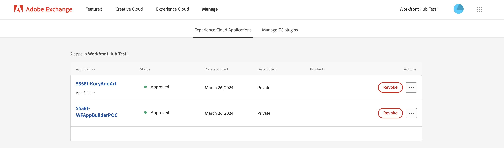

# Workfront中的AppBuilder檔案詳細資訊

您可以在檔案詳細資訊中安裝AppBuilder。

## 先決條件

您必須具備下列條件：

* 啟用IMS的Workfront帳戶
* 具有節點v18和npm的開發機器

## 將開發人員新增至Admin Console

>[!IMPORTANT]
>
>請確定您已針對下列所有步驟選取正確的IMS組織。 如果您屬於多個組織，則可能會選取錯誤的組織。 請確定您是在正確的組織底下操作，組織通常列於右上角。


1. 導覽至下列其中一項：

* 分段： [https://stage.adminconsole.adobe.com/](https://stage.adminconsole.adobe.com/)
* Prod： [https://adminconsole.adobe.com/](https://adminconsole.adobe.com/)

1. 在使用者區段中，按一下 **開發人員** > **新增開發人員**.

   

   >[!NOTE]
   >
   >如果您看不到管理開發人員的選項，表示您沒有允許開發存取的產品。 Workfront不提供開發人員存取權，但AEM提供。 如果您沒有看見，我們將需要瞭解如何讓Workfront加入允許開發人員使用的應用程式清單中。

1. 新增使用者的電子郵件。 它應該搜尋已從Admin Console中新增的現有使用者。

1. 將必要的產品新增至開發人員設定檔，然後按一下 **儲存**.


## 存取AppBuilder

組織需要與其客戶經理合作，才能購買AppBuilder。 我們不需要針對POC執行此動作，因此無法瞭解此情形的確切程式。

如果您想要測試AppBuilder整合，可以在這裡為您的IMS組織請求免費試用：
[https://developer.adobe.com/app-builder/trial/#](https://developer.adobe.com/app-builder/trial/#)

我的印象是，即使是30天的免費試用，在此時間之後他們實際上並不會停用此試用。

如果AppBuilder已正確設定，您應該會在建立新專案時看到「從範本建立專案」（這會在下一節中介紹）。

## 在開發主控台中建立新專案

1. 按一下 **從範本建立專案**.

   >[!IMPORTANT]
   >
   >如果沒有看見此選項，表示您在Admin Console中的設定有誤，且無法存取App Builder目錄。 只有在您有權存取AppBuilder時，才會顯示此選項。

   

1. 選取 **App Builder**.

1. 輸入 **專案標題** 和 **應用程式名稱**. 兩者都有預設值，但如果您自訂值，稍後更容易識別您想要的專案。

   >[!NOTE]
   >
   >您可以選擇在此步驟中新增其他工作區。 我們建議您為每個開發人員建立一個工作區。 如此一來，當開發人員工作時，秘密和部署彼此分開。 您應該使用使用使用工作區的開發人員名稱來命名工作區。 AIO cli有切換工作區的選項，稍後我們將介紹。


1. 離開 **包含執行階段** 已選取。 我真的不知道為什麼，但不要改變它！

1. 按一下「**儲存**」。

## AdobeIO (aio) CLI

Adobe提供開放原始碼CLI，可用來協助建立App Builder應用程式。 您可在此處找到檔案： [https://github.com/adobe/aio-cli](https://github.com/adobe/aio-cli) 以及AdobeApp Builder指示 [https://developer.adobe.com/app-builder/docs/getting_started/first_app/](https://developer.adobe.com/app-builder/docs/getting_started/first_app/).

1. 安裝
   1. 若要安裝工具，（請先確認您位於節點v18）請執行： `npm install -g @adobe/aio-cli `.

1. 在終端機中驗證
   1. 啟動您的終端機，並使用命令登入AIO： `aio login`.

1. 初始化您的應用程式
   1. 執行以下程式以開始設定您的應用程式： `aio app init example-app`.

1. 設定選擇
   1. 繼續從提供的選項中選取您的組織和專案。\
      
      

1. 範本選取和設定
   1. 瀏覽所有可用的範本，然後選擇 **@adobe/aem-cf-editor-ui-ext-tpl** 專案的範本。
      
      

1. 定義您的擴充功能
   1. 為擴充功能命名。
   1. 提供擴充功能的描述性摘要。
   1. 選取要開始使用的初始版本編號。
   1. 透過選擇確認完成 **我已完成**.
      

1. 導覽至您的專案資料夾
   1. 存取src資料夾
   1. 重新命名資料夾 `aem-cf-editor-1` 至 `workfront-doc-details-1`.

1. 修改組態檔
   1. 開啟app.config.yaml
   1. 更新明細行，從 `aem/cf-editor/1` 至 `workfront/doc-details/1`.
   1. 調整包含路徑，從 `src/aem-cf-editor-1/ext.config.yaml` 至 `src/workfront-doc-details-1/ext.config.yaml`.

1. 編輯擴充功能註冊元件
   1. 開啟 `src/workfront-doc-details-1/web-src/src/components/ExtensionRegistration.js`.
   1. 在方法區段中，新增函式 `secondaryNav` 包含非同步函式 `getButtons`.
   1. `getButtons` 應該會收到具有以下結構的物件：

      ```
          {
          docId: "String",  // Document ID
          docvId: "String", // Document version ID
          sharedContext: {
              hostname: "String",
              protocol: "String",
              auth: {
              imsOrgID: "String",    // Customer's IMS Org ID
              imsToken: "String",    // User's IMS token
              imsClientId: "String"
              }
          }
          }
      ```

1. 此函式傳回將出現在導覽中的按鈕物件陣列：

   ```
       methods: {
       secondaryNav: {
           async getButtons({docId, docvId, sharedContext}) {
           return [
               { label: 'Registration', url: '/index.html' },
               { label: 'Review', url: '/index.html#review' }
           ];
           }
       }
       }
   ```

1. 設定應用程式路由
   1. 開啟您的App.js檔案並設定路由，以包含新開發的功能。 您需要為預設檢視和任何其他檢視（如稽核頁面）設定路由。 您可以用以下方法定義這些路由：

      ```
          <Route index element={<ExtensionRegistration />} />
          <Route exact path="index.html" element={<ExtensionRegistration />} />
          <Route exact path="review" element={<Review />} />
      ```

1. 存取檔案詳細資訊
   1. 實作提供的函式 `document.getDocumentDetails` 以擷取基本檔案細節。 此函式擷取包含 `docId` 和 `docvId`，以及 `sharedContext` 物件與 `hostname`， `protocol`和驗證詳細資訊。 請確定您的應用程式可正確處理這些資料。

1. 在您的元件中整合資料擷取
   1. 將新元件新增至應用程式的元件資料夾。 在此元件中，建立與Workfront的連線，以使用與主機應用程式建立的連線來擷取檔案資訊和驗證資料。 以下是如何建構元件以處理此問題的範例：

      ```
          import { useEffect, useState } from 'react';
          import { attach } from "@adobe/uix-guest";
          import { extensionId } from "./Constants";
      
          function Review() {
              const [conn, setConn] = useState();
      
              useEffect(() => {
              const iife = async () => {
                  // "attach" the guest application to the host. This creates a "tunnel" from the host app that allows data to be passed to the iframe running this app.
                  const connection = await attach({
                  id: extensionId,
                  });
                  setConn(connection);
              };
      
              iife();
              }, []);
      
              useEffect(() => {
                  if (conn) {
                      // Using the connection created above, grab the document details from the host tunnel.
                      conn?.host?.document?.getDocumentDetails().then(setDocDetails);
                      // Pull the auth tokens from the sharedContext (see host app for details)
                      setAuth(conn?.sharedContext?.get("auth"));
                      setHostname(conn?.sharedContext?.get("hostname"));
                      setProtocol(conn?.sharedContext?.get("protocol"));
                  }
              }, [conn]);
      
          return (<>Text</>);
          }
      
          export default Review;
      ```

## 現有AIO專案的設定

1. 更新組態檔
   1. 開啟 `app.config.yaml`.
   1. 透過更新參考來修改設定 `aem/cf-editor/1` 至 `workfront/doc-details/1`. 此調整會將檔案路徑與您目前的專案結構對齊。

1. 修訂擴充功能註冊元件
   1. 找到並開啟名為的檔案 `ExtensionRegistration.js`.
   1. 在方法區段中，新增函式 `secondaryNav` 包含非同步函式 `getButtons`.
   1. `getButtons` 應該會收到具有以下結構的物件：

      ```
          {
          docId: "String",  // Document ID
          docvId: "String", // Document version ID
          sharedContext: {
              hostname: "String",
              protocol: "String",
              auth: {
              imsOrgID: "String",    // Customer's IMS Org ID
              imsToken: "String",    // User's IMS token
              imsClientId: "String"
              }
          }
          }
      ```

1. 此函式傳回將出現在導覽中的按鈕物件陣列：

   ```
       methods: {
       secondaryNav: {
           async getButtons({docId, docvId, sharedContext}) {
           return [
               { label: 'Registration', url: '/index.html' },
               { label: 'Review', url: '/index.html#review' }
           ];
           }
       }
       }
   ```

1. 設定應用程式路由
   1. 開啟您的 `App.js`檔案並設定路由，以包含新開發的功能。 您需要為預設檢視和任何其他檢視（如稽核頁面）設定路由。 您可以用以下方法定義這些路由：

      ```
          <Route index element={<ExtensionRegistration />} />
          <Route exact path="index.html" element={<ExtensionRegistration />} />
          <Route exact path="review" element={<Review />} />
      ```

1. 存取檔案詳細資訊
   1. 實作提供的函式 `document.getDocumentDetails` 以擷取基本檔案細節。 此函式擷取包含 `docId` 和 `docvId`，以及 `sharedContext` 物件與 `hostname`， `protocol`和驗證詳細資訊。 請確定您的應用程式可正確處理這些資料。

1. 在您的元件中整合資料擷取
   1. 將新元件新增至應用程式的元件資料夾。 在此元件中，建立與Workfront的連線，以使用與主機應用程式建立的連線來擷取檔案資訊和驗證資料。 以下是如何建構元件以處理此問題的範例：

      ```
          import { useEffect, useState } from 'react';
          import { attach } from "@adobe/uix-guest";
          import { extensionId } from "./Constants";
      
          function Review() {
              const [conn, setConn] = useState();
      
              useEffect(() => {
              const iife = async () => {
                  // "attach" the guest application to the host. This creates a "tunnel" from the host app that allows data to be passed to the iframe running this app.
                  const connection = await attach({
                  id: extensionId,
                  });
                  setConn(connection);
              };
      
              iife();
              }, []);
      
              useEffect(() => {
                  if (conn) {
                      // Using the connection created above, grab the document details from the host tunnel.
                      conn?.host?.document?.getDocumentDetails().then(setDocDetails);
                      // Pull the auth tokens from the sharedContext (see host app for details)
                      setAuth(conn?.sharedContext?.get("auth"));
                      setHostname(conn?.sharedContext?.get("hostname"));
                      setProtocol(conn?.sharedContext?.get("protocol"));
                  }
              }, [conn]);
      
          return (<>Text</>);
          }
      
          export default Review;
      ```

## 發佈應用程式

>[!IMPORTANT]
>
>請務必針對下列各個步驟選取正確的IMS組織。

若要在Workfront中載入訪客應用程式，應用程式必須推送至生產工作區並提交核准。

1. 將應用程式部署到生產工作區
   1. `aio app use -w Production `
   1. `aio app deploy `

1. 瀏覽至 [https://developer-stage.adobe.com/](https://developer-stage.adobe.com/) 或 [https://developer.adobe.com/](https://developer.adobe.com/).
   1. 按一下 **主控台** 位於右上角。

1. 尋找您用來建立AppBuilder應用程式的專案。

1. 選取生產工作區。
   

1. 提交申請以進行私人檢閱（您會收到我們未發佈至應用程式交易市集的警告，這沒問題）。

1. 填寫表單（標題、說明、圖示和稽核者備註）。
   

>[!IMPORTANT]
>
>提交後，組織的系統管理員將需要核准提交。

## 核准提交

1. 作為系統管理員，請瀏覽至 [https://stage.exchange.adobe.com/](https://stage.exchange.adobe.com/) 或 [https://exchange.adobe.com/](https://exchange.adobe.com/).

1. 按一下 **管理** > **Experience Cloud應用程式**. 您應該會看到已提交的應用程式，其中包含可核准/拒絕的選項。
核准後，發佈的應用程式擴充功能應會自動載入您的Workfront環境。

   

## 其他說明

Adobe提供絕佳檔案，說明如何開始建立AppBuilder應用程式及進行部署。

以下是一些實用的連結：

* [https://developer.adobe.com/app-builder/docs/getting_started/first_app/#4-bootstrapping-new-app-using-the-cli](https://developer.adobe.com/app-builder/docs/getting_started/first_app/#4-bootstrapping-new-app-using-the-cli)

* [https://developer.adobe.com/uix/docs/guides/publication/](https://developer.adobe.com/uix/docs/guides/publication/)

* [https://developer.adobe.com/uix/docs/services/aem-cf-console-admin/extension-development/](https://developer.adobe.com/uix/docs/services/aem-cf-console-admin/extension-development/)

