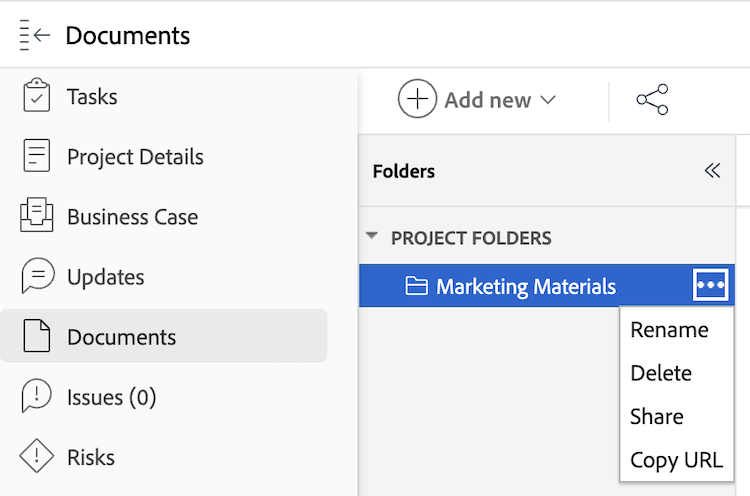

# 複製和共用檔案資料夾的連結

您可以為下列任何[!DNL Workfront]物件中包含的任何檔案資料夾複製直接連結： [!UICONTROL 方案]、[!UICONTROL Portfolio]、[!UICONTROL 專案]、[!UICONTROL 任務]或[!UICONTROL 問題]。 您無法從[主功能表]複製[!UICONTROL 檔案]區域包含的任何資料夾連結，因為這些資料夾會直接連結到您的使用者設定檔，且無法與其他人共用。

## 存取需求

您必須具有下列存取權才能執行本文中的步驟：

<table style="table-layout:auto"> 
 <col> 
 <col> 
 <tbody> 
  <tr> 
   <td role="rowheader">Adobe Workfront計畫*</td> 
   <td> 
任何
 </td> 
  </tr> 
  <tr> 
   <td role="rowheader">Adobe Workfront授權*</td> 
   <td> 
工作或更高
 </td> 
  </tr> 
  <tr> 
   <td role="rowheader">存取層級設定*</td> 
   <td> 
檢視檔案的存取權
 
注意：如果您還是沒有存取權，請詢問您的Workfront管理員，他們是否在您的存取層級中設定其他限制。 如需Workfront管理員如何修改存取層級的詳細資訊，請參閱<a href="../../administration-and-setup/add-users/configure-and-grant-access/create-modify-access-levels.md" class="MCXref xref">建立或修改自訂存取層級</a>。
 </td> 
  </tr> 
  <tr> 
 </tbody> 
</table>

&#42;若要瞭解您擁有的計畫、授權型別或存取權，請連絡您的Workfront管理員。

## 複製和共用檔案資料夾的連結

若要複製檔案資料夾的連結：

1. 瀏覽至包含檔案資料夾的[!DNL Workfront]物件。
1. 按一下&#x200B;**[!UICONTROL 更多]**&#x200B;功能表，然後選取&#x200B;**[!UICONTROL 複製URL]**。 您可以共用此連結，以提供資料夾的快速存取權。 使用者必須至少具有物件的檢視存取權，才能檢視資料夾。
   
