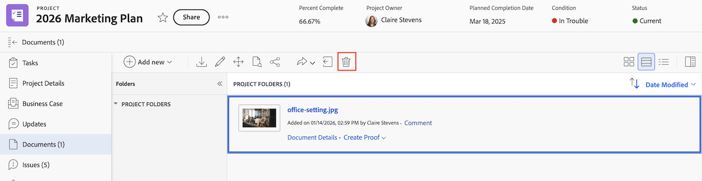

# 刪除檔案

您可以刪除上傳的檔案。 如果您被授予管理特定檔案的存取權，您也可以刪除這些檔案。

## 存取權要求

+++ 展開以檢視這篇文章中所述功能的存取權要求。

<table style="table-layout:auto"> 
 <col> 
 <col> 
 <tbody> 
  <tr> 
   <td role="rowheader">Adobe Workfront 封裝</td> 
   <td> 
 任何
 </td> 
  </tr> 
  <tr> 
   <td role="rowheader">Adobe Workfront 授權</td> 
   <td> 
   
標準

   
工作或更高層級
 </td> 
  </tr> 
  <tr> 
   <td role="rowheader">存取層級設定</td> 
   <td> 
編輯對已啟用刪除許可權之檔案的存取權
 </td> 
  </tr> 
  <tr> 
   <td role="rowheader">物件許可權</td> 
   <td> 
檢視包含「檔案」之物件的存取許可權或以上許可權
 
使用檔案上啟用的刪除許可權來管理存取權
 </td> 
  </tr> 
 </tbody> 
</table>

如需有關此表格的詳細資訊，請參閱Workfront檔案中的[存取需求](/help/quicksilver/administration-and-setup/add-users/access-levels-and-object-permissions/access-level-requirements-in-documentation.md)。

+++

## 刪除舊版檔案區域中的檔案

如果您的組織位於舊版Workfront儲存空間，當您存取Workfront中的檔案時，將會看到舊版檔案區域。 如需有關舊版Workfront儲存體的詳細資訊，請參閱[舊版Workfront儲存體與Adobe企業儲存體之間的差異](/help/quicksilver/review-and-approve-work/esm-overview.md)。

若要刪除檔案：

1. 前往包含檔案的專案、任務或問題，然後在左側面板中選取&#x200B;**檔案**。
1. 尋找您需要的檔案。

1. 按一下檔案區域上方的&#x200B;**刪除**&#x200B;圖示。

1. 在出現的方塊中，按一下&#x200B;**是，刪除**&#x200B;以進行確認。

   系統或群組管理員可以在刪除後30天內還原檔案，如[還原已刪除的專案](../../administration-and-setup/manage-workfront/manage-deleted-items/restore-deleted-items.md)中所述。

   

## 在新檔案區域刪除檔案

如果您的組織使用企業儲存空間，當您存取Workfront中的檔案時，將會看到新檔案區域。 如需企業儲存的詳細資訊，請參閱[Adobe企業儲存概述](/help/quicksilver/review-and-approve-work/esm-overview.md)。

若要刪除檔案：

1. 前往包含檔案的專案、任務或問題，然後在左側面板中選取&#x200B;**檔案**。

1. 尋找您需要的檔案，然後按一下[刪除]。**&#x200B;**

1. 在出現的方塊中，按一下&#x200B;**刪除**&#x200B;以確認。

   系統或群組管理員可以在刪除後30天內還原檔案，如[還原已刪除的專案](../../administration-and-setup/manage-workfront/manage-deleted-items/restore-deleted-items.md)中所述。

   