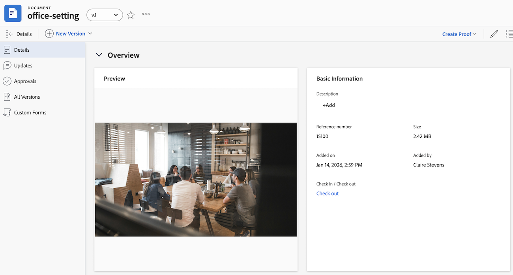

# 檔案詳細資訊總覽

「檔案詳細資訊」頁面可讓您檢視、傳達及管理附加至Adobe Workfront物件的檔案屬性。

## 舊版檔案區域

如果您的組織位於舊版Workfront儲存空間，當您存取Workfront中的檔案時，將會看到舊版檔案區域。 如需有關舊版Workfront儲存空間的詳細資訊，請參閱[舊版Workfront儲存空間與Adobe雲端儲存空間之間的差異](/help/quicksilver/review-and-approve-work/esm-overview.md)。

### 對檔案和校訂執行基本動作

您可以從「檔案詳細資訊」頁面對檔案和校樣執行下列動作：

* 建立簡單或進階校訂
* 建立新版本
* 進行核准決定
* 預覽檔案
* 編輯檔案說明
* 簽入或簽出檔案

此外，您可以使用檔名稱旁的「更多」圖示來執行下列動作：

* 共用
* 移動
* 刪除
* 下載
* 傳送

### 執行校訂的特定動作

如果您在校訂工作流程中，可以從檔案詳細資訊頁面執行下列動作：

* 檢視已傳送、已開啟、評論、決定(SOCD)詳細資料
* 開啟校訂
* 開啟列印摘要
* 鎖定或解除鎖定校訂
* 編輯校訂自訂欄位

  校訂自訂欄位必須在Workfront Proof中設定。 如需詳細資訊，請參閱[在Workfront Proof中建立和管理自訂欄位](../../workfront-proof/wp-acct-admin/account-settings/create-and-manage-custom-fields.md)。

### 在舊版檔案區域中開啟「檔案詳細資訊」頁面

{{step1-to-documents}}

1. 將滑鼠停留在檔案上，然後按一下&#x200B;**檔案詳細資料**。

   

## 新檔案區域

如果您的組織使用Adobe雲端儲存空間，當您存取Workfront中的檔案時，將會看到新的檔案區域。 如需Adobe雲端儲存空間的詳細資訊，請參閱[Adobe雲端儲存空間概觀](/help/quicksilver/review-and-approve-work/esm-overview.md)。

您可以從「檔案詳細資訊」頁面對檔案執行下列動作：

<table style="border: none; width: 80%; margin: 0 auto;">
<tr style="border: none;">
<td style="border: none; width: 50%; padding-right: 20px;">
<ul>
<li>在Frame.io中開啟。  您必須擁有Frame.io企業授權才能使用此功能。</li>
<li>刪除檔案</li>
<li>編輯檔案</li>
</ul>
</td>
<td style="border: none; width: 50%; padding-left: 20px;">
<ul>
<li>移動檔案</li>
<li>傳送檔案給Experience Manager Access</li>
<li>共用檔案</li>
</ul>
</td>
</tr>
</table>

### 在新檔案區域中開啟檔案詳細資訊面板

1. 前往包含檔案的專案、任務或問題，然後在左側面板中選取&#x200B;**檔案**。
1. 選取檔案，然後按一下左側邊欄中的&#x200B;**顯示詳細資料**。

   

### 在新的檔案區域中檢視列印摘要

檔案獲得核准後，您可以開啟「Frame.io列印註解」頁面，以可列印格式檢視資產預覽、註解和核准決定。

1. 前往包含檔案的專案、任務或問題，然後在左側面板中選取&#x200B;**檔案**。
1. 選取檔案，然後按一下左側邊欄中的&#x200B;**顯示詳細資料**。

   

1. 在&#x200B;**概述**&#x200B;區段中，按一下&#x200B;**開啟列印摘要**。

>[!NOTE]
>
>「列印摘要」連結只會在核准已新增至檔案之後顯示。

