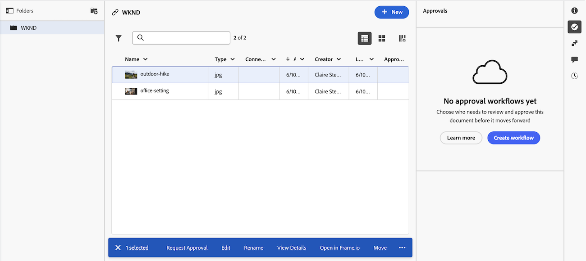

# 檔案區域

在「檔案」區域中，您可以組織、管理和檢視上傳至Adobe Workfront的檔案的中繼資料。 您也可以檢視校訂決定。

Workfront目前有兩個版本的檔案區域：舊版檔案區域和新檔案區域。 貴組織使用的版本取決於貴組織是在舊版Workfront儲存空間還是Adobe雲端儲存空間。 如需這些儲存體型別的詳細資訊，請參閱[Adobe雲端儲存體概觀](/help/quicksilver/review-and-approve-work/esm-overview.md)。

## 舊版檔案區域

檔案區域有兩種型別。 兩者的特色和功能相同：

* **方案、投資組合、範本、專案、任務或問題的檔案區域：**&#x200B;列出您有權存取特定專案、任務或問題的所有檔案。 若要存取此區域，在檢視專案、任務或問題時，按一下左側面板中的&#x200B;**檔案** 。

* **全域檔案區域：**&#x200B;列出您在Workfront中可以存取的所有檔案。 若要存取此區域，請按一下主功能表中的&#x200B;**檔案** 。

如需有關將檔案上傳到Workfront的資訊，請參閱[從您的檔案系統新增檔案到Adobe Workfront](../../documents/adding-documents-to-workfront/add-documents-from-file-system.md)。

檔案區域會記錄下列專案的計數：

* Workfront資料夾
* 從檔案系統上傳的檔案
* 從整合新增至Workfront的檔案
* 連結的Experience Manager Assets

### 摘要面板

當您在檔案區域中選取檔案時，您可以使用右側的「摘要」來檢視檔案詳細資訊、管理檔案更新和核准、檢視檔案版本，以及新增和編輯檔案的自訂Forms。

如果已為檔案設定校訂，則「詳細資訊」區段包含校訂到期日和目前校訂進度等資訊。

當您需要有關檔案的所有資訊時，可以按一下「詳細資訊」標題以前往完整的「檔案詳細資訊」區域。

如需「摘要」的相關資訊，請參閱[檔案概述](../../documents/managing-documents/summary-for-documents.md)的摘要。

### 校訂決定

一旦做出校訂決定，它就會出現在檔案清單中。

### 資料夾

您可以設定資料夾來組織檔案。 如需詳細資訊，請參閱[建立檔案資料夾](../../documents/organizing-documents/create-documents-folder.md)。

在全域檔案區域中，您可以設定兩種型別的資料夾來組織您有權存取的檔案：

* **智慧資料夾：**&#x200B;僅顯示您想要檢視的檔案。 如需詳細資訊，請參閱[建立及管理智慧資料夾](../../documents/organizing-documents/create-manage-smart-folders.md)。

* **我的資料夾：**&#x200B;依您想要的方式整理檔案。 如需詳細資訊，請參閱[建立檔案資料夾](../../documents/organizing-documents/create-documents-folder.md)。

### 展開的檔案詳細資訊

「檔案詳細資訊」頁面提供右側「摘要」中「檔案詳細資訊」的更完整版本。

## 新檔案區域

新檔案區域僅適用於貴組織位於Adobe雲端儲存空間時。 如需Adobe雲端儲存空間的詳細資訊，請參閱[Adobe雲端儲存空間概觀](/help/quicksilver/review-and-approve-work/esm-overview.md)。

### 使用摘要面板

當您在檔案區域中選取檔案時，您可以使用右側的「摘要」面板來檢視檔案的詳細資訊、新增和編輯附加的自訂表單、建立和管理核准工作流程、檢視檔案的版本等等。

#### 使用Frame.io檢閱和核准

您可以使用Frame.io檢視器，在新的「檔案」區域中檢閱和核准檔案。

如需詳細資訊，請參閱[開始進行統一檢閱和核准](/help/quicksilver/review-and-approve-work/get-started-with-unified-approvals.md)。

#### 管理版本

您可以在新的檔案區域中上傳檔案的新版本。 上傳新版本時，會保留先前版本，並可從「摘要」面板存取。 版本會根據上傳的日期和時間自動命名，但可視需要重新命名。

您也可以針對特定檔案版本啟動新的核准工作流程。

![摘要面板開啟到[版本]索引標籤](assets/new-doc-versions.png)

#### 檢視檔案歷史記錄

您可以在新的「檔案」區域中檢視檔案的歷史記錄。 歷史記錄包含下列型別的資訊：

* 上傳檔案的時間
* 上傳新版本時
* 當檔案的核准工作流程啟動時
* 及更多內容

![摘要面板開啟到[歷程記錄]索引標籤](assets/new-doc-history.png)

### 檔案許可權的系統層級資料夾

將第一個檔案上傳至任務或問題時，Workfront會自動建立系統層級資料夾。 這些資料夾從任務或問題繼承許可權，並顯示在專案層級檔案區域中。 上傳至該任務或問題的所有檔案都會儲存在該資料夾中，並繼承其許可權。 這是管理新「檔案」區域中檔案許可權的主要方式。 如需詳細資訊，請參閱[Adobe雲端儲存模型的](/help/quicksilver/review-and-approve-work/esm-access-permissions.md#how-document-permissions-work)物件許可權和存取層級總覽。

### 從您的案頭存取檔案

如果您的組織使用Adobe雲端儲存空間，您也可以使用Adobe Cloud Drive從Mac或Windows案頭存取檔案。 Adobe Cloud Drive會將您的Adobe雲端儲存空間專案掛載為電腦上的磁碟機，如此一來，您便可以在任何應用程式中開啟及編輯檔案，同時使變更與Workfront保持同步。 如需詳細資訊，請參閱[Adobe Cloud Drive總覽](/help/quicksilver/documents/adobe-cloud-drive/adobe-cloud-drive-overview.md)。

## 考量事項

* 新檔案區域已針對寬度或大於1024畫素的熒幕最佳化。 如果您的畫面較小，則存取「摘要」面板時可能會發生問題。

* 全域檔案區域在新的檔案區域體驗中無法使用。 您只能從方案、投資組合、專案、任務或問題存取檔案。
