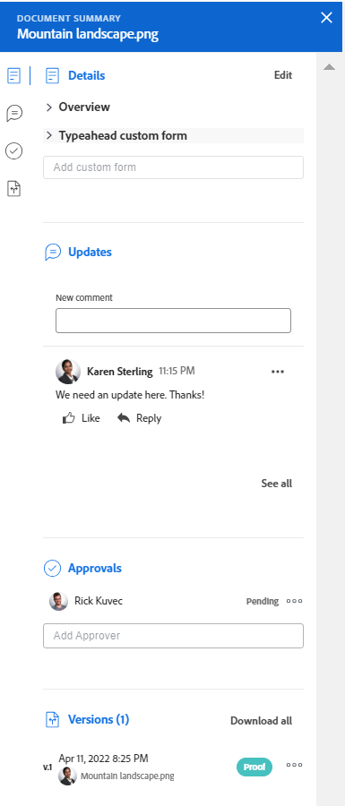

# 檔案摘要概覽

此頁面上反白顯示的資訊僅可在預覽環境中使用。 <!--and in the Production environment for customers who have opted for the fast release process. For information about fast releases, see [Enable or disable fast releases for your organization](/help/quicksilver/administration-and-setup/set-up-workfront/configure-system-defaults/enable-fast-release-process.md). For information about the current release schedule, see [First Quarter 2024 release overview](/help/quicksilver/product-announcements/product-releases/24-q2-release-activity/24-q2-release-overview.md).-->

「摘要」可讓您直接從檔案清單與重要資訊互動。

## 存取需求

您必須具備下列條件：

<table style="table-layout:auto"> 
 <col> 
 </col> 
 <col> 
 </col> 
 <tbody> 
  <tr> 
   <td role="rowheader">Adobe Workfront計畫*</td> 
   <td> 
 任何
 </td> 
  </tr> 
  <tr> 
   <td role="rowheader">Adobe Workfront授權*</td> 
   <td> 
要求或更高版本
 </td> 
  </tr> 
  <tr data-mc-conditions=""> 
   <td role="rowheader">存取層級設定*</td> 
   <td> 
編輯檔案的存取權
 
注意：如果您還是沒有存取權，請詢問您的Workfront管理員，他們是否在您的存取層級中設定其他限制。 如需有關Workfront管理員如何修改您的存取層級的資訊，請參閱 <a href="../../administration-and-setup/add-users/configure-and-grant-access/create-modify-access-levels.md" class="MCXref xref">建立或修改自訂存取層級</a>.
 </td> 
  </tr> 
  <tr data-mc-conditions=""> 
   <td role="rowheader">物件許可權</td> 
   <td> 
檢視與檔案關聯之物件的存取權
 
如需請求其他存取許可權的詳細資訊，請參閱 <a href="../../workfront-basics/grant-and-request-access-to-objects/request-access.md" class="MCXref xref">要求物件的存取權 </a>.
 </td> 
  </tr> 
 </tbody> 
</table>

&#42;若要瞭解您擁有的計畫、授權型別或存取權，請聯絡您的Workfront管理員。

## 開啟摘要檢視

1. 前往 **檔案** 區域並選取清單中的專案。
1. 按一下 **開啟摘要圖示** .

   開啟「摘要」後，當您按一下其他檔案時，摘要會保持開啟狀態，直到您手動關閉摘要為止。

   

## 詳细資料

使用詳細資訊區段檢視高階總覽資訊並與自訂表單互動。 按一下 **詳細資料** 前往完整檔案詳細資訊頁面。

* [概觀](#overview)
* [自訂表單](#custom-forms)

### 概觀 {#overview}

展開「概觀」區段以檢視或下載影像縮圖、開啟校樣、更新基本說明、取出檔案等等。

### 自訂表單 {#custom-forms}

使用自訂Forms區段來新增、編輯或檢視與檔案相關聯的任何自訂表單。 開始輸入自訂表單的名稱，以將其新增到檔案。 如需詳細資訊，請參閱 [新增或編輯自訂表單至檔案](../../documents/managing-documents/add-custom-form-documents.md).

## 更新

使用更新區段來讀取某人對該檔案或校訂進行的更新。 摘要會顯示前2個註解。 如需更新的詳細資訊，請參閱 [對校訂進行評論](../../review-and-approve-work/proofing/reviewing-proofs-within-workfront/comment-on-a-proof/comment-on-proof.md).

## 核准

使用核准區段來要求檔案核准。 您也可以提醒某人有關核准的資訊、重新提交核准並取消先前的決定，或刪除核准。 檔案核准者可使用摘要來做出決定。

校訂核准必須新增到校訂工作流程中。 如需核准的詳細資訊，請參閱

* [核准工作](../../review-and-approve-work/manage-approvals/approving-work.md)
* [請求文件核准](../../review-and-approve-work/manage-approvals/request-document-approvals.md)

## 版本

使用「版本」區段可檢視針對特定檔案建立的版本數目。 按一下 **更多選單** 至

* 開啟校訂
* 下載校訂或檔案
* 預覽瀏覽器支援的檔案
* 前往檔案詳細資訊
* 刪除校訂或檔案

